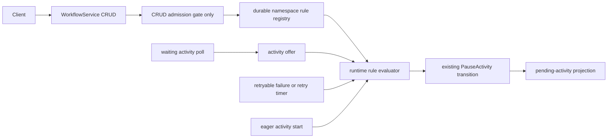

# Design Document: Workflow Rules

## Overview

This design adds a namespace-scoped rule registry and runtime evaluation seam for Temporal v1.31.0
Workflow Rules. CRUD lives in the edge/runtime namespace-configuration plane; automatic evaluation
is runtime-owned, independent of the CRUD feature gate, and feeds the existing deterministic
PauseActivity transition. In particular, the activity-offer boundary evaluates the current rule
snapshot rather than a gate value captured when the long poll began. This removes the confirmed
bug condition `C(X)` from the requirements. No rule semantics are implemented in the gRPC
translator, and `TriggerWorkflowRule` remains the target's exact unimplemented exception.

## Dependencies and Non-Goals

### Owning relationships

- `api-conformance-activity-by-id` owns faithful Pause/Unpause activity lifecycle behavior.
- The conformance override bridge supplies `frontend.workflowRulesAPIsEnabled=true` for the enabled
  suite run; production default remains false.
- Existing visibility and activity metadata provide the attributes consumed by predicate matching.

### Non-goals

- No action or trigger variant beyond those present in v1.31.0.
- No implementation of `TriggerWorkflowRule`.
- No promise about List order or namespace-config propagation latency.
- No use of the frontend CRUD gate as an activity-dispatch policy input.

## Architecture



CRUD reads/writes one namespace registry. Activity offer, eager start, retryable-failure, and retry
timer processing read an immutable current rule snapshot, skip expired rules, evaluate workflow then
activity predicates, and request a rule-derived pause before dispatch. A long poll never chooses
whether rules apply: it only waits for an offer. The authoritative activity state stores the rule
id; Describe enriches it from the current registry when available.

## Components and Interfaces

### Rule registry (`tokeira-edge` namespace service / durable store)

```rust
pub async fn create_rule(namespace: &str, request: CreateRule) -> Result<WorkflowRule>;
pub async fn describe_rule(namespace: &str, rule_id: &str) -> Result<WorkflowRule>;
pub async fn delete_rule(namespace: &str, rule_id: &str) -> Result<()>;
pub async fn list_rules(namespace: &str) -> Result<Vec<WorkflowRule>>;
```

The implementation preserves the namespace-config semantics of
`service/frontend/namespace_handler.go @ v1.31.0`: duplicate/missing ids are InvalidArgument, the
default limit is 10, and capacity eviction chooses the earliest non-nil expiration time. Expiration
suppresses automatic matching but does not remove a rule from Describe/List; deletion and
capacity-driven eviction are the removal operations.

### Runtime evaluator (`tokeira-runtime`)

```rust
pub fn matching_pause_rule(
    workflow: &WorkflowRuleWorkflowView,
    activity: &WorkflowRuleActivityView,
    rules: &[WorkflowRule],
    now: OffsetDateTime,
) -> Option<String>;
```

The pure decision helper uses the existing visibility-expression machinery for the restricted
workflow query and a dedicated activity predicate context. Runtime call sites invoke it at ordinary
and eager start boundaries, after a failure is known to be retryable, and before a retry timer
enqueues work. A matching rule id is threaded into the activity pause transition; storage and
dispatch remain consequences of the ordinary committed transition.

### Offer-time evaluation (`tokeira-edge` / `tokeira-runtime`)

Poll admission always enters the ordinary offer path. When an offer arrives, that path reads the
current namespace rules and evaluates them before starting the activity. The evaluator has no CRUD
gate input. Under tonic, this also ensures a poll admitted while the gate is disabled cannot later
bypass a rule created after the gate is enabled. Eager dispatch is required to call the same policy
seam rather than claiming directly from the broker.

### gRPC handlers (`crates/tokeira-edge/src/grpc/workflow_service.rs`)

Create/Describe/Delete/List translate fields, apply the gate before validation, and delegate to the
registry. Trigger returns the exact v1.31.0 Unimplemented status directly.

## Data Models

`WorkflowRule` mirrors the proto: server create time, complete spec, creator identity, and
description. The durable key is `(namespace_id, rule_id)`. Activity pause provenance is a tagged
manual-or-rule value; rule-derived state stores the rule id and pause time, not a copy of mutable
rule metadata.

## Correctness Properties

### Property 1: Namespace isolation and CRUD model

*For any* sequence of valid Create/Describe/Delete/List operations across namespaces, each
namespace's observed rule set SHALL equal a reference map keyed by rule id, subject to the v1.31.0
capacity/eviction rule.

**Validates: Requirements 2.1, 2.2, 2.5, 2.6, 2.7, 3.1, 3.3, 3.5, 3.6**

### Property 2: Gate-before-validation precedence

*For any* CRUD request body, a disabled namespace gate SHALL yield the method-specific
`UNIMPLEMENTED` result before any body validation, while enabling the gate SHALL expose ordinary
validation and CRUD behavior.

**Validates: Requirements 1.1, 1.2, 1.3**

### Property 3: Rule evaluation reference model

*For any* workflow view, activity view, time, and rule set, the evaluator SHALL choose exactly the
unexpired ActivityPause rules whose visibility and activity predicates both match, without allowing
one rule's parse error to fail the transition.

**Validates: Requirements 4.1, 4.2, 4.3, 4.6, 4.7**

### Property 4: Rule-pause provenance

*For any* matching rule and pending activity, the committed pause SHALL retain the rule id and pause
time; Describe SHALL enrich creator identity/description only when the rule remains present, and rule
deletion SHALL neither erase the id nor unpause the activity.

**Validates: Requirements 4.4, 4.5, 5.1, 5.2, 5.3**

### Property 5: Rejection has no side effect

*For any* duplicate, missing-id, over-capacity, disabled-gate, or Trigger request, rejection SHALL
leave namespace and workflow state byte-identical.

**Validates: Requirements 1.1, 2.3, 2.4, 2.5, 2.7, 3.2, 3.4, 6.1, 6.2**

### Property 6: Poll-admission independence

*For any* activity poll, CRUD-gate values at admission and offer, and current namespace rule set,
the pause/start result SHALL depend only on the offered activity, authoritative workflow state, and
the current stored rules. Changing either captured gate value SHALL not change that result.

This is the bug-condition exploration property. It must fail on the unfixed implementation when a
poll admitted with the gate disabled receives an activity matching a rule created before offer.

**Validates: Requirements 1.5, 4.1, 4.3, 4.8**

### Property 7: Expiration separates evaluation from retention

*For any* stored rule and evaluation time after its expiration, automatic matching SHALL ignore the
rule while Describe/List retain it; only explicit Delete or capacity eviction may remove it.

**Validates: Requirements 2.6, 3.1, 3.5, 3.7, 4.6**

### Property 8: Activity-start path equivalence

*For any* activity and current rule set, ordinary offer, eager start, retryable-failure, and
retry-timer paths SHALL reach the same pause decision before dispatch. A terminal failure SHALL not
apply retry-rule pause state.

**Validates: Requirements 4.2, 4.3, 4.4, 4.9, 4.10, 4.11**

## Error Handling

| Condition | Internal error | External status/code |
|---|---|---|
| CRUD gate disabled | Feature disabled | `UNIMPLEMENTED`, method-specific message |
| Missing spec/id, duplicate id, missing rule | Invalid rule request | `INVALID_ARGUMENT`, v1.31.0 message |
| Rule count remains at maximum | Rule limit | `INVALID_ARGUMENT`, includes max |
| Namespace missing | Namespace resolution error | Standard namespace status |
| Predicate parse/evaluation error | Non-match plus structured log | No RPC/transition error |
| Trigger called | Target exception | `UNIMPLEMENTED`: `method TriggerWorkflowRule not supported` |

## Testing Strategy

- **Property tests:** Properties 1–8 with `proptest`, minimum 100 cases each. Property 6 is added
  first as the exploration test and must reproduce the confirmed failure before the correction.
- **Unit tests:** exact v1.31.0 messages, force-scan/request-id ignored behavior, unspecified List
  order, expiration selection and CRUD retention, and Trigger's fixed response.
- **Integration tests:** gate-independent offer-time pause, pre-start/eager pause, pause after a
  retryable but not terminal failure, retry-timer pause, and delete rule then explicit type-based
  Unpause.
- **Functional corpus:** two clean `TestActivityApiRulesClientTestSuite` runs in the rule-enabled mode.
