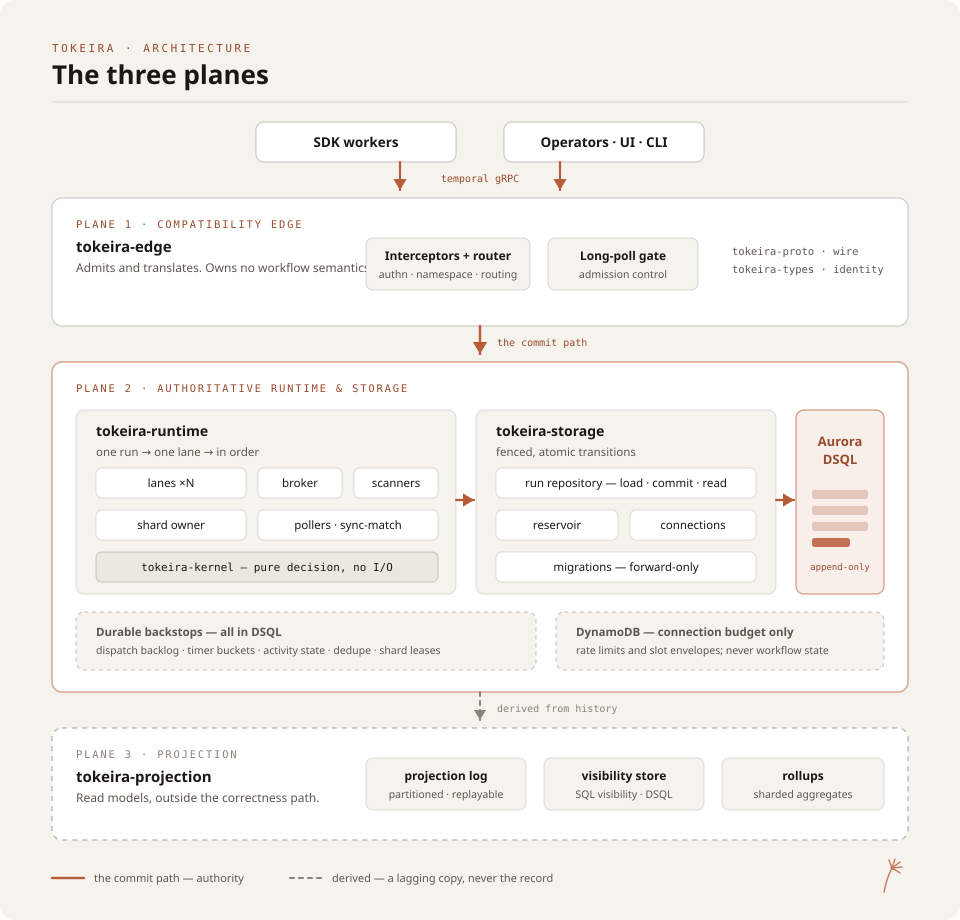
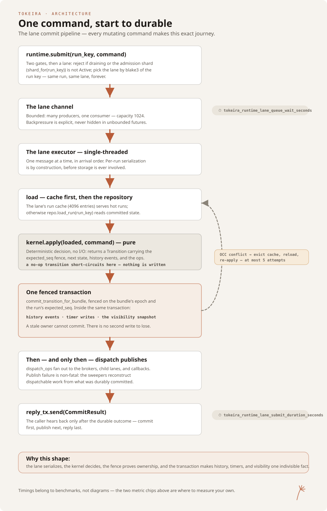

# Tokeira

[](LICENSE)

<p align="center">
  <picture>
    <source media="(prefers-color-scheme: dark)" srcset="docs/assets/tokeira-signature-dark.png">
    
  </picture>
</p>

**Tokeira is a Temporal-compatible durable execution service, built from
scratch in Rust for Amazon Aurora DSQL.**

Run existing Temporal applications against Tokeira using the SDKs and workflow
model you already know. Or embed the same execution engine directly into a
Rust application when a separate service is unnecessary.

**Keep the workflow. Choose the engine.**

## Mission

Tokeira exists to preserve the public
[Temporal](https://temporal.io) contract while exploring a different
architecture beneath it.

Temporal's SDKs, workflow model, event histories, replay semantics, task
lifecycles, signals, timers, retries, Continue-As-New, WorkflowService,
OperatorService, and the behaviours applications depend upon form the
compatibility boundary. Behind that boundary, Tokeira is its own system.

Tokeira is not a fork and does not port Temporal's server implementation.
Where behaviour must match, it is established against a pinned Temporal
release and verified through conformance testing.

Internally, Tokeira collapses correctness around one authoritative per-run
transition log. Per-workflow event history is the semantic ordering domain;
queue delivery, visibility, and other operational state are derived from it.
The architecture does not reproduce Temporal's Frontend / History / Matching /
Worker service topology.

Amazon Aurora DSQL is the design centre rather than a storage backend added
behind a generic persistence abstraction. Rust provides the execution
environment in which the resulting engine is built.

The goal is not to create a different workflow programming model.

It is to give the existing one another engine.

## Design Principles

### History is the authority

Every state-changing request becomes a per-run transition that appends
history, updates the run summary, and emits derived effects atomically.
Tokeira never relies on an external queue write as the canonical record that
work exists.

### Order only what correctness requires

Tokeira enforces a total order per workflow run, with explicit causal edges
across runs and side effects. It does not impose a global total order where
the workflow model does not require one.

Queue delivery and visibility remain derived ordering domains.

### Delivery is ephemeral-first

Worker polling and synchronous matching live primarily in memory. Durable
backlog provides recovery and fallback rather than defining the normal
delivery path.

### Visibility is a projection

The projection plane owns read models, SQL visibility, rollups, and custom
sinks. It operates outside the correctness path and advances through
independent checkpoints.

A lagging projection is a quality problem, not a correctness failure.

### The kernel is pure

The deterministic state machine transforms commands into transitions without
I/O, storage access, networking, metrics, or delivery concerns.

Correctness can therefore be reasoned about and tested independently of the
systems surrounding it.

### Configuration stays small

Tokeira prefers policy, measurement, and automatic adaptation over exposing
the mechanics of its implementation as operator configuration.

Complexity belongs inside the system.

## Temporal Conformance

**Temporal compatibility is a continuing commitment, not a one-time target.**

Tokeira intends to remain current with Temporal's public contract as Temporal
evolves. Compatibility advances deliberately, release by release: a newer
Temporal version becomes Tokeira's claimed compatibility level only after its
behaviour has been implemented, measured, and evidenced.

The current compatibility baseline is defined by two independent pins in
[`crates/tokeira-build-info/src/pinned.rs`](crates/tokeira-build-info/src/pinned.rs):

- **Temporal server compatibility: v1.31.0** — the release whose public API
  behaviour Tokeira currently aims to match. Behaviour questions are resolved
  against this release rather than inferred.
- **Temporal API: v1.62.11** — the vendored protobuf surface against which
  Tokeira builds, held in [`proto/upstream/`](proto/upstream/).

They are independent by design. Protocol definitions can advance without
silently advancing Tokeira's behavioural compatibility claim.

**v1.31.0 is a checkpoint, not a destination.**

As Temporal releases advance, Tokeira will continue advancing these pins and
its conformance corpus. The project would rather publish an older,
evidence-backed compatibility claim than call itself current before the
evidence supports it.

### Conformance is measured, not asserted

**Compatibility matrices.** Every WorkflowService and OperatorService RPC is
classified as `Implemented`, `Partial`, `Experimental`, `Stubbed`, or
`Unsupported` in the checked-in `FEATURE_MATRIX`. SDK claims live separately
in `SDK_MATRIX`, together with their evidence and verification state.
`tkr compat show` exposes both.

See [docs/conformance/compatibility.md](docs/conformance/compatibility.md).

**Functional corpus replay.** Temporal's own functional Go test suites,
pinned to the claimed server compatibility release, are exercised over the
real gRPC wire against a running `tokeirad`.

See
[docs/testing/functional-conformance-harness.md](docs/testing/functional-conformance-harness.md).

**Release evidence.** Tokeira publishes the evidence behind compatibility
claims rather than asking users to take them on trust. For v0.1.0, the ordered
corpus replay against the exact release commit produced **1,261 passes and
0 failures**, with every exclusion cited back to Temporal's source.

See [docs/readiness/corpus-evidence.md](docs/readiness/corpus-evidence.md).

**Public conformance ledger.**
[docs/readiness/conformance.md](docs/readiness/conformance.md) records what
has been verified, what is implemented but not yet measured, and what remains
outstanding. The corresponding
[docs/conformance/v1.31.0/](docs/conformance/v1.31.0/README.md) corpus defines
what full compatibility with the current baseline means.

## Architecture

Tokeira separates execution into three planes.

### Compatibility edge

The edge presents the Temporal-facing contract: WorkflowService,
OperatorService, health endpoints, authentication and authorization,
namespace resolution, and request identity.

It owns no workflow semantics.

### Authoritative runtime and storage

The runtime owns correctness: shard and bundle ownership, fencing, lane-local
workflow actors, durable transitions, timers, and derived dispatch.

A workflow run has one authoritative transition history.

### Projection plane

The projection plane owns read models: SQL visibility, rollups, and custom
sinks with independent checkpoints and replay.

It remains outside the correctness path.

<p align="center">
  
</p>

And one command's whole journey through them:

<p align="center">
  
</p>

The architecture is documented in
[docs/architecture/](docs/architecture/000-overview.md). A navigable reference
for every published engine and supporting crate lives in
[docs/crates/](docs/crates/README.md).

## Run Tokeira

The same execution engine can live behind a service boundary or inside your
process.

### Tokeira service

`tokeirad` runs Tokeira as a standalone Temporal-compatible service. Temporal
SDK clients and workers communicate with it over gRPC using the familiar
Temporal protocol.

The conformance corpus exercises this path over the real wire.

Tokeira's operator surface is being built around `tkr`, with named
deployments and an explicit **plan → confirm → apply** lifecycle. Platform
definitions currently cover bare-host `local`, Docker Compose, ECS, and EKS;
the Compose platform can provision the accompanying
Mimir · Loki · Grafana · Alloy observability stack.

The service and its operational platform are the primary Tokeira deployment
model. The operator lifecycle remains under active development and sits
outside the v0.1.0 support claim while it hardens.

Explore [docs/platforms/](docs/platforms/README.md).

### Embedded Tokeira

Tokeira can also disappear entirely inside a Rust process.

The same engine runs without a TCP listener, daemon, or separate deployment.
The Temporal Rust SDK connects to it over an in-memory duplex:

```rust
// A Temporal-compatible engine, in-process.
let engine = tokeira_engine::Engine::embedded().await?;

// Hand its endpoint to the Temporal Rust SDK:
//   ConnectionOptions::service_override(engine.service_override())
// and every SDK worker and client in the process speaks to it directly.
```

Embedded deployments can begin in memory — optionally with snapshots — and
move to Aurora DSQL without changing the execution model: either a managed
cluster the engine creates and recovers, or an existing cluster you supply.

This makes durable execution practical for applications that want Temporal's
programming model without operating a separate workflow service — while
remaining the same Tokeira engine used by `tokeirad`.

The engine is on crates.io:

```console
cargo add tokeira-engine
```

The [`v0.1.1` release](https://github.com/tokeira/tokeira/releases/tag/v0.1.1)
is the published tree; the conformance evidence names
[`v0.1.0`](https://github.com/tokeira/tokeira/releases/tag/v0.1.0), which it
packages.

Building agents in Rust?
[Tokeira Odori](https://github.com/tokeira/tokeira-odori) builds durable
agentic workflows on Tokeira.

## Security

Authentication and authorization live at the compatibility edge. Secrets are
redacted by default, and `unsafe` Rust is denied workspace-wide.

The security model and vulnerability-reporting process are documented in
[SECURITY.md](SECURITY.md).

## Built with Claude, Codex, and Kiro

Tokeira is also an experiment in how substantial systems software can be
built with coding agents without lowering the engineering bar.

The repository has been developed by one grateful owner ❤️ collaborating with
three hugely capable agents: [Claude](https://claude.com) from Anthropic,
[Codex](https://openai.com/codex) from OpenAI, and
[Kiro](https://kiro.dev) from AWS.

The agents have made material contributions across architecture,
implementation, testing, conformance, documentation, and review — often
working concurrently and reviewing one another's work.

Their work is governed by the repository's written engineering contract,
[AGENTS.md](AGENTS.md): spec-driven development, ground-truth verification
against the pinned Temporal release, compiler-enforced quality standards,
isolated worktrees, and serial human review before integration.

Credit is preserved in the engineering record. Commits involving agents name
them through `Co-authored-by:` and `Assisted-by:` trailers rather than
silently attributing their work to the human operator.

The concurrency model and fleet mechanics are documented in
[docs/agents/](docs/agents/concurrent-agents.md).

## Development

Tokeira builds with standard Cargo on a pinned stable Rust toolchain, and the
workspace test suite runs without AWS credentials or Docker. The development
environment, quality gates, and repository conventions are documented in
[docs/development.md](docs/development.md).

## Contributing

Issues and pull requests are welcome. Please discuss substantial changes in an
issue before beginning implementation.

The quality bar, pull-request process, and conformance-harness runbook are
documented in [CONTRIBUTING.md](CONTRIBUTING.md).

## License

Tokeira is licensed under [Apache-2.0](LICENSE).
