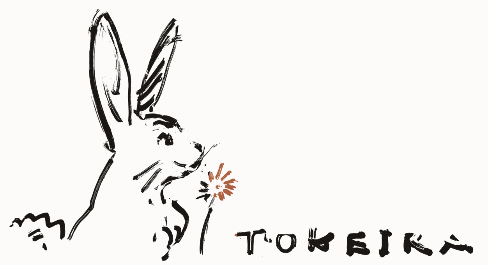

# Tokeira

  

A Temporal-compatible durable execution engine, built in Rust and specialized
for Amazon Aurora DSQL.

## Mission

Preserve the public [Temporal](https://temporal.io) contract that SDKs,
operators, and tooling depend on — WorkflowService, OperatorService, workflow
history semantics, the replay model, task lifecycle, sticky execution,
polling, retries, signals, timers, Continue-As-New, archival. Collapse
internal correctness around a single authoritative per-run transition log.

Tokeira is a product from scratch, not a fork: the architecture is informed by
Temporal, but the implementation is original — where behaviour must match, it
is verified against the pinned Temporal release, never copied from it. It is
not a service-by-service port of Temporal's Frontend / History / Matching /
Worker layout: per-workflow event history is the only semantic ordering
domain, and everything else — queue ordering, delivery ordering, visibility
ordering — is derived. Aurora DSQL is the design centre, not a pluggable
afterthought.

### Design Principles

**History is the authority.** Every state-changing request becomes a per-run
transition that appends history, updates the run summary, and emits derived
effects atomically. The system never relies on an external queue write as the
canonical record that work exists.

**Per-run total order, not global total order.** Tokeira enforces a total
order per workflow run, plus explicit causal edges across runs and side
effects. Queue delivery and visibility are derived domains.

**Delivery is ephemeral-first.** Worker polling and sync matching live
primarily in memory. Durable backlog is a fallback and recovery aid, not the
default path.

**Visibility is a projection.** The projection plane owns read models and
operates outside the correctness path. A lagging projection is a quality
problem, not a correctness failure.

**The kernel is pure.** The deterministic state machine transforms commands
into transitions with no I/O, no storage access, and no delivery concerns.

**Configuration stays minimal.** Prefer policies and auto-tuning over exposed
mechanical knobs.

## Temporal Conformance

Tokeira carries two independent compatibility pins
([`crates/tokeira-build-info/src/pinned.rs`](crates/tokeira-build-info/src/pinned.rs)):

- **Temporal server compatibility: v1.31.0** — the release whose public API
  *behaviour* Tokeira aims to match. Behaviour questions are resolved against
  that release, not guessed.
- **Temporal API: v1.62.11** — the vendored proto surface Tokeira builds
  against ([`proto/upstream/`](proto/upstream/)).

The pins are tracked independently on purpose: vendored protos may advance
ahead of the behavioural claim, and updating protos never silently raises it.

Conformance is measured, not asserted:

- **Compatibility matrices.** Every WorkflowService and OperatorService RPC is
  classified (`Implemented` / `Partial` / `Experimental` / `Stubbed` /
  `Unsupported`) in a checked-in `FEATURE_MATRIX`; SDK support claims live in
  `SDK_MATRIX` with evidence and verification state. `tkr compat show`
  inspects both. See
  [docs/conformance/compatibility.md](docs/conformance/compatibility.md).
- **Functional corpus replay.** Temporal's own functional Go test suites —
  unmodified, pinned at v1.31.0 — are replayed over the real gRPC wire against
  a running `tokeirad`. See
  [docs/testing/functional-conformance-harness.md](docs/testing/functional-conformance-harness.md).
- **A public ledger.**
  [docs/readiness/conformance.md](docs/readiness/conformance.md) records
  exactly what has been verified, what is implemented but unmeasured, and what
  is outstanding — against
  [docs/conformance/v1.31.0/](docs/conformance/v1.31.0/README.md), which
  defines what full v1.31.0 compliance means.

## Architecture

Tokeira is organized into three planes:

- **Compatibility edge** — admits and translates requests. Exposes
  WorkflowService, OperatorService, and health endpoints; performs
  authn/authz, namespace lookup, and request-ID handling. Owns no workflow
  semantics.
- **Authoritative runtime and storage** — owns correctness: shard/bundle
  ownership and fencing, lane-local execution of workflow actors, durable
  state transitions, durable timers, and derived dispatch.
- **Projection plane** — owns read models: SQL visibility, rollups, and
  custom sinks with independent checkpoints and replay. Outside the
  correctness path.

Design documents live in
[docs/architecture/](docs/architecture/000-overview.md), decision records in
[docs/adr/](docs/adr/), and a navigable reference for the seven engine crates
in [docs/crates/](docs/crates/README.md).

## Quick Start

Install `tkr`, create a `local` deployment, apply — a Temporal-compatible
server is running on your host in minutes, with no containers, no cloud
account, and no schema step. The same lifecycle then scales up through Docker
Compose to ECS and EKS.
Guide: [docs/platforms/quick-start.md](docs/platforms/quick-start.md).

## Platform Support

| Platform | Runs `tokeirad` as | Storage | Observability |
|----------|--------------------|---------|---------------|
| [`local`](docs/platforms/local/README.md) | Bare host process | in-memory or DSQL | None |
| [`compose`](docs/platforms/compose/README.md) | Docker Compose stack | in-memory or DSQL | Mimir · Loki · Grafana · Alloy |
| [`ecs`](docs/platforms/ecs/README.md) | AWS ECS on Graviton4, private subnets | Aurora DSQL | Mimir · Loki · Grafana · Alloy |
| [`eks`](docs/platforms/eks/README.md) | Kubernetes on AWS EKS (Auto Mode, Graviton), private subnets | Aurora DSQL | Mimir · Loki · Grafana · Alloy |

Full matrix and per-platform guides:
[docs/platforms/](docs/platforms/README.md).

## Deployment

`tkr` manages named deployments end to end — image build and mirroring,
ordered infrastructure modules, DSQL schema migrations, service rollout — with
an explicit **plan → confirm → apply** contract: mutations are previewed, and
destructive operations never run without `--yes` or interactive confirmation.
Guide:
[docs/platforms/iac/configuration.md](docs/platforms/iac/configuration.md).

## Observability

Every process exposes `/metrics`, `/healthz`, and `/readyz`; the compose and
ECS platforms provision a full stack — Alloy collection into Mimir (metrics)
and Loki (logs), Grafana dashboards, and alert rules wired to runbooks —
validated by `tkr observability check`. Guide:
[docs/platforms/observability.md](docs/platforms/observability.md).

## Operations

Day-2 operation goes through the same tooling: scaling, log streaming,
SSM-based port forwarding and container exec (no public endpoints), one-shot
admin commands, and schema management. The command surface is in the
[deployment configuration guide](docs/platforms/iac/configuration.md), and
each [platform guide](docs/platforms/README.md) shows its own operating loop.

## Security

Authentication and authorization live at the compatibility edge; production
platforms default to private networking with SSM-based operator access;
secrets are redacted by default; `unsafe` Rust is denied workspace-wide.
Vulnerability reporting and the full posture: [SECURITY.md](SECURITY.md).

## Development

Standard cargo workflows on a pinned stable toolchain;
`cargo test --workspace` needs no AWS credentials and no Docker. When a laptop
build is too slow, `tkr workstation` provisions a Graviton4 build box with
cold workspace builds under two minutes. Guides:
[docs/development.md](docs/development.md) ·
[docs/remote-workstation.md](docs/remote-workstation.md).

## Working with Agents

This repository is engineered for concurrent development by humans and AI
agents. [AGENTS.md](AGENTS.md) is the binding contract — engineering rules,
Temporal ground-truthing discipline, and the fleet git protocol — with the
mechanics in [docs/agents/](docs/agents/concurrent-agents.md). Agent
contributions are credited in commit history with `Co-authored-by:` /
`Assisted-by:` trailers.

## Contributing

Issues and pull requests are welcome; discuss substantial changes in an issue
first. The quality bar, PR process, and conformance-harness runbook are in
[CONTRIBUTING.md](CONTRIBUTING.md).

## Acknowledgements

The architecture, requirements specification, and technical design of this
project were developed in close collaboration with [Kiro](https://kiro.dev),
which made significant contributions to the design and realisation of the
system.

## License

[Apache-2.0](LICENSE)
