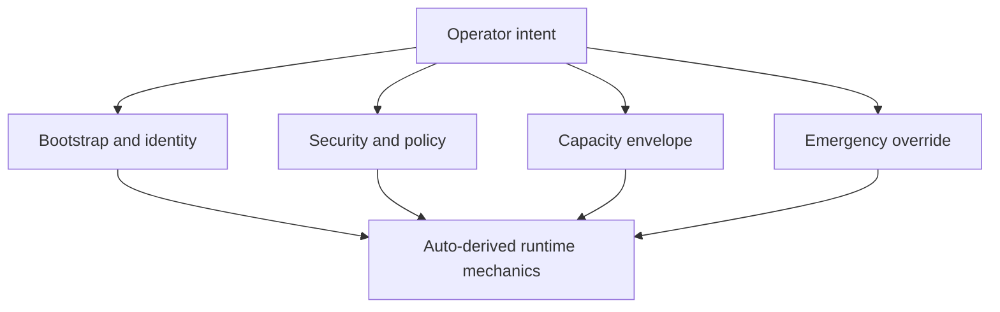
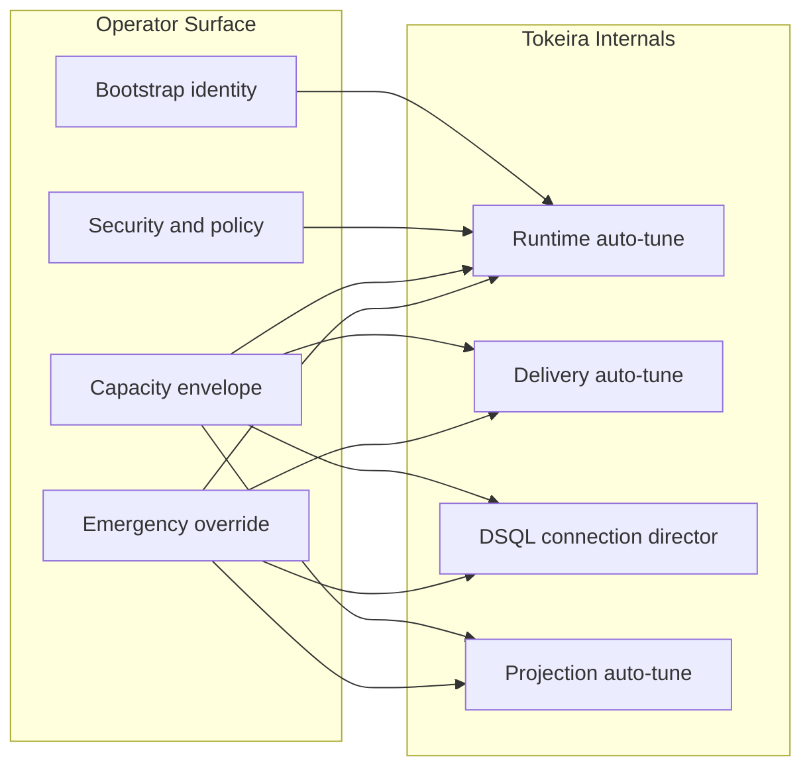

# 015 Configuration (minimal surface area)

**Status:** draft for architecture review  
**Decision direction:** preferred  
**Related docs:** [000-overview](000-overview.md), [030-runtime-lanes](030-runtime-lanes.md), [040-delivery-broker](040-delivery-broker.md), [050-dsql-storage](050-dsql-storage.md), [055-admission-control](055-admission-control.md), [060-connection-management](060-connection-management.md), [065-runtime-auto-tune](065-runtime-auto-tune.md)

## Intent

This note defines the **configuration philosophy** for **Tokeira**.

The design goal is aggressive:

> **User-visible tuning knobs should trend toward zero.**

The operator should describe:

- **identity**,
- **security**,
- **policy**,
- **resource limits**,
- **deployment intent**,

and Tokeira should infer or tune the rest.

This is a deliberate reaction against the operational pattern seen in Temporal today, where worker and queue performance often depends on tuning combinations of task slots, pollers, sticky cache, rate limits, and queue metrics such as schedule-to-start and sync-match rate.[^temporal-worker-performance][^temporal-worker-tuning][^temporal-worker-health][^temporal-task-queue]

Admission control in Tokeira should therefore be expressed primarily as **policy class and capacity envelope**, with the detailed mechanics owned by the platform itself. See [055-admission-control](055-admission-control.md).

## Problem statement

Temporal already offers useful tuning guidance, but that guidance itself reveals the problem we want to solve. Temporal’s docs describe multiple worker-side controls for compute, memory, and I/O, including task-slot sizing, sticky workflow cache sizing, workflow/activity poller counts, and rate limits, and they explicitly recommend observing schedule-to-start latency, poll success, sync-match rate, and backlog characteristics while tuning.[^temporal-worker-performance][^temporal-worker-tuning]

That is reasonable for a general-purpose platform, but it is the opposite of the Tokeira philosophy.

For Tokeira, the desired operator experience is:

- **very few explicit choices**,
- **clear separation between policy and mechanics**,
- **automatic adaptation to profile changes**,
- **no persistence-plugin configuration matrix**, because DSQL is the only persistence backend.

## Principle: configuration expresses intent, not mechanics

The system should expose **intent** and hide **mechanics**.

### Good configuration

Good configuration says things like:

- which AWS region and VPC the cluster belongs to,
- what namespaces exist,
- what retention, auth, or quota policies apply,
- what compute classes are available,
- whether the environment is private-only,
- whether a namespace is allowed to use custom visibility sinks.

### Bad configuration

Bad configuration says things like:

- how many queue partitions to use,
- what sticky timeout to apply,
- how many workflow-task pollers should exist,
- how many runtime lanes per host should be opened,
- how many DSQL connections should be reserved for projector reads,
- how large the timer bucket fanout should be,
- which retry backoff curve to use for OCC conflicts.

Those are **mechanical** choices. Tokeira should own them.

## Configuration classes

Tokeira should have only four user-visible configuration classes.



### 1. Bootstrap and identity

This is the minimum needed to start a cluster.

Examples:

- cluster name / environment name,
- AWS region,
- Aurora DSQL cluster endpoint or identifier,
- ECS service names / ASGs,
- VPC endpoint names or discovery names,
- TLS material references,
- IAM role references.

This class exists because the system cannot infer environment identity on its own.

### 2. Security and policy

This captures **rules**, not mechanics.

Examples:

- auth mode,
- namespace quotas,
- retention periods,
- default activity/workflow limits,
- visibility retention,
- namespace allowlists for advanced features,
- whether public ingress is allowed.

### 3. Capacity envelope

This class tells Tokeira **what it is allowed to consume**, not how to consume it.

Examples:

- min / max runtime hosts,
- min / max edge tasks,
- min / max projection tasks,
- reserved host classes,
- DSQL budget envelope,
- storage retention targets.

This class is important because auto-tune must still operate inside explicit business and cost limits.

### 4. Emergency override

This class should exist, but be clearly marked as **break-glass only**.

Examples:

- temporarily pin a shard range,
- force-disable stickiness,
- freeze projection catch-up,
- cap poll admission for a namespace,
- hold runtime scale-in during an incident.

These should not be part of day-to-day tuning.

## Mechanical settings that should not be exposed

The following should be internal by default.

### Runtime internals

- number of active lanes per runtime process,
- actor eviction thresholds,
- mailbox coalescing window,
- shard-to-lane spread policy,
- sweep cadence,
- failover backoff.

### Delivery internals

- live-ready grace window,
- backlog spill threshold,
- sticky preference horizon,
- per-queue fairness budget,
- poll waiter queue lengths,
- broker-side reservation TTLs.

### DSQL internals

- local pool warm target,
- per-class session permits,
- open-rate token-bucket refill,
- reconnect jitter,
- projection batch write shape,
- OCC retry backoff/jitter.

### Projection internals

- projector batch size,
- sink catch-up aggressiveness,
- rollup interval selection,
- query-plan driver selection,
- replay concurrency.

## Derived rather than configured

The rule should be:

> **If a value can be derived from local mechanics and live measurements, it should not be configured.**

Some examples:

| Internal value | Derived from |
|---|---|
| Runtime lane count | host CPU, scheduler saturation, lane queue depth |
| Sticky preference window | sticky hit rate, sticky forced evictions, replay cost |
| Live-ready grace window | waiter arrival rate, sync-match hit rate, backlog age |
| Poll admission caps | open poll count, memory use, broker latency, per-queue fairness |
| DSQL warm pool target | recent in-use distribution, open-rate budget, connection lifetime |
| Projection batch size | lag, apply latency, DSQL commit latency, OCC conflicts |

Aurora DSQL’s own metrics make this practical because AWS exposes metrics such as `TotalTransactions`, `OccConflicts`, and `CommitLatency` that directly reflect transactional pressure and conflict behavior.[^dsql-cloudwatch]

## One-screen configuration target

The platform-level config for a cluster should fit on roughly one screen.

Illustrative example:

```yaml
cluster:
  name: tokeira-prod-eu-west-1
  region: eu-west-1
  private_only: true

network:
  service_connect_namespace: tokeira.internal
  dsql_endpoint: cluster-xyz.dsql.eu-west-1.on.aws

security:
  tls:
    mode: mtls
    server_cert_secret: arn:aws:secretsmanager:...
  auth:
    mode: oidc

capacity:
  runtime_hosts:
    min: 12
    max: 80
  edge_api_tasks:
    min: 4
    max: 24
  edge_poll_tasks:
    min: 6
    max: 80
  projection_tasks:
    min: 2
    max: 20

policy:
  default_retention_days: 30
  namespace_creation: controlled
  public_ingress: false
```

What is intentionally **absent**:

- shard count,
- queue partitions,
- poller counts,
- sticky timeouts,
- connection-pool sizes,
- projector concurrency,
- retry knobs.

## Namespace configuration should also stay small

A namespace should set policy, not mechanics.

Examples of acceptable namespace-level settings:

- retention,
- archival policy if supported,
- namespace quotas,
- default task-queue fairness class,
- visibility sink allowlist,
- maximum workflow timeout,
- namespace tags / ownership metadata.

Examples of unacceptable namespace-level settings:

- task-queue partition count,
- sticky cache size,
- workflow poller count,
- mailbox coalescing threshold,
- lane placement policy.

## Worker configuration: honest boundary

There is one important caveat.

If Tokeira must remain compatible with **stock Temporal SDK workers**, then some worker-process tuning knobs still exist in those SDKs, because they live outside the server. Temporal’s own docs show that worker-side compute, memory, and I/O settings include task-slot counts, cache sizing, and poller counts.[^temporal-worker-tuning]

So Tokeira can do three things:

1. **minimize the need for server-side tuning**,  
2. **make worker/server interaction more forgiving**, and  
3. **optionally provide managed-worker or sidecar guidance later**.

But Tokeira cannot completely remove every knob from third-party SDK processes it does not control.

That boundary should be stated openly.

## Recommended design: no public tuning API

Tokeira should not ship a broad “performance settings” API.

Instead:

- platform config expresses intent,
- runtime auto-tune owns mechanics,
- observability explains what the system is doing,
- break-glass overrides exist only for incident response.

This is the difference between:

- **configuration as ongoing tuning**, and
- **configuration as stable policy plus bounded capacity**.

Tokeira should choose the second.

## Configuration diagram



## Review questions

1. Should break-glass overrides live only in admin tooling, or also in static config?
2. Do we want to expose any namespace-level fairness or priority policy on day one, or infer that too?
3. Should a future Tokeira-managed worker mode be allowed to override SDK poller/cache/slot settings automatically?

## References

[^temporal-worker-performance]: Temporal worker performance: https://docs.temporal.io/develop/worker-performance  
[^temporal-worker-tuning]: Temporal worker tuning quick reference: https://docs.temporal.io/develop/worker-tuning-reference  
[^temporal-worker-health]: Temporal worker health guidance: https://docs.temporal.io/cloud/worker-health  
[^temporal-task-queue]: Temporal task queues and ordering: https://docs.temporal.io/task-queue  
[^dsql-cloudwatch]: Aurora DSQL observability metrics: https://docs.aws.amazon.com/aurora-dsql/latest/userguide/cloudwatch-monitoring.html
