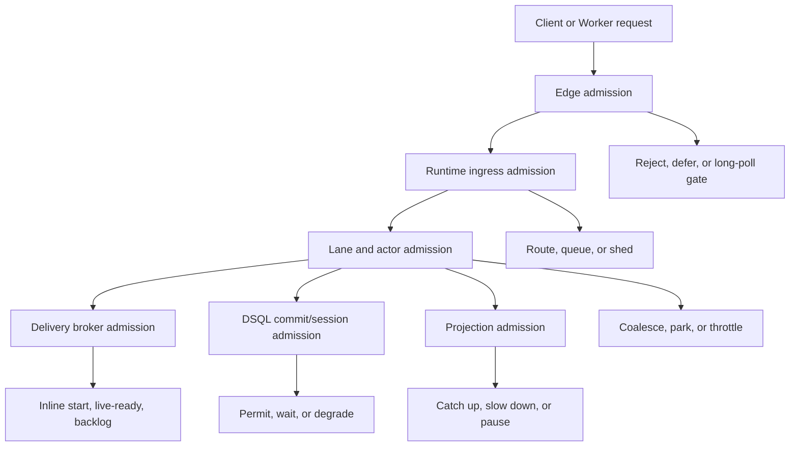
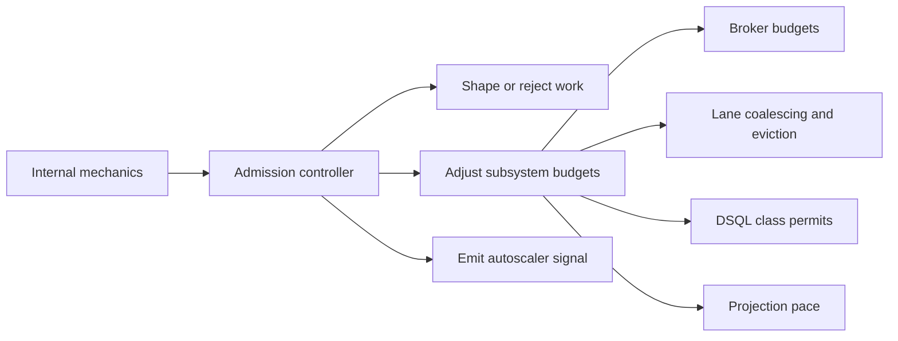

# 055 Admission Control

**Status:** future direction — not yet implemented; spec authors should treat as intent, not decided architecture  
**Decision direction:** preferred  
**Related docs:** [015-configuration](015-configuration.md), [030-runtime-lanes](030-runtime-lanes.md), [040-delivery-broker](040-delivery-broker.md), [050-dsql-storage](050-dsql-storage.md), [060-connection-management](060-connection-management.md), [065-runtime-auto-tune](065-runtime-auto-tune.md), [090-failover-and-recovery](090-failover-and-recovery.md)

## Intent

This note defines how **Tokeira** should control admission, fairness, and overload response **without** exposing a forest of RPS knobs.

The design target is explicit:

> **Admission control should be built into the platform, driven by live mechanics, and expose as little operator tuning surface as possible.**

This is a deliberate reaction against the operational pattern visible in Temporal today, where throughput protection and persistence pressure are spread across many dynamic-configuration knobs, including service-level and namespace-level persistence QPS settings, plus worker-side tuning around pollers, task slots, sticky cache, and queue health metrics.[^temporal-dynamic-config][^temporal-worker-performance][^temporal-worker-health]

Tokeira should not reproduce that model.

## Problem statement

A durable execution platform has to answer a hard question continuously:

> **What work should be admitted right now, what work should wait, what work should be coalesced, and what work should be rejected?**

If the platform does not answer that question explicitly, it answers it implicitly and badly:

- by letting pollers overwhelm edge memory,
- by letting broker backlog starve fresh work,
- by letting read traffic steal DSQL session budget from commits,
- by letting one namespace or one noisy worker dominate shared capacity,
- by asking operators to chase load with manual RPS changes.

Temporal’s own operational guidance already shows the symptoms that appear when these controls are not handled coherently: poll success, sync-match rate, and Schedule-To-Start are treated as key health indicators, and worker tuning guidance still revolves around pollers, slots, sticky cache, and backlog behavior.[^temporal-worker-performance][^temporal-worker-health][^temporal-task-queue]

Tokeira should turn those concerns into **first-class internal control loops**, not into a long operator checklist.

## Design principle

The core rule is:

> **Admission belongs at every resource boundary, but policy should be centralized and mechanically derived.**

That implies four constraints:

1. **Protect correctness first.** Lease renewal, fencing, state transitions, and task-start validation must survive overload longer than reads, projections, and background work.
2. **Prefer shaping and coalescing before rejection.** Rejection is necessary, but it should come after cheaper and more reversible actions when possible.
3. **Do not expose raw RPS knobs unless they are true policy.** A business quota is acceptable; a tuning knob for a persistence subservice is not.
4. **Use real internal mechanics, not generic CPU-only heuristics.** Admission should react to queue depth, lane pressure, live poll count, DSQL session permits, OCC conflict rate, and projection lag.

## What should be configurable

Admission control should follow the configuration philosophy from [015-configuration](015-configuration.md): expose **policy**, not **mechanics**.

### Acceptable operator-facing configuration

- namespace or tenant **service class**,
- hard **capacity envelope** for runtime, edge, and projection fleets,
- optional per-namespace **fairness/isolation policy**,
- break-glass switches for incident response.

### Configuration that should not exist in normal operation

- frontend RPS limits,
- history RPS limits,
- matching RPS limits,
- persistence QPS per service,
- namespace-specific persistence QPS,
- workflow poller count tuning,
- sticky timeout tuning,
- broker live-ready grace tuning,
- per-class DSQL pool sizing,
- backlog spill thresholds.

Those are all mechanical values that Tokeira should derive dynamically.

## The layered admission model

Tokeira should apply admission control at **every meaningful boundary**.



The goal is not to build one giant gate. The goal is to ensure that **each subsystem protects the next one**.

## Admission classes

Tokeira should internally classify work into a very small number of classes.

### Class A — correctness-critical

Examples:

- shard lease renewals,
- shard ownership handoff,
- fenced workflow/activity transition commits,
- workflow/activity task-start transactions,
- failover repair actions needed to restore correctness.

This class should have the strongest protection. If the system is overloaded, other classes degrade before this one.

### Class B — latency-sensitive control plane

Examples:

- start / signal / update ingestion,
- describe / query routing logic,
- namespace resolution,
- worker poll registration and broker handoff.

This class should remain responsive, but it may be shaped when the system is protecting Class A.

### Class C — best-effort read plane

Examples:

- list/count visibility queries,
- operational dashboards,
- non-critical admin reads.

These should slow down or shed before Class A or B is impacted.

### Class D — background maintenance and projection

Examples:

- projection catch-up,
- rollup maintenance,
- archival and repair scans,
- low-priority sweep work that is not blocking correctness.

This is the first class to slow, pause, or shed under storage or connection pressure.

## Edge admission

Edge is the first protection boundary.

### Non-poll API admission

`edge-api` should:

- bound in-flight non-poll requests,
- isolate requests by namespace/service class,
- protect memory and scheduler saturation,
- fail fast when runtime is clearly unavailable.

The important point is that admission happens **before** work is turned into deeper runtime pressure.

### Long-poll admission

`edge-poll` should have an explicit **LongPollGate**.

A long poll should only be admitted if:

- there is open waiter capacity globally,
- the namespace has not exhausted its fair share,
- the task queue is not already dominating the poll fleet,
- the edge process has sufficient memory and event-loop headroom.

A long poll should consume:

- a socket,
- a waiter record,
- a timer/deadline,
- optional runtime broker registration.

It should **not** consume:

- a DSQL session,
- a runtime lane thread,
- durable queue state.

That is the primary defense against the “worker pollers overwhelm Frontend” pattern that operators often see in Temporal.[^temporal-worker-health][^temporal-task-queue]

### Poll overload policy

When `edge-poll` is under pressure, it should respond in this order:

1. reduce per-namespace or per-queue open-poll share,
2. shorten poll admission window,
3. reject excess polls quickly with retryable status,
4. signal autoscaler to add more poll-edge tasks.

The system should never solve poll overload by allowing long polls to spill into correctness-path resources.

## Runtime ingress admission

Once a request is accepted at Edge, runtime still needs its own admission policy.

A runtime node should admit ingress based on:

- shard ownership and local placement,
- per-shard inflight transition count,
- lane mailbox depth,
- hot-run concentration,
- local DSQL session permits,
- current degraded mode.

Runtime ingress is where the platform decides whether work can be handled **now**, should be **queued locally**, or should be **deflected/retried**.

A runtime node should not accept unbounded ingress merely because Edge accepted it.

## Lane and actor admission

The lane is the first place where admission becomes extremely mechanical.

Each lane should track:

- runnable actor count,
- mailbox depth,
- oldest mailbox item age,
- current commit rate,
- local coalescing opportunities.

Lane control should prefer:

1. **coalescing** compatible messages for the same run,
2. **parking** inactive actors quickly,
3. **preventing one run from monopolizing the lane**,
4. **routing new hot work away from already hot nodes via rebalance**.

This is also where signal storms should be absorbed by **bounded coalescing**, not by scheduling one workflow task wake-up per signal.

## Delivery broker admission

The broker needs its own admission and fairness logic because it has three distinct delivery modes:

- inline start,
- live-ready memory tier,
- durable backlog.

The broker should admit work into those tiers based on:

- waiter availability,
- sticky health,
- live-ready occupancy,
- backlog age,
- task queue fairness state.

### Broker actions

The broker’s admissible actions are:

- immediate inline start,
- place in live-ready,
- spill to durable backlog,
- prefer sticky delivery,
- bypass sticky and general-deliver,
- temporarily reduce sticky preference,
- reject or delay new waiters for overloaded queue families.

Fairness should live primarily on the **backlog path**, while sync-match and live-ready remain as lightweight as possible.[^temporal-fairness]

## DSQL admission

Storage pressure must be treated as a first-class admission signal.

Aurora DSQL exposes metrics such as total transaction rate, OCC conflict rate, commit latency, and active sessions.[^dsql-cloudwatch] Tokeira should consume those directly.

The `ConnectionDirector` from [060-connection-management](060-connection-management.md) should enforce session permits for at least these classes:

- `Control`,
- `Commit`,
- `StartTask`,
- `VisibilityRead`,
- `Projection`,
- `Maintenance`.

### DSQL degradation order

Under storage pressure, Tokeira should degrade in this order:

1. slow or pause projection,
2. slow visibility reads,
3. tighten broker backlog writes and keep more work in live-ready where safe,
4. tighten edge poll admission,
5. preserve control and commit permits as long as possible.

The platform should never let visibility or projector traffic steal the last sessions needed for correctness.

## Projection admission

Projection is not on the correctness path, so it should be the easiest part of the system to slow down.

Projection admission should control:

- batch size,
- batch frequency,
- sink concurrency,
- lag target,
- sink pause/resume.

When DSQL or runtime pressure rises, projection should yield first. When the platform recovers, projection can catch up from the durable projection log.

## Fairness and isolation

Admission control is not only about protecting the whole cluster; it is also about preventing one tenant or workload shape from capturing shared capacity.

Tokeira should therefore implement fairness at multiple levels:

- per-namespace edge admission,
- per-task-queue poll share,
- per-namespace broker backlog share,
- per-runtime host connection permit share,
- optional projection sink isolation.

The preferred operator surface here is **service class**, not a hand-tuned RPS table.

For example, a namespace may be classified as:

- `default`,
- `high-priority`,
- `background`,
- `isolated`.

Internally, those classes may influence fair-share weights, but the operator should not need to tune dozens of hidden per-subsystem rate knobs.

## Dynamic admission, not static RPS

The most important design choice is this:

> **Tokeira should steer admission from live mechanics, not from static RPS ceilings.**

A static RPS ceiling is useful only when it expresses a hard business policy. It is a poor substitute for real platform control because the actual bottleneck may be:

- long-poll memory,
- broker live-ready occupancy,
- lane saturation,
- DSQL commit latency,
- OCC conflicts,
- projection lag,
- failover debt.

The same nominal request rate can be harmless or dangerous depending on which internal resource is tight.

## Admission actions available to Tokeira

A good admission system has more than two actions.

Tokeira should be able to:

- admit immediately,
- queue locally,
- coalesce,
- park and defer,
- spill to backlog,
- slow a subsystem,
- temporarily reduce sticky preference,
- reject quickly with retryable semantics,
- trip a subsystem-specific degraded mode,
- request more capacity from `tokeira-autoscaler`.

That richer action set is what lets the platform stay stable without forcing operators into manual tuning loops.

## Feedback loop

Admission control should be tied directly to runtime auto-tune.



This is why admission control and auto-tune should be documented separately but designed together.

## Self-healing under infrastructure failure

Admission also matters during failure.

### Runtime node loss

When a runtime node fails:

- new owner nodes should acquire leases with higher epochs,
- Edge should refresh routing,
- repair sweep should rebuild dispatchable work,
- admission should temporarily tighten on recovering shards so catch-up work does not starve fresh correctness-critical traffic.

### DSQL degradation

When DSQL latency or OCC conflicts rise:

- projection should yield,
- visibility reads should slow,
- poll admission should tighten,
- correctness-critical commit and control permits should be preserved,
- autoscaler may add runtime hosts only if the bottleneck is not purely storage-side.

### Poll flood

When workers over-poll:

- `edge-poll` should reject or limit excess waiters,
- broker should avoid turning poll load into backlog churn,
- runtime should stay insulated from open-poll count,
- autoscaler may add poll-edge tasks if memory/event-loop pressure is the limiting factor.

## The operator experience we want

The operator should experience admission control like this:

- the platform stays stable under floods,
- noisy pollers do not starve normal API traffic,
- visibility may slow before correctness suffers,
- tenant isolation is expressed through a small policy surface,
- manual RPS retuning is rare and exceptional.

If operators regularly need to tweak per-service or per-namespace RPS values, Tokeira has failed this design goal.

## Suggested minimal operator surface

A very small explicit surface is enough:

```yaml
admission:
  namespace_classes:
    default:
      weight: 1
    high_priority:
      weight: 3
    background:
      weight: 1
      preemptible: true

  guardrails:
    max_runtime_hosts: 200
    max_edge_poll_tasks: 300
    max_edge_api_tasks: 80
    max_projection_tasks: 100

  emergency:
    freeze_projection_scale_in: false
    disable_sticky_globally: false
    block_namespace: []
```

Even here, the intention is to configure **policy class** and **envelope**, not low-level knobs.

## Review questions

1. Do we want namespace service classes only, or also task-queue-level isolation classes for large multi-tenant namespaces?
2. Should `edge-poll` have a separate fairness model from `edge-api`, or should they share namespace-level weights with different local realizations?
3. How aggressive should the system be in rejecting excess polls versus holding them briefly in the waiter gate?
4. Do we want a small explicit business-quota API in addition to service classes, or should service class remain the only supported public policy surface initially?

## References

[^temporal-dynamic-config]: Temporal Cluster dynamic configuration reference: https://docs.temporal.io/references/dynamic-configuration  
[^temporal-worker-performance]: Temporal worker performance docs: https://docs.temporal.io/develop/worker-performance  
[^temporal-worker-health]: Temporal worker health docs: https://docs.temporal.io/cloud/worker-health  
[^temporal-task-queue]: Temporal Task Queue docs: https://docs.temporal.io/task-queue  
[^temporal-fairness]: Temporal Task Queue Priority and Fairness docs: https://docs.temporal.io/develop/task-queue-priority-fairness  
[^dsql-cloudwatch]: Aurora DSQL CloudWatch monitoring docs: https://docs.aws.amazon.com/aurora-dsql/latest/userguide/cloudwatch-monitoring.html
