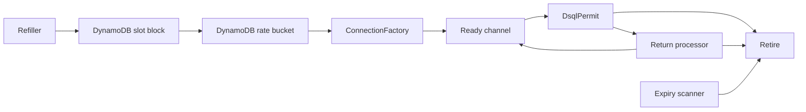

# 060 Connection Management

**Status:** accepted  
**Related docs:** [050-dsql-storage](050-dsql-storage.md), [055-admission-control](055-admission-control.md), [030-runtime-lanes](030-runtime-lanes.md)

## Purpose

Aurora DSQL connection management is a correctness and operability boundary. DSQL has a cluster-wide new-connection rate limit, a cluster-wide active connection limit, and IAM-authenticated sessions with finite safe lifetimes. Tokeira therefore treats the DSQL reservoir as the sole owner of physical database connections. There is no sqlx `PgPool` in the runtime path.

The design goal is simple: commits should either get an already-safe connection or receive immediate storage backpressure. A request should not trigger an unbounded connection-open cascade.

## Reservoir Ownership

The storage crate owns a `Reservoir` per `DsqlStore`. The reservoir owns raw `PgConnection` values created through `aurora_dsql_sqlx_connector::connection::connect_with`. The connector handles IAM token creation internally during connection establishment; Tokeira does not maintain an IAM token cache and does not instrument token refresh directly.

Connection flow:



The reservoir has three background tasks:

- `Refiller`: reserves capacity, waits for a distributed rate token, creates a raw connection, and places it in the ready channel.
- `Expiry scanner`: scans at most half of the target ready channel per pass and retires connections inside the guard window.
- `Return processor`: accepts returned permits and validates only lifetime plus the bad flag. It performs no network ping.

## Admission Path

Every storage operation first acquires a class permit from `ClassBudgets`, then performs a non-blocking reservoir checkout. If the class semaphore is saturated, the operation queues at the class boundary. If the reservoir is empty after admission, the class permit is dropped and `ReservoirError::Empty` is returned immediately.

Default classes match the runtime `DbClass` enum:

- `control`
- `commit`
- `read`
- `projection`
- `maintenance`

The default allocation is derived from the target ready count and preserves at least one permit per class. Commit gets the largest share because the transition log is the authoritative write path.

## Distributed Rate Bucket

Coordination has two modes, selected by the deployment shape rather than configuration: served multi-node `tokeirad` coordinates through the DynamoDB-backed machinery below; a single-owner embedded engine coordinates process-locally (see [Embedded Coordination](#embedded-coordination)).

DSQL connection creation is limited cluster-wide. A local token bucket per process would only move the thundering-herd problem from one process to many processes, so Tokeira uses a DynamoDB-backed token bucket.

The table is `{project}-dsql-rate-limiter` with partition key `pk` and TTL attribute `ttl_epoch`. The global bucket row stores tokens and the last refill timestamp. Refiller tasks use consistent reads and conditional writes. Conditional-write conflicts are expected and treated as retry pressure, not as hard errors.

The required acquisition order is:

1. acquire the local in-flight creation semaphore,
2. reserve one slot through the slot block manager,
3. wait for the distributed token bucket,
4. create the raw DSQL connection.

If any step after slot reservation fails, the slot is released before retry/backoff.

## Slot Block Manager

Active connection budget is coordinated through `{project}-dsql-conn-lease`, also keyed by `pk` with TTL on `ttl_epoch`. Nodes acquire blocks of slots with conditional writes and renew those blocks periodically. A connection that is successfully created consumes exactly one reserved slot until it is retired or discarded.

The invariant is strict: every path that drops a created connection releases exactly one slot.

Slot release happens when:

- refiller fails to place a created connection in the ready channel,
- expiry scanner retires a ready connection,
- expiry scanner cannot requeue a scanned connection,
- return processor discards a bad or guard-window connection,
- return processor cannot place a returned connection back in the ready channel,
- `DsqlPermit::drop` discards a connection that exceeded its lifetime,
- `DsqlPermit::drop` cannot send the connection to the return processor.

If renewal loses a block because another node claimed it, the manager removes the block from local ownership, reduces total slot capacity, emits `tokeira_dsql_slot_block_lost_total`, and continues. Existing in-flight connections are not killed; refill naturally stops if used slots exceed remaining capacity.

## Embedded Coordination

A single-owner embedded engine has no peer processes to coordinate with, so it
constructs no DynamoDB resources. `Engine::embedded()` installs a process-local
coordinator (`ProcessLocalConnectionCoordinator`,
`crates/tokeira-storage/src/dsql/connection_coordinator.rs`): a monotonic token
bucket admits connection creation and an atomic slot budget caps active
connections, behind the same acquire-slot-then-token order the distributed path
uses. The module is deliberately absent from the distributed `tokeirad` path —
the reservoir, rate limiter, and slot-block manager above are unchanged by it.

This applies to every embedded storage mode: in-memory, managed DSQL, and
adopted DSQL. The embedded engine is the sole owner of its cluster's connection
budget, so process-local admission is the whole coordination problem.

## Lifetime Rules

The reservoir uses conservative internal constants:

- target ready connections: 50
- in-flight connection creations: 8
- base lifetime: 10 minutes
- lifetime jitter: up to 2 minutes
- guard window: 45 seconds
- scan interval: 1 second
- scan budget: 25 entries per pass
- warmup timeout: 30 seconds

The safety invariant is:

```text
base_lifetime + lifetime_jitter + guard_window < 15 minutes
```

That ensures the reservoir retires idle/returned connections before they can be handed to new work too close to the DSQL token/session safety boundary. Jitter prevents synchronized mass retirement.

## Schema Commands

Schema setup/status commands do not use the reservoir. They create one raw admin `PgConnection` through `ConnectionFactory` and pass it to the migration runner. This keeps schema operations simple and avoids warming a runtime reservoir for one-off CLI work.

## Metrics

Connection metrics use existing `tokeira_dsql_pool_*` names where a signal already existed. Important signals include:

- `tokeira_dsql_pool_connections_total`
- `tokeira_dsql_pool_checkout_duration_seconds`
- `tokeira_dsql_pool_empty_reservoir_total`
- `tokeira_dsql_pool_connections_created_total`
- `tokeira_dsql_pool_connections_retired_total`
- `tokeira_dsql_pool_connections_returned_total`
- `tokeira_dsql_pool_rate_limiter_tokens`
- `tokeira_dsql_pool_rate_limiter_rate`
- `tokeira_dsql_class_permit_wait_duration_seconds`
- `tokeira_dsql_connection_error_total`
- `tokeira_dsql_slot_blocks_owned`
- `tokeira_dsql_slot_block_lost_total`

These metrics are emitted unconditionally through the `metrics` crate. Operators should read empty-reservoir rate as immediate storage backpressure and slot-block loss as reduced node capacity.

## Shutdown

The reservoir aborts its background tasks on drop. It also exposes explicit shutdown paths through `Reservoir::shutdown`, `DsqlConnectionDirector::shutdown`, and `DsqlStore::shutdown` so embedding code can release DynamoDB slot blocks before dropping the store.
