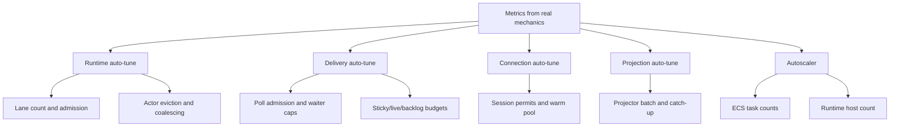
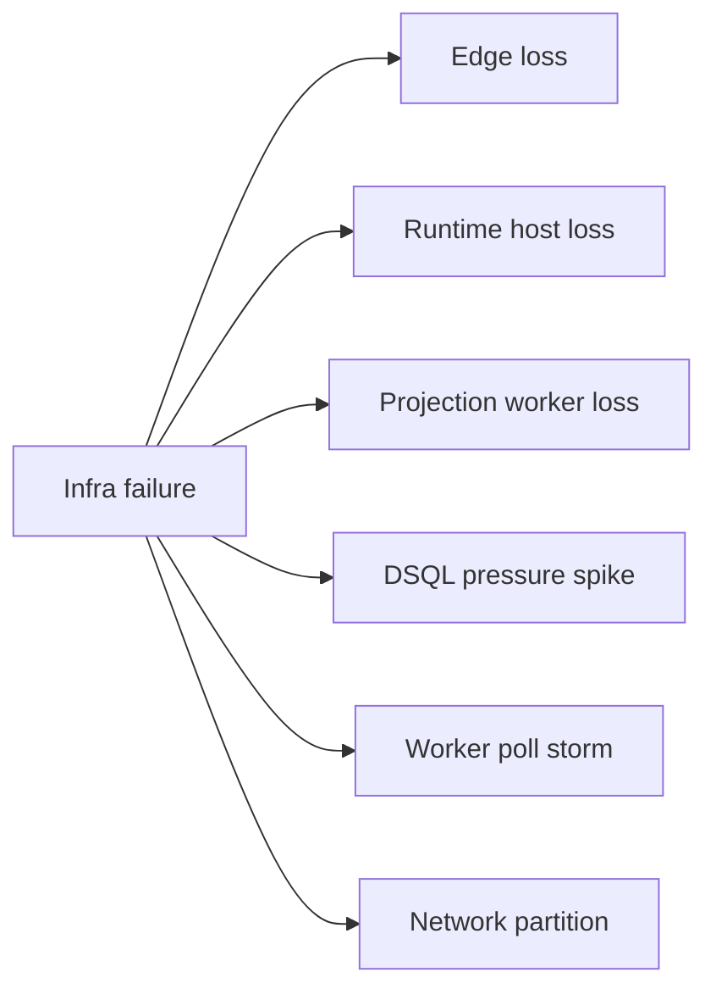

# 065 Runtime Auto-Tune and Self-Healing

**Status:** future direction — not yet implemented; spec authors should treat as intent, not decided architecture  
**Decision direction:** preferred  
**Related docs:** [015-configuration](015-configuration.md), [030-runtime-lanes](030-runtime-lanes.md), [040-delivery-broker](040-delivery-broker.md), [045-autoscaling-on-ecs-ec2](045-autoscaling-on-ecs-ec2.md), [050-dsql-storage](050-dsql-storage.md), [055-admission-control](055-admission-control.md), [060-connection-management](060-connection-management.md), [090-failover-and-recovery](090-failover-and-recovery.md)

## Intent

This note defines how **Tokeira** should react to changing load, changing workflow shape, and infrastructure failures **without** requiring operators to keep retuning knobs.

The design target is:

> **Tokeira should know enough about its own mechanics to tune itself in real time and heal itself when parts of the platform fail.**

That means:

- the system must measure its **real internal mechanisms**, not only external symptoms,
- those measurements must feed explicit control loops,
- the loops must prefer protecting correctness first,
- and most tuning decisions must happen automatically inside bounded envelopes from [015-configuration](015-configuration.md).

## Why this matters

Temporal’s docs provide substantial worker-performance guidance: task slots, worker cache sizing, poller counts, poller autoscaling, schedule-to-start, sync-match rate, backlog signals, and sticky-cache signals are all part of normal operations.[^temporal-worker-performance][^temporal-worker-tuning][^temporal-worker-health]

That is evidence that durable execution systems really do need feedback loops. Tokeira’s difference is not that it needs fewer feedback loops. It is that the loops should live **inside the platform**, not mostly in the operator’s head.

Admission control is one of the primary outputs of those loops: the platform should not only measure load, but continuously decide what to admit, defer, coalesce, slow, or reject. See [055-admission-control](055-admission-control.md).

Aurora DSQL also exposes transactional signals that are directly relevant to these loops, such as `TotalTransactions`, `OccConflicts`, and `CommitLatency`.[^dsql-cloudwatch] Those should feed runtime decisions automatically instead of being treated as dashboards only.

## Design principle

The core rule is:

> **Every subsystem must export the measurements needed to tune itself, and every tuning action must be observable and reversible.**

This implies two design constraints:

1. **Do not hide critical mechanics behind opaque queues or black boxes.**
2. **Do not require static tuning for values that can be learned continuously.**

## Control-loop map

## The system should measure mechanics, not guesses

The platform should emit first-class metrics for the things it actually controls.

### Runtime mechanics

- lane mailbox depth,
- lane runnable-transition count,
- actor activation count and load latency,
- actor eviction rate,
- sweep debt,
- shard skew,
- transition apply latency,
- transition commit latency.

### Delivery mechanics

- open pollers by namespace / task queue,
- poll admission accept/reject rate,
- live-ready hit rate,
- sync-start hit rate,
- backlog spill rate,
- sticky hit / miss / timeout rate,
- reservation expiration rate,
- broker handoff latency.

### Connection mechanics

- available permit count by class,
- active and idle sessions,
- open-rate token utilization,
- recycled session count,
- degraded-mode duration,
- grant utilization.

### DSQL mechanics

- commit latency,
- OCC conflict rate,
- total transaction rate,
- bytes written,
- active sessions.

Aurora DSQL exposes metrics for total transactions, OCC conflicts, commit latency, bytes read/written, and sessions, which makes it possible to tune against real storage pressure instead of indirect approximations.[^dsql-cloudwatch]

### Projection mechanics

- per-sink lag,
- oldest unapplied mutation age,
- apply latency,
- checkpoint age,
- batch size,
- replay retries.

### Edge mechanics

- open long polls,
- API concurrency,
- per-method latency,
- per-method rejection rate,
- namespace fairness pressure,
- route-refresh rate.

## Closed loops by subsystem

## 1. Edge auto-tune

The edge must protect the rest of the system.

For **non-poll** traffic, the edge should watch:

- in-flight requests,
- per-method latency,
- runtime-route error rate,
- namespace-level burst rate.

For **poll** traffic, the edge should watch:

- open long polls,
- per-queue open waiters,
- broker handoff latency,
- poll timeout distribution,
- memory pressure.

Actions the edge should take automatically:

- tighten or loosen per-queue open-poll caps,
- tighten or loosen per-namespace open-poll caps,
- shift namespaces into fair-share admission,
- reject excess pollers early instead of letting them pile up,
- shed low-priority read traffic before write traffic.

This directly addresses a common Temporal pain point: worker pollers can become a major operational variable, and Temporal’s own docs point operators toward schedule-to-start, poll success, and sync-match rate as the tuning signals.[^temporal-worker-health]

## 2. Delivery broker auto-tune

The delivery broker should continuously adjust:

- sticky preference strength,
- live-ready grace window,
- backlog spill threshold,
- sticky/live/backlog scheduling budgets,
- fairness weights across queues.

It should base those actions on:

- sticky hit rate,
- sticky forced timeouts,
- live-ready hit rate,
- backlog age,
- schedule-to-start,
- reservation expiry rate.

The goal is not just “high sync match.” It is:

- low end-to-end latency,
- low unnecessary persistence churn,
- stable fairness under mixed workloads.

Temporal’s task-queue docs note that on partitioned queues, once backlog builds, sync-match rate can collapse because backlog dispatch starts to dominate.[^temporal-task-queue] Tokeira’s broker should explicitly counter that rather than accept it as the steady state.

## 3. Runtime lane auto-tune

The runtime should adapt to profile changes without asking the operator whether a workload is hot, bursty, or dormant.

The lane controller should tune:

- active lanes per process,
- queue-to-lane spread,
- activation concurrency,
- eviction aggressiveness,
- mailbox coalescing window,
- shard rebalance requests.

It should use:

- host CPU saturation,
- executor lag,
- lane mailbox depth,
- actor load latency,
- per-lane runnable work,
- hot-shard skew,
- connection-director backpressure.

The key rule is:

> **inactive runs should become cheap without making active runs slow.**

So, for example:

- if actor load latency is low and memory pressure is high, evict more aggressively;
- if a queue becomes bursty and the same runs reactivate repeatedly, keep them warm longer;
- if one shard becomes much hotter than others, request rebalance before the node degrades.

## 4. Connection auto-tune

[060-connection-management](060-connection-management.md) already defines the node-local connection director and DDB-based budget allocator for DSQL session budgets.

The auto-tune layer around that should adjust:

- warm-pool target,
- per-class permit allocations,
- degraded-mode thresholds,
- reconnect pacing,
- projection-read throttles,
- visibility-read throttles.

These actions should be driven by:

- grant utilization,
- class wait queues,
- DSQL commit latency,
- OCC conflicts,
- active sessions,
- connection open-rate pressure.

The rule is:

- protect **control** and **commit** first,
- protect **task start** second,
- degrade **projection** and **read-only** work before correctness work.

## 5. Projection auto-tune

The projection plane should continuously adapt its own pace.

Adjust automatically:

- projector task count,
- per-sink batch size,
- replay concurrency,
- rollup aggressiveness,
- custom-sink backpressure.

Use:

- per-sink lag,
- oldest mutation age,
- apply latency,
- DSQL write pressure,
- sink-specific error rate.

Projection lag is acceptable; correctness lag is not. So projection should throttle itself whenever DSQL write pressure starts to threaten core execution.

## 6. Autoscaler loop

[045-autoscaling-on-ecs-ec2](045-autoscaling-on-ecs-ec2.md) already takes the preferred route:

> **Use a custom `tokeira-autoscaler` that reads Mimir and writes AWS scaling decisions directly.**

That autoscaler should consume the mechanics above rather than generic CPU-only signals.

Examples:

- scale `edge-poll` on open polls, poll rejects, and broker handoff latency,
- scale `edge-api` on in-flight API load and p99 latency,
- scale projection on lag and apply latency,
- scale runtime hosts on runnable transitions, shard skew, sweep debt, and DSQL headroom.

This keeps the scaling loop aligned with workflow mechanics rather than infrastructure symptoms alone.

## Self-healing model

Auto-tune is only half the story. The other half is self-healing.

## Failure classes

### Runtime host loss

Expected response:

1. shard lease renewal stops,
2. lease expires,
3. another runtime acquires the shard at a higher epoch,
4. sweeper rebuilds dispatchable work from authoritative run state,
5. stale owners cannot commit because epoch fencing rejects them.

### Edge loss

Expected response:

1. ECS replaces failed edge tasks,
2. clients reconnect,
3. open polls are lost but are safe because they were memory-only,
4. workers simply re-poll.

### Projection worker loss

Expected response:

1. ECS replaces the task,
2. projector restarts from its last durable checkpoint,
3. lag grows temporarily but correctness is unaffected.

### DSQL pressure spike

Expected response:

1. connection director enters degraded mode,
2. projection and read-heavy work are throttled first,
3. commit and control classes are preserved,
4. autoscaler may add runtime hosts if that improves queueing,
5. if the issue is OCC contention instead of capacity, runtime requests shard rebalance and broker reduces persistence churn.

### Poll storm

Expected response:

1. edge poll gate clamps admissions,
2. low-priority or excess pollers get early backpressure,
3. broker and runtime continue serving admitted work,
4. autoscaler can add `edge-poll` tasks if the pressure is legitimate capacity demand rather than pathological overpolling.

## Managed degradation order

The system should degrade in this order:

1. optional read paths,
2. projection catch-up speed,
3. background maintenance,
4. poll admission generosity,
5. non-critical API concurrency,

and only then threaten:

6. task start latency,
7. workflow transition commits.

That is the opposite of what happens when every class of traffic competes equally.

## No user-visible tuning loop

The operator should **see** what auto-tune is doing, but should not need to steer it continually.

That means every loop should expose:

- current mode,
- recent decisions,
- decision reason,
- last stable baseline,
- whether a loop is clamped by policy,
- whether a loop is in degraded mode.

In other words, the system should not be “automatic but mysterious.” It should be automatic and explainable.

## Honest boundary: stock SDK workers

There is one hard boundary.

If Tokeira serves unmodified Temporal SDK workers, it cannot directly rewrite worker-internal settings such as local cache size, thread pools, or task-slot implementations inside those external processes. Temporal’s own docs show that these are still worker-side concerns.[^temporal-worker-tuning]

So the auto-tune promise should be phrased carefully:

- **Tokeira can auto-tune the platform itself.**
- **Tokeira can dramatically reduce the need for manual worker/server tuning.**
- **Tokeira cannot fully self-tune arbitrary third-party worker internals unless it also controls the worker runtime.**

If a future Tokeira-managed worker mode exists, that mode can extend the loop further.

## Recommended direction

The preferred direction is:

- keep explicit config minimal,
- make runtime mechanics richly observable,
- encode control loops directly in the platform,
- degrade optional planes before correctness planes,
- and make every auto-tune decision visible and auditable.

That is how Tokeira can be both easier to operate and more adaptive than the current Temporal experience.

## Review questions

1. Should the first release expose auto-tune decisions only in metrics/logs, or also through an admin API?
2. Do we want a “frozen mode” that stops most automatic tuning during incident investigation?
3. Should shard rebalance be fully automatic on skew, or should the controller require a second signal such as sustained lane saturation?

## References

[^temporal-worker-performance]: Temporal worker performance: https://docs.temporal.io/develop/worker-performance  
[^temporal-worker-tuning]: Temporal worker tuning quick reference: https://docs.temporal.io/develop/worker-tuning-reference  
[^temporal-worker-health]: Temporal worker health guidance: https://docs.temporal.io/cloud/worker-health  
[^temporal-task-queue]: Temporal task queues and ordering: https://docs.temporal.io/task-queue  
[^dsql-cloudwatch]: Aurora DSQL observability metrics: https://docs.aws.amazon.com/aurora-dsql/latest/userguide/cloudwatch-monitoring.html
