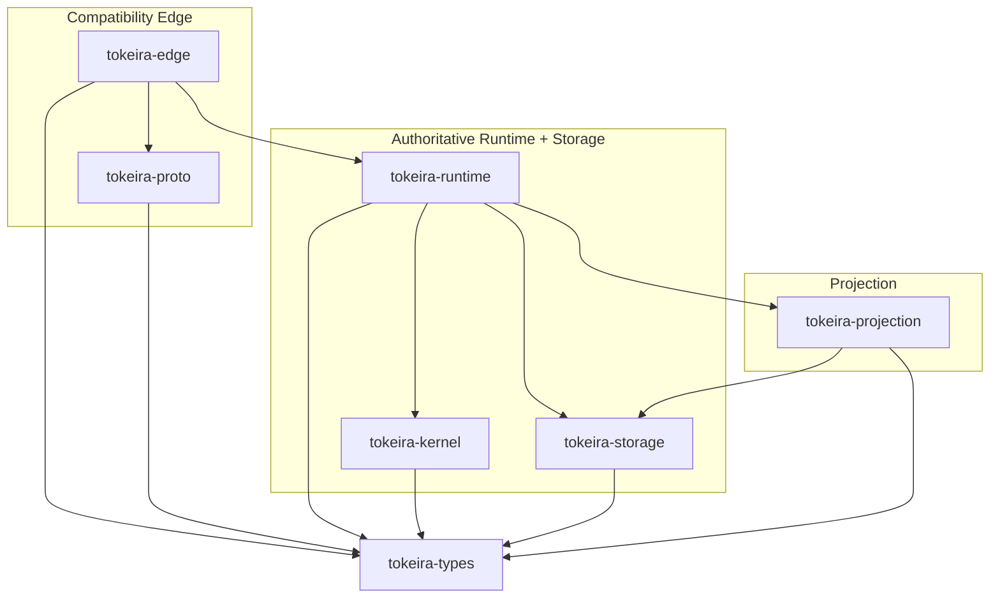
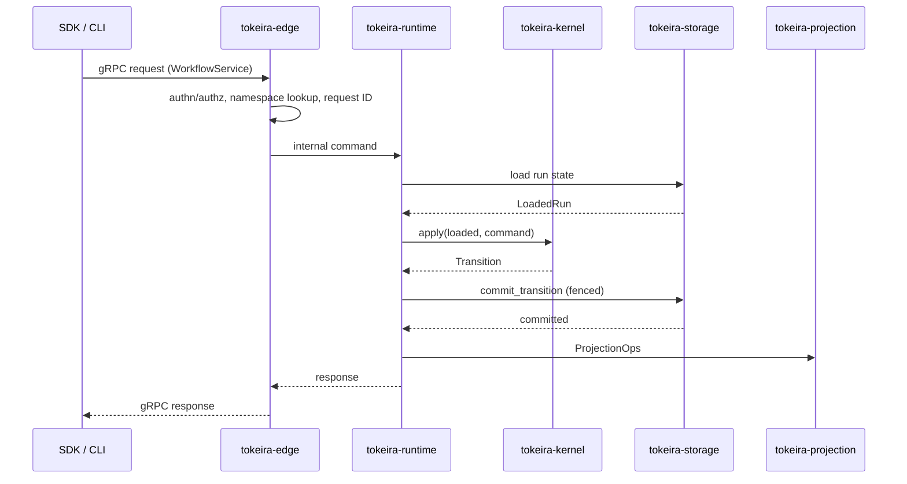

# Crate Reference

This is the navigable reference layer for Tokeira's seven crates. For architectural decision records and design rationale, see [../architecture/](../architecture/).

## Crate Dependency Diagram



## Data Flow



## Three Planes

| Plane | Crates | Owns | Does NOT own |
|---|---|---|---|
| **Compatibility Edge** | `edge`, `proto`, `types` | gRPC surface, authn/authz, namespace lookup, request shaping, proto translation, long-poll gating | Workflow semantics, state transitions, persistence |
| **Authoritative Runtime + Storage** | `kernel`, `runtime`, `storage` | State transitions, history, shard ownership, actor lifecycle, delivery, fenced commits, OCC retry | Visibility queries, proto wire format, public API shape |
| **Projection** | `projection` | Visibility rows, search attributes, rollups, sink checkpoints, replay | Correctness, history authority, delivery |

## Crate Roles

| Crate | Role | Owns | Does NOT own |
|---|---|---|---|
| [`tokeira-types`](types.md) | Shared domain types and identities | `RunKey`, `RunId`, `NamespaceId`, `Payload`, `SearchAttributes`, `QueueKey`, task tokens | Any behavior or I/O |
| [`tokeira-proto`](proto.md) | Wire types and gRPC definitions | Temporal-compatible protos, internal control-plane protos, proto↔domain conversions | Workflow semantics |
| [`tokeira-edge`](edge.md) | Temporal-compatible gRPC shell | `WorkflowService`, `OperatorService`, health, authn/authz, long-poll gating, request ID handling | State transitions, storage |
| [`tokeira-kernel`](kernel.md) | Pure deterministic state machine | Command processing, history event emission, state mutation, transition production | I/O, storage, delivery, routing |
| [`tokeira-runtime`](runtime.md) | Execution orchestration | Shards, lanes, run actors, delivery broker, timer scanner, sweeper, WFT/activity dispatch | State transition logic, persistence details |
| [`tokeira-storage`](storage.md) | Aurora DSQL persistence | Fenced commits, history append, activity/timer state, request dedup, connection management | State transition logic, delivery, projection |
| [`tokeira-projection`](projection.md) | Read-model plane | Projection log consumption, SQL visibility, search attributes, sink checkpoints | Correctness, history authority |


## Temporal API Surface

### WorkflowService RPCs

| RPC | Primary crate | Supporting crates | Notes |
|---|---|---|---|
| `StartWorkflowExecution` | edge → runtime → kernel | storage | `Start` command; creates run + first WFT |
| `SignalWorkflowExecution` | edge → runtime → kernel | storage | `Signal` command; coalesces with pending WFT |
| `TerminateWorkflowExecution` | edge → runtime → kernel | storage | `Terminate` command; hard close, no worker consulted |
| `RequestCancelWorkflowExecution` | edge → runtime → kernel | storage | `Cancel` command; cooperative, two-phase |
| `QueryWorkflow` | edge → runtime | — | Read-only; handled entirely by runtime, kernel not called |
| `UpdateWorkflow` | edge → runtime → kernel | storage | `Update` command; spans two transitions (accept + complete) |
| `PollWorkflowTaskQueue` | edge → runtime (broker) | storage | Long-poll; sync match / live-ready / backlog |
| `RespondWorkflowTaskCompleted` | edge → runtime → kernel | storage | `WorkflowTaskCompleted` command; applies workflow commands |
| `RespondWorkflowTaskFailed` | edge → runtime → kernel | storage | `WorkflowTaskFailed` command; reschedules WFT |
| `PollActivityTaskQueue` | edge → runtime (broker) | storage | Long-poll; activity dispatch |
| `RespondActivityTaskCompleted` | edge → runtime → kernel | storage | `ActivityResolved` command |
| `RespondActivityTaskFailed` | edge → runtime | — | Activity retry handled by runtime, not kernel |
| `RecordActivityTaskHeartbeat` | edge → runtime | storage | Heartbeat processing is runtime-only |
| `ListWorkflowExecutions` | edge → projection | storage | SQL visibility query compilation |
| `CountWorkflowExecutions` | edge → projection | storage | Count over visibility rows |
| `GetWorkflowExecutionHistory` | edge → storage | — | Direct history read |
| `DescribeWorkflowExecution` | edge → runtime/storage | — | Run state + pending entities |
| `ListOpenWorkflowExecutions` | edge → projection | storage | Filtered visibility query |
| `ListClosedWorkflowExecutions` | edge → projection | storage | Filtered visibility query |

### OperatorService RPCs

| RPC | Primary crate | Notes |
|---|---|---|
| `AddSearchAttributes` | edge → projection | Namespace-scoped SA registry |
| `RemoveSearchAttributes` | edge → projection | Registry management |
| `ListSearchAttributes` | edge → projection | Registry read |
| Namespace CRUD | edge | Namespace management |

### Nexus Operations (future)

| Operation | Primary crate | Notes |
|---|---|---|
| Nexus endpoint handling | edge | Inbound Nexus requests |
| `ScheduleNexusOperation` | kernel (workflow cmd) | Outbound Nexus invocation |
| `NexusOperationResolved` | kernel (top-level cmd) | Resolution from runtime |

### Worker Versioning / Deployment (future)

| Feature | Primary crate | Notes |
|---|---|---|
| Build ID routing | runtime (broker) | `QueueKey` carries deployment/build_id |
| Deployment-based dispatch | runtime (broker) | Queue family keyed by deployment compatibility |
| `UpdateExecutionOptions` | kernel | Versioning override on running workflows |

## Request Lifecycle

A typical `StartWorkflowExecution` flows through the system like this:

```
1. Client sends gRPC request
2. tokeira-edge:
   - Validates authn/authz
   - Resolves namespace
   - Assigns request ID if missing
   - Translates proto → internal command
3. tokeira-runtime:
   - Routes to correct shard/lane
   - Loads run state via storage (expects Absent)
   - Checks request dedup via storage
4. tokeira-kernel:
   - apply(LoadedRun::Absent, Command::Start { ... })
   - Produces Transition with:
     - WorkflowExecutionStarted event
     - WorkflowTaskScheduled event
     - ProjectionOp::UpsertExecution
     - DispatchOp::EnqueueWorkflowTask
     - RequestDedupeOp
5. tokeira-storage:
   - Fenced DSQL commit:
     - Insert current_execution
     - Insert workflow_hot
     - Append history batch
     - Insert request_dedupe
6. tokeira-runtime:
   - Publishes ProjectionOps → projection
   - Publishes DispatchOps → delivery broker
   - Attempts sync match with waiting poller
7. tokeira-projection:
   - Consumes ProjectionOp::UpsertExecution
   - Writes vis_execution row
8. tokeira-edge:
   - Translates response → proto
   - Returns to client
```

A typical `PollWorkflowTaskQueue` follows a different path — it never touches the kernel:

```
1. Client sends long-poll
2. tokeira-edge:
   - Validates authn/authz
   - Gates the long poll (no DSQL connection consumed)
3. tokeira-runtime (delivery broker):
   - Registers waiter in memory
   - Checks: sticky match? live-ready task? backlog?
   - On match: start-task transaction via storage
   - Returns task token + history delta
4. tokeira-edge:
   - Translates response → proto
   - Returns to worker
```

## Per-Crate Reference

- [tokeira-types](types.md) — Shared domain types
- [tokeira-proto](proto.md) — Wire types and gRPC definitions
- [tokeira-edge](edge.md) — Temporal-compatible gRPC shell
- [tokeira-kernel](kernel.md) — Pure deterministic state machine
- [tokeira-runtime](runtime.md) — Execution orchestration
- [tokeira-storage](storage.md) — Aurora DSQL persistence
- [tokeira-projection](projection.md) — Read-model plane
