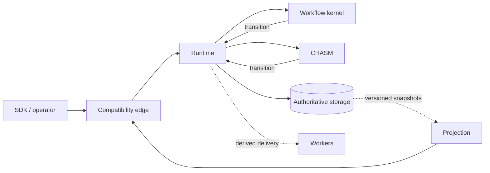

# Published Crate Reference

This directory is the map for Tokeira's published Rust crates. The coverage
rule is simple: every workspace package whose Cargo manifest permits publishing
has a page here. The crate rustdoc remains the detailed API reference; these
pages explain ownership, boundaries, and the contracts that connect crates.

The engine is organised into three planes. Several supporting crates cross
those boundaries without taking ownership away from a plane. See the
[architecture overview](../architecture/000-overview.md) for the full system
shape.

## Compatibility edge — 5 crates

| Crate | Role |
|---|---|
| [`tokeira-auth`](auth.md) | Transport-independent claims, authentication sources, grants, Worker scope, and authorization decisions |
| [`tokeira-compatibility`](compatibility.md) | Canonical feature, SDK, conformance, configuration, and RPC-dispatch compatibility metadata |
| [`tokeira-edge`](edge.md) | Temporal-compatible request admission, routing, translation, and response shaping |
| [`tokeira-proto`](proto.md) | Generated Temporal and Tokeira wire types, service descriptors, and common conversions |
| [`tokeira-types`](types.md) | Shared value types used at and below the compatibility boundary |

## Authoritative runtime and storage — 6 crates

| Crate | Role |
|---|---|
| [`tokeira-chasm`](chasm.md) | Pure component state-machine substrate, parallel to the workflow kernel |
| [`tokeira-chasm-activity`](chasm-activity.md) | Pure standalone-activity component and transition rules |
| [`tokeira-chasm-derive`](chasm-derive.md) | Compile-time `Component` implementation and static field registry generation |
| [`tokeira-kernel`](kernel.md) | Pure deterministic workflow transition engine |
| [`tokeira-runtime`](runtime.md) | Lane execution, CHASM execution, schedules, timers, delivery, and shard orchestration |
| [`tokeira-storage`](storage.md) | Authoritative persistence traits plus in-memory and Aurora DSQL implementations |

## Projection — 1 crate

| Crate | Role |
|---|---|
| [`tokeira-projection`](projection.md) | Derived visibility rows, SQL-native advanced visibility, rollups, and checkpoints |

## Cross-cutting — 5 crates

| Crate | Role |
|---|---|
| [`tokeira-build-info`](build-info.md) | Immutable build, compatibility, toolchain, and schema provenance |
| [`tokeira-config`](config.md) | Typed daemon and embedded-engine configuration, loading, overlays, validation, and secret references |
| [`tokeira-engine`](engine.md) | Embeddable engine facade and the shared `tokeirad` service bootstrap |
| [`tokeira-managed-dsql`](managed-dsql.md) | Crash-safe lifecycle ownership for a dedicated embedded Aurora DSQL cluster |
| [`tokeira-observability`](observability.md) | Shared process-level metrics, tracing, logging, readiness, and telemetry installation |

## How the planes connect

A state-changing workflow request becomes a pure kernel transition and a fenced
authoritative commit. A CHASM request follows the parallel CHASM transition and
node-store path. Delivery and projection are derived effects; neither is the
source of correctness. Runtime-owned schedules create ordinary workflow starts
through the same authoritative path.

`tokeira-engine` composes these contracts in two shapes: a zero-listener
in-process engine and the listener-backed `tokeirad` service. Both use the same
edge handlers and runtime semantics.

## Boundary with deployment crates

This reference covers the published engine and supporting crates. Deployment,
platform, and infrastructure-as-code packages have a different responsibility:
they describe, plan, provision, and operate environments that host the engine.
Use the [IaC framework guide](../iac/README.md) and
[provisioning guide](../provisioning/README.md) for those crates instead of
duplicating their contracts here.

## Pointers

- [Architecture overview](../architecture/000-overview.md)
- [Decisions and boundaries](../architecture/005-decisions-and-boundaries.md)
- [Workspace crate roots](../../crates/)
- [Embedded Tokeira](../../README.md#embedded-tokeira)
