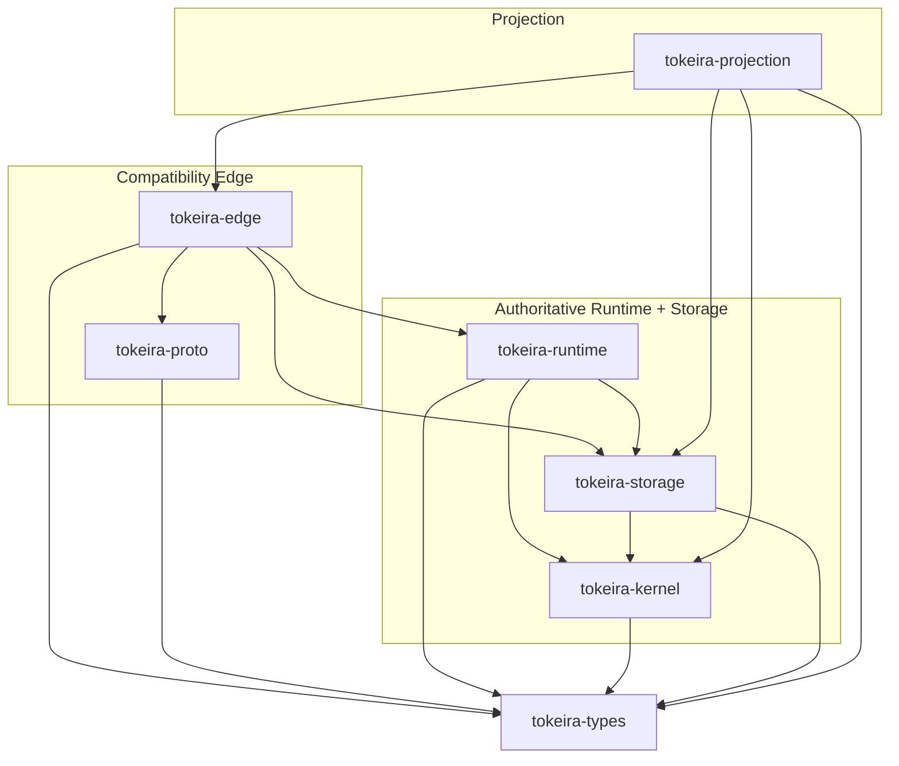
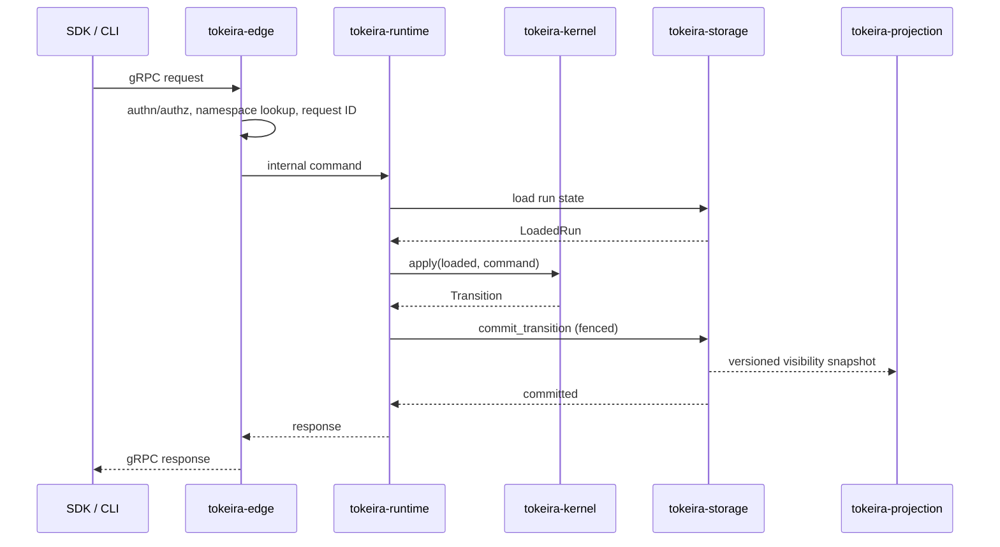

# Crate Reference

Navigable reference for Tokeira's seven crates. For architectural decision records and design rationale, see [../architecture/](../architecture/).

## Crate Dependency Diagram

## Three Planes

| Plane | Crates | Owns | Does NOT own |
|---|---|---|---|
| **Compatibility Edge** | `edge`, `proto`, `types` | gRPC surface, authn/authz, namespace lookup, proto translation, long-poll gating, poller tracking, history long-poll | Workflow semantics, state transitions, persistence |
| **Authoritative Runtime + Storage** | `kernel`, `runtime`, `storage` | State transitions, history, shard ownership, delivery, fenced commits, OCC retry | Visibility queries, proto wire format, public API shape |
| **Projection** | `projection` | Visibility rows, search attributes, rollups, filter compilation, sink checkpoints | Correctness, history authority, delivery |

## Crate Roles

| Crate | Role | Key Contents |
|---|---|---|
| [`tokeira-types`](types.md) | Shared domain types | `RunKey`, `RunId`, `NamespaceId`, `Payload`, `SearchAttributes`, `QueueKey`, task tokens, `RetryPolicy`, `ProjectionCursor` |
| [`tokeira-proto`](proto.md) | Wire types and gRPC definitions | 28 upstream Temporal API packages (v1.62.11), internal proto shells, wire↔domain conversions, timestamp/duration helpers |
| [`tokeira-kernel`](kernel.md) | Pure deterministic state machine | ~27 command variants, 40+ event kinds, `ActivityTaskStarted`, `BasicKernel::apply()`, reset replay |
| [`tokeira-storage`](storage.md) | Persistence interfaces + in-memory store | `RunRepository`, `ProjectionLog`, `LeaseRepository`, OCC fencing, shard-filtered sweeps, `find_latest_run` |
| [`tokeira-runtime`](runtime.md) | Execution orchestration | 15 features: lanes, broker, activity pump, timers, children, nexus, updates, queries, sweeper, fairness |
| [`tokeira-edge`](edge.md) | Temporal-compatible gRPC shell | 26+ RPC handlers, `PollerRegistry`, `HistoryWaitRegistry`, `HistoryNotifyingRepository`, long-poll gating, HTTP proxy |
| [`tokeira-projection`](projection.md) | Read-model plane | `InMemoryVisibilityStore`, `VisibilityQueryService`, `ProjectionWorker`, filter compiler, rollup deltas, typed SA indexes |

## Data Flow

## Codebase Snapshot

| Crate | Source lines | Tests | Status |
|---|---|---|---|
| `tokeira-types` | ~725 | — | Stable |
| `tokeira-proto` | ~508 | — | Stable. 24 upstream packages |
| `tokeira-kernel` | ~3,811 | 221 (153 golden + 68 property) | Stable. All 10 kernel features |
| `tokeira-storage` | ~2,705 | 21 | Stable. In-memory store |
| `tokeira-runtime` | ~13,231 | 125 unit + 37 integration | Complete. All 15 features |
| `tokeira-edge` | ~3,010 | 15 + 1 integration | Stable. 26+ RPC handlers |
| `tokeira-projection` | ~1,500+ | ~15 property + unit | Full visibility pipeline |

## Per-Crate Reference

- [tokeira-types](types.md) — Shared domain types
- [tokeira-proto](proto.md) — Wire types and gRPC definitions
- [tokeira-kernel](kernel.md) — Pure deterministic state machine
- [tokeira-runtime](runtime.md) — Execution orchestration
- [tokeira-storage](storage.md) — Persistence interfaces
- [tokeira-edge](edge.md) — Temporal-compatible gRPC shell
- [tokeira-projection](projection.md) — Read-model plane
