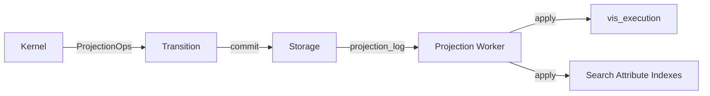

# tokeira-projection

**Purpose:** Read-model plane for visibility, rollups, and custom sinks.

See [070-projection-plane](../architecture/070-projection-plane.md) for the projection architecture and [080-sql-visibility](../architecture/080-sql-visibility.md) for the SQL visibility model.

## What it owns

- **Projection log consumption** — reading committed `ProjectionOp`s from the projection log
- **SQL visibility** — canonical Temporal-compatible list/filter/count behavior
- **Search attributes** — namespace-scoped attribute registry and typed side indexes
- **Execution summaries** — `vis_execution` rows for each run
- **Sink model** — replayable, checkpointed, independent sink workers
- **Rollups** — low-cardinality aggregates for operator dashboards (future)
- **Custom sinks** — tenant-specific or analytics indexes (future)

## What it does NOT own

- **Correctness** — projection can lag without affecting workflow semantics
- **State transitions** — never calls the kernel
- **History** — does not write or own history events
- **Delivery** — does not participate in task matching

## Module Map

```
tokeira-projection/src/
  sink.rs        — sink trait and abstractions
  visibility.rs  — in-memory visibility sink and canonical visibility applier
  worker.rs      — projector worker loop
```

## In-Memory Visibility Sink

The `InMemoryVisibilitySink` implements the `ProjectionSink` trait using an in-memory `HashMap<RunKey, VisibilityRow>` protected by `tokio::sync::Mutex`. It is the primary projection backend for:

- **Integration tests** — verifying that kernel transitions produce correct visibility effects
- **Local development** — running `tokeirad` without a DSQL cluster or SQL visibility tables
- **End-to-end testing** — confirming that the runtime→storage→projection pipeline works

The in-memory sink processes `ProjectionOp`s from committed transitions:

- `UpsertExecution { status, .. }` — creates or updates a visibility row with the execution status
- `CloseExecution { status, .. }` — marks the row as closed with the terminal status

The sink exposes a `get(run_key)` method for test assertions, returning the current `VisibilityRow` (status + closed flag).

This is not the final SQL visibility design. It does not support list/filter/count queries, search attributes, or the full query compiler pipeline described in the architecture docs. Those will be implemented when the canonical SQL visibility sink is built against DSQL.

## How It Consumes ProjectionOps

The kernel emits typed `ProjectionOp`s as part of each `Transition`. After the runtime commits the transition via storage, it publishes these ops to the projection log.



### ProjectionOp Types

| Op | Meaning |
|---|---|
| `UpsertExecution` | Create or update visibility row (start, memo change, SA change) |
| `CloseExecution` | Mark execution as closed with terminal status |
| `SetSearchAttr` | Update a specific search attribute value |
| `SetMemo` | Update memo |
| `DeleteExecution` | Remove from visibility (retention flow, rare) |
| `IncrementRollup` | Update aggregate counters (future) |

## Sink Model

Each sink is independent, replayable, and checkpointed:

```
Sink Worker Loop:
  1. Read next batch from one substream after checkpoint
  2. Apply idempotently to sink storage
  3. Persist advanced checkpoint
  4. Repeat
```

### Checkpoint Model

Each sink keeps an independent checkpoint per projection substream:

```
checkpoint(sink_id, partition_id, fanout) = last_applied_cursor
```

- One lagging sink does not block another
- Backfill is sink-local
- Replay resumes from a known prefix

### Consistency Model

> Each sink sees a prefix of committed transitions in each assigned substream.

Stronger than "eventually consistent" but does not force global total order across unrelated runs.

## SQL Visibility

The canonical sink implements Temporal-compatible visibility using DSQL tables:

### Tables

- `vis_execution` — one row per run with system fields (status, workflow type, task queue, times, etc.)
- `sa_registry` — maps `(namespace_id, attr_name)` → `(attr_id, attr_type)`
- `sa_current` — current value of each custom search attribute per run
- Typed index tables: `sa_keyword_idx`, `sa_int_idx`, `sa_bool_idx`, `sa_datetime_idx`, `sa_double_idx`, `sa_keyword_list_idx`, `sa_text_token_idx`

### Query Compiler

Translates Temporal's list-filter language to DSQL SQL:

1. Parse filter to AST
2. Classify predicates (system row, custom SA, full-text token)
3. Select driver predicate
4. Build candidate `run_key` sets via CTEs/subqueries
5. Join back to `vis_execution`
6. Apply stable pagination

### Supported Operations

| Temporal RPC | Projection action |
|---|---|
| `ListWorkflowExecutions` | Query compiler → DSQL |
| `CountWorkflowExecutions` | Count over candidate sets |
| `ListOpenWorkflowExecutions` | Filtered query (status = Running) |
| `ListClosedWorkflowExecutions` | Filtered query (terminal statuses) |

## Backfill Strategy

Two modes:

1. **Projection-log replay** — preferred when log still exists for the desired range
2. **Authoritative rebuild** — reads canonical run state/history and synthesizes projection ops; slower but always available

## Custom Sinks (future)

The sink trait is designed to support additional consumers:

- **Rollup sink** — low-cardinality aggregates for dashboards
- **Archive/analytics sink** — S3 export, Parquet, columnar backends
- **Custom domain sink** — tenant-specific indexes

## Temporal Feature Coverage

| Feature | Projection participation |
|---|---|
| Visibility | Owns canonical SQL visibility |
| Search attributes | Owns registry and typed indexes |
| List/filter/count | Query compiler for Temporal list-filter language |
| Memo | Stores memo in `vis_execution` for display |
| Execution status | Tracks open/closed status transitions |
| Workflow type / task queue | Indexed in `vis_execution` |
| Custom search attributes | Namespace-scoped, typed side indexes |
| Rollups | Future: aggregate counters |
| Archival | Future: S3 export sink |
