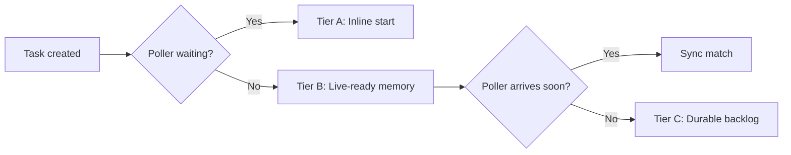

# tokeira-runtime

**Purpose:** Lane-based execution orchestration — the shell around the pure kernel.

See [030-runtime-lanes](../architecture/030-runtime-lanes.md) for the lane model, [040-delivery-broker](../architecture/040-delivery-broker.md) for task delivery, and [090-failover-and-recovery](../architecture/090-failover-and-recovery.md) for fencing and sweepers.

## What it owns

- **Shard ownership** — lease acquisition, renewal, epoch fencing
- **Lane executors** — single-thread execution lanes hosting run actors
- **Run actor lifecycle** — demand-load, drain mailbox, commit, park/evict
- **Delivery broker** — sync match, sticky routing, live-ready tier, durable backlog fallback
- **WFT dispatch** — scheduling workflow tasks to workers via the broker
- **Activity dispatch** — scheduling activity tasks to workers via the broker
- **Sticky routing** — honoring sticky affinity hints from the kernel
- **Timer scanner** — detecting due timers and injecting `TimerDue` commands
- **Sweeper** — reconstructing dispatchable work after failover/restart
- **Activity retry** — re-dispatching failed activities per retry policy (outside kernel)
- **Activity heartbeat** — processing heartbeats and detecting heartbeat timeouts
- **Query dispatch** — routing read-only queries to workers without kernel involvement
- **Mailbox coalescing** — draining multiple items for the same run before parking

## What it does NOT own

- **State transition logic** — that's the kernel
- **Persistence** — that's storage; runtime calls storage APIs
- **Proto translation** — that's edge/proto
- **Visibility queries** — that's projection

## Module Map

```
tokeira-runtime/src/
  runtime.rs  — top-level runtime orchestration
  lane.rs     — lane executor, run actor map, eviction
  broker.rs   — delivery broker, sync match, backlog
```

## Orchestration Flow

The runtime's core loop for a mutation command:

```
1. Receive command (from edge or internal source)
2. Ensure shard ownership (check epoch)
3. Route to lane: hash(shard_id, run_key) mod lane_count
4. Load actor if absent (via storage)
5. Check request dedup (via storage)
6. Call kernel.apply(loaded_state, command)
7. Commit transition (via storage, fenced by expected_seq)
8. Publish DispatchOps → delivery broker
9. Publish ProjectionOps → projection
10. Park or evict actor
```

On OCC conflict at step 7, the runtime reloads state and retries from step 6.

## Topology

```
shard
  → lane (single-thread executor)
    → run actor (demand-loaded)
    → run actor
    → ...
```

- A **shard** is the ownership/fencing unit
- Each shard is assigned to one runtime node
- Each node hosts several **lanes**
- Each run is routed to one lane based on `hash(shard_id, run_key)`
- A lane hosts many run actors and lane-local services

## Delivery Broker

The broker handles worker polling and task matching with three tiers:



- **Tier A (inline start):** If a compatible poller is already waiting, schedule and start the task in one flow
- **Tier B (live-ready):** Short-lived in-memory ready structure; avoids durable backlog for near-future matches
- **Tier C (durable backlog):** Only if the task survives past the live-ready window

This is safe because authoritative pending-task state lives with the run (`workflow_hot.pending_wft`, `activity_state`). If the broker dies, the sweeper reconstructs delivery candidates from authoritative state.

## Queue Family Identity

The broker keys waiters and tasks by:

```
QueueFamilyKey = (namespace, task_queue_name, task_kind,
                  deployment/build_id, optional sticky_target)
```

Workflow tasks and activity tasks are separate task kinds with different tuning.

## Timer Scanner

Background task that:

1. Scans timer buckets for due timers
2. Injects `TimerDue` commands into the run actor's mailbox
3. The run actor then calls `kernel.apply` with the `TimerDue` command

Timer scanning is not authoritative — the authoritative transition happens when the kernel processes the command and storage commits it.

## Sweeper

After restart or shard failover, the sweeper:

1. Scans authoritative state for pending WFTs, dispatchable activities, expired sticky claims
2. Republishes to live-ready or backlog
3. Ensures no work is lost due to broker state being ephemeral

## Actor Cache and Eviction

Eviction policy prefers:

1. Keep actors with a started WFT or immediate follow-on work
2. Keep recently signaled actors briefly for burst coalescing
3. Evict idle parked actors aggressively
4. Evict sticky-affine actors only under cache pressure

## Worker Versioning / Deployment Routing (future)

The `QueueKey` in dispatch ops carries placeholder `deployment` and `build_id` fields. The broker will use these for deployment-aware routing when worker versioning is implemented.

## Nexus Operation Dispatch (future)

The runtime will handle outbound Nexus operation dispatch (triggered by `DispatchOp::ScheduleNexusOperation` from the kernel) and deliver resolution results back as `NexusOperationResolved` commands.

## Temporal Feature Coverage

| Feature | Runtime participation |
|---|---|
| Workflow lifecycle | Orchestrates load → kernel → commit → publish |
| Signals | Routes to run actor, calls kernel |
| Queries | Dispatches to worker directly (no kernel) |
| Updates | Routes to run actor, manages two-phase lifecycle |
| Activities | Dispatches tasks, manages retry, processes heartbeats |
| Timers | Timer scanner detects due timers, injects commands |
| Delivery | Owns sync match, sticky routing, backlog |
| Sticky execution | Broker honors sticky hints from kernel |
| Continue-As-New | Reads close event, issues `Start` for successor |
| Children | Creates child runs, delivers resolution |
| Workflow timeouts | Detects execution/run timeout, issues command |
| Activity timeouts | Detects schedule-to-start, start-to-close, heartbeat timeouts |
| Failover recovery | Sweeper reconstructs dispatchable work |
| Worker versioning | Future: deployment-based broker routing |
| Nexus | Future: outbound operation dispatch |
