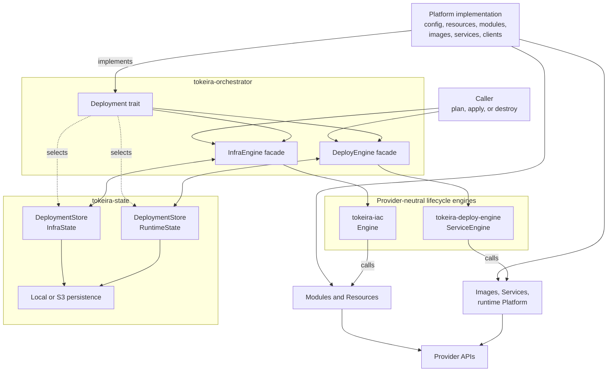
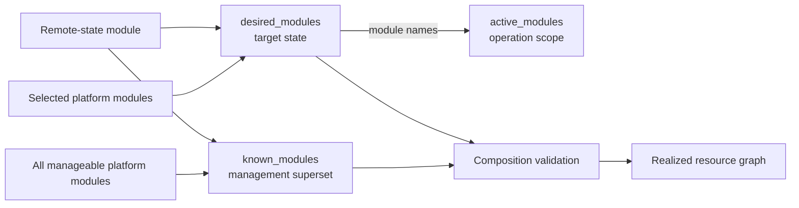
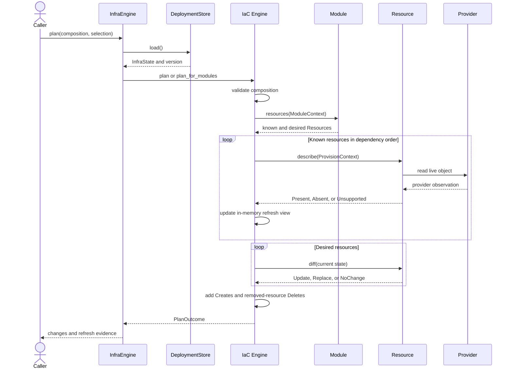
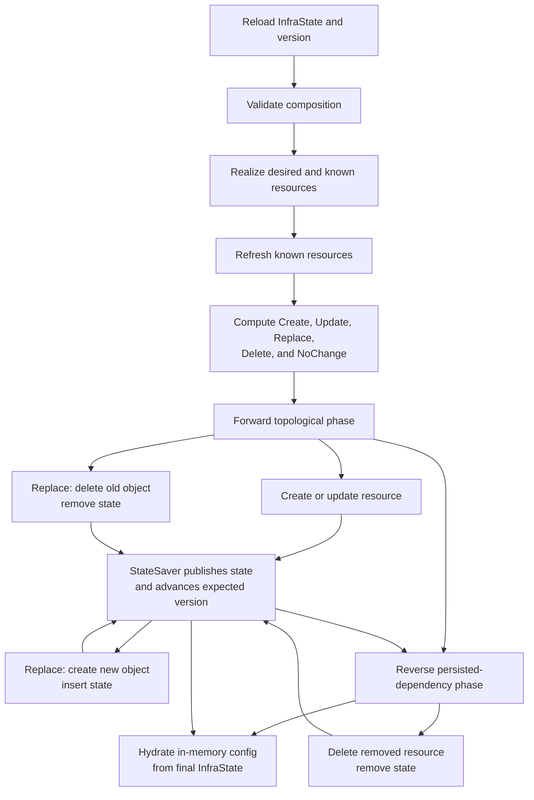
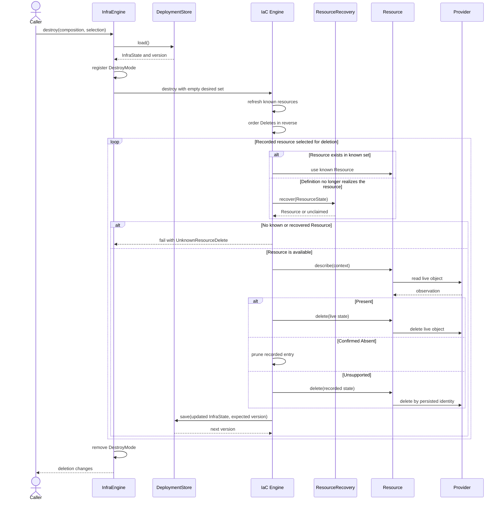
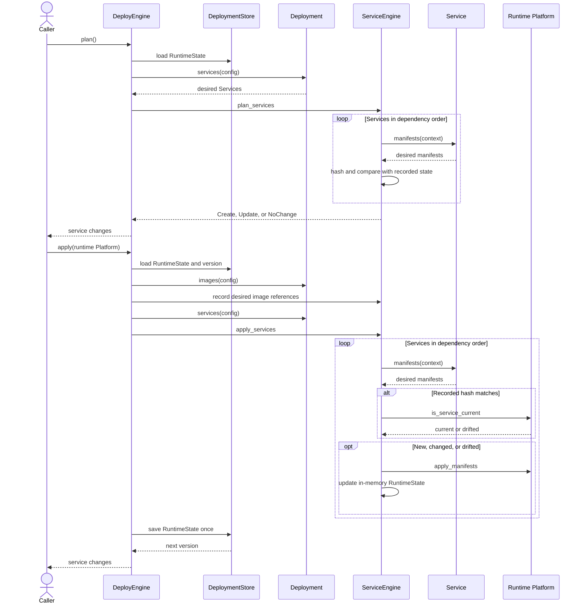

# Infrastructure as code framework

Tokeira's infrastructure as code (IaC) framework reconciles platform-specific desired
state with live provider state. It computes a reviewable plan, applies changes in
dependency order, and records enough state to identify and manage the same resources
on the next operation.

The framework is assembled from four provider-neutral crates:

- `tokeira-iac` defines infrastructure resources, modules, plans, and convergence;
- `tokeira-state` persists versioned deployment-state documents;
- `tokeira-orchestrator` connects a platform implementation to the engines and stores;
  and
- `tokeira-deploy-engine` converges runtime images and service manifests when a
  platform uses a separate workload lifecycle.

Platform crates complete the framework by supplying concrete resources, modules,
services, images, provider clients, and store selection. No single crate owns the
whole lifecycle.

## Mental model

An operation combines three views of a deployment:

1. **Desired state** comes from a platform implementation as typed modules, resources,
   images, and services.
2. **Recorded state** preserves logical identities, provider identities, comparison
   properties, dependency edges, and previous runtime manifests.
3. **Live state** is read from providers during infrastructure refresh and, for runtime
   services, during apply-time currency checks.

The engines are stateless algorithms. The orchestrator loads recorded state, builds the
operation context, calls the appropriate engine, and persists the resulting state.
Concrete platform objects perform provider lifecycle operations.

The arrows are ownership boundaries as well as call paths. `tokeira-iac` does not know
which provider a `Resource` uses. `tokeira-state` does not interpret a resource graph.
`tokeira-orchestrator` does not implement provider behavior. Platform crates do not
reimplement generic planning or persistence coordination.

## Crate responsibilities

### `tokeira-iac`: infrastructure model and convergence

`tokeira-iac` owns the infrastructure vocabulary and stateless lifecycle algorithm:

- `ResourceId`, `ResourceType`, and `ResourceState`;
- `Resource` and `Module` traits;
- `ProvisionContext` and `ModuleContext`;
- `InfraComposition` and module selection;
- change kinds, field-level differences, and change semantics;
- refresh evidence in `PlanOutcome`;
- dependency ordering; and
- infrastructure `plan`, `apply`, `plan_destroy`, `destroy`, and
  `destroy_selected`.

It also defines the `InfraState` and `RuntimeState` document shapes. Defining those
shapes does not make the crate responsible for storing them: persistence is supplied by
the caller through `StateSaver` and `DeploymentStore`.

### `tokeira-state`: document persistence

`tokeira-state` owns generic persistence mechanics:

- the `Validate` boundary for state documents;
- `DeploymentStore<T>`, which loads a document with an opaque version and saves against
  an expected version;
- `CasStore<T>` over a generic `StateBackend`;
- `LocalBackend` for filesystem state;
- `S3StateStore<T>` for manifest-addressed immutable snapshots; and
- operation-lock primitives.

The crate stores bytes and validated documents. It does not decide which resources are
desired, calculate changes, or call resource lifecycle methods.

### `tokeira-orchestrator`: platform integration

`tokeira-orchestrator` defines the `Deployment` contract implemented by a platform and
provides two facades:

- `InfraEngine<D>` connects `Deployment`, `tokeira-iac`, `InfraState`, and an
  infrastructure store.
- `DeployEngine<D>` connects `Deployment`, `tokeira-deploy-engine`, `RuntimeState`, and
  a runtime store.

The orchestrator owns the integration sequence: register typed extensions, create the
platform-selected stores, load state for each operation, compose modules, delegate to a
stateless engine, and persist the result. After infrastructure apply it can hydrate
in-memory platform configuration and expose calculated writeback values to the caller.

### `tokeira-deploy-engine`: runtime manifest convergence

`tokeira-deploy-engine` owns the optional workload lifecycle:

- `Image` and `ImageContext`;
- `Service` and `ServiceContext`;
- the runtime `Platform` interface;
- service dependency ordering;
- manifest hashing and recorded image references; and
- `ServiceEngine` plan, apply, and delete-only behavior.

It does not own `RuntimeState` persistence. `DeployEngine<D>` loads the document before
the operation and saves it after the service loop completes.

### Platform crates: concrete behavior

A platform crate implements the provider-facing side of these contracts. It owns:

- validated platform configuration;
- concrete `Module` and `Resource` implementations;
- concrete `Image`, `Service`, and runtime `Platform` implementations where needed;
- provider clients and credentials;
- infrastructure and runtime store selection;
- output hydration and writeback calculation; and
- the `Deployment` implementation that assembles those parts.

Provider lifecycle calls belong in `Resource::{create, update, delete, describe}` and
runtime `Platform` methods, not in the generic engines.

## Infrastructure model

### Logical resource identity

A `Resource` represents one logical lifecycle and state entry. The entry can correspond
to one provider object or a coordinated bundle that must be reconciled as a unit.

`ResourceId` is the stable key shared by desired configuration, dependency edges, plans,
and `InfraState`. It must not depend on a provider-assigned physical identifier that is
unknown before creation. The physical identifier and provider-specific comparison
properties belong in `ResourceState`.

A persisted `ResourceState` contains:

- the resource type;
- the provider physical identifier;
- provider-specific properties used by later diff and delete operations;
- logical resource dependencies;
- creation and update timestamps; and
- the owning module.

### Resource lifecycle contract

A provider resource implements:

| Method | Responsibility |
|---|---|
| `resource_id` | Return the stable logical identity. |
| `dependencies` | Return logical IDs that must exist first. |
| `module` | Name the owning module. |
| `describe` | Read the provider and distinguish present, confirmed absent, and unknown. |
| `diff` | Purely classify the desired change against current state. |
| `create` | Create or adopt the provider object and return complete state. |
| `update` | Reconcile an existing object in place and return new state. |
| `delete` | Delete the live object identified by persisted state. |
| `change_semantics` | Describe the effects of an already classified change for explanation. |

`describe` returns `DescribeResult`:

- `Present(ResourceState)` means a provider read found the live object;
- `Absent` means a provider read positively confirmed nonexistence; and
- `Unsupported` means existence could not be determined.

Only confirmed absence permits the engine to prune recorded state. A stub, unavailable
client, missing prerequisite, or unsupported provider query must return `Unsupported`,
not `Absent`.

`diff` selects `Update`, `Replace`, or `NoChange` for a desired resource that already
has state. `change_semantics` annotates that decision; it cannot switch an update onto
the replacement execution path.

### Modules and composition

A `Module` is a named resource factory with explicit dependencies on other modules.
The engine expands modules in topological order, then validates and orders the resulting
resource graph independently.

`InfraComposition` carries three module sets:

- **desired modules** describe what should exist after apply;
- **known modules** are everything the platform can manage, including objects that are
  no longer desired but may still require deletion; and
- **active modules** identify the scope of a selected operation.

`InfraEngine::compose` always includes the remote-state module. Selected platform
modules form the desired set; all platform modules form the known set.

Before calculating a delta, the engine rejects duplicate module IDs, desired modules
missing from the known set, module cycles, and duplicate resource IDs. Resource cycles
are rejected when the graph is ordered for refresh or mutation.

Dependencies outside the supplied module or resource set do not participate in that
operation's topological sort. Within the set, ordering is deterministic: ready nodes
are selected alphabetically.

### Typed execution contexts

Provider-neutral crates cannot depend on every provider SDK. The framework therefore
passes provider capabilities through typed extension bags:

- `ProvisionContext` carries `InfraState`, project metadata, progress reporters, and
  infrastructure extensions.
- `ModuleContext` borrows the current infrastructure state and the same infrastructure
  extension map while modules realize resources.
- `ServiceContext` carries service state, infrastructure state, and a separate runtime
  extension map.
- `ImageContext` carries image state and its own extension map.

A platform registers clients, platform handles, validated configuration fragments, or
recovery helpers through `Deployment::register_*_extensions`. Resources and services
retrieve them by concrete type. Registrations are context-local: adding a value to
`ProvisionContext` does not make it available to `ServiceContext` or `ImageContext`.

## Infrastructure plan

Planning reloads recorded state, validates composition, refreshes all known resources,
and calculates a delta for desired resources. It performs provider reads but no provider
create, update, or delete.

`PlanOutcome` contains more than a flat change list:

- per-resource refresh status records whether the provider confirmed live or missing
  state or could not determine it;
- `live_departed` identifies confirmed provider observations that differ from recorded
  properties;
- change semantics and display nouns support operator explanations; and
- known-resource dependency edges preserve the context needed to explain impact.

Plan refresh mutates the in-memory `ProvisionContext`, but the plan path supplies no
state saver. “Read-only plan” therefore means no provider mutation and no state
publication, not no provider I/O.

## Infrastructure apply

Apply begins with the same validation, realization, refresh, and delta calculation as
plan. Mutation then has two ordered phases.

Creates and updates run in forward resource order. A replacement is deliberately split
into two durable transitions: delete and save the absence, then create and save the new
state. If execution stops between them, the next refresh sees a missing desired resource
and resumes with creation instead of trying to update a deleted object.

Deletes run after the forward phase, in reverse order reconstructed from persisted
`ResourceState.dependencies`. Historical dependency information can be incomplete after
configuration changes. Missing edges are tolerated; cyclic or unresolved remnants are
appended in stable sorted order rather than blocking cleanup.

`StateSaver` runs after each successful create, update, or delete and after both state
transitions of replacement. A save failure aborts the operation. The orchestrator's
saver keeps the latest opaque store version and passes it as the expected version of the
next save.

The engine returns all calculated changes, including `NoChange`. Confirmation policy
and rendering belong to the caller; they are not hidden side effects of `Engine::apply`.

## Infrastructure destroy

Destroy treats the desired set as empty, but it still uses the known set to locate
provider behavior. It refreshes known resources, computes deletions for recorded state,
and deletes in reverse persisted-dependency order.

`ResourceRecovery` is the fail-closed seam for state that outlives the configuration
that created it. A platform can reconstruct a deletable resource from `ResourceState`.
If neither the known set nor recovery claims the resource type, the engine refuses to
drop the state entry and orphan the provider object.

`destroy_selected` is a narrower delete-only primitive. It acts only on exact logical
IDs, leaves every other resource untouched, treats IDs absent from state as already
done, and uses the same recovery and reverse-order deletion path. It does not refresh
the full known set first.

## State persistence

The state document types live in `tokeira-iac`; their storage mechanisms live in
`tokeira-state`.

| Document | Records | Persistence cadence |
|---|---|---|
| `InfraState` | Resources, provider identities and properties, dependency edges, outputs, and apply metadata. | Incrementally after infrastructure state transitions. |
| `RuntimeState` | Desired image references, service manifest hashes, and service apply metadata. | Once after a runtime operation completes. |

### Store contract

`DeploymentStore<T>::load` returns a validated document and an opaque version.
`save` validates the document, accepts the version from the load or successful save
that produced it, and returns the next version. A stale expected version returns
`StateError::Conflict`; callers must reload and re-plan rather than force an overwrite.

Missing backing state loads as `T::default()` with an initial empty version so the
remote-state module can bootstrap the backing resource during first apply. An empty
expected version is create-only: it succeeds only while no current document exists.

### Local CAS publication

`CasStore<T>` serializes the complete validated document and delegates versioned
publication to a `StateBackend`. `LocalBackend` uses a SHA-256 hash of the manifest
bytes as its version.

Writers acquire an exclusive lock on a stable sidecar file before checking the expected
version. The lock remains held while a uniquely named temporary manifest is written and
atomically renamed over the published manifest. The sidecar is separate from the
manifest inode so rename cannot allow another writer to bypass the lock. On one host,
concurrent writers using the same expected version therefore admit exactly one success;
the others observe the new hash and return `StateError::Conflict`.

Readers do not take the writer lock. Atomic rename means they observe either the
complete previous manifest or the complete replacement. `LocalBackend` is a
single-host mechanism; it does not provide distributed locking.

### S3 CAS publication

`S3StateStore<T>` keeps immutable full-document snapshots under
`snapshots/<timestamp>-<uuid>.json` and a single mutable `manifest.json` containing the
head pointer and short save lease.

A save proceeds as one version-threaded protocol:

1. validate and serialize the document;
2. load the manifest and verify the caller's expected ETag, using an empty version only
   when no manifest exists;
3. acquire the save lease in the same conditional manifest write that rejects a stale
   expected version;
4. upload a new immutable snapshot;
5. verify the lease token and expiry; and
6. publish the new head and release the lease in one `If-Match` manifest update.

The ETag returned by the final conditional update is the version for the committed
document and is threaded into the caller's next save. A failed final manifest update
can leave an unreferenced immutable snapshot, but it cannot move or corrupt the
committed head. Loads follow the manifest head, verify the snapshot SHA-256 checksum,
deserialize the document, and validate it before returning.

### Operation-level coordination

Per-save CAS protects one state publication. `OperationLock` is a separate renewable
lease over `StateBackend` that can serialize a complete multi-save deployment
operation. The S3 save lease is narrower still: it protects only one snapshot and
manifest publication. These mechanisms complement rather than replace one another.

See [State and convergence](state-and-convergence.md) for state ownership and
interruption behavior.

## Runtime deployment lifecycle

The runtime engine is separate from infrastructure convergence. A platform can use it
when workloads are best represented as images and service manifests rather than as
infrastructure resources.

`Image::desired_ref` contributes a desired repository and tag. The current
`record_images` path records `repository:tag`, source metadata, and a timestamp; it does
not resolve or persist an artifact digest. Artifact build and publication are outside
this engine operation.

`Service::manifests` produces the provider manifests for one service. Manifest
serialization must be stable because its SHA-256 hash is the desired-state comparison
key. Service dependencies are strict: duplicate names, missing dependencies, and cycles
are errors.

Runtime plan performs no live provider check; it compares generated manifest hashes with
recorded state. Apply performs the live `is_service_current` check even when a hash
matches and can promote `NoChange` to `Update`.

Unlike infrastructure apply, runtime apply saves once after the complete service loop.
An interruption can therefore replay services that already succeeded.
`Platform::apply_manifests` must be idempotent.

`ServiceEngine::destroy_services` first verifies that the runtime platform supports
deletion, then deletes in reverse service dependency order and removes service state.
It refuses an unsupported non-empty delete pass before touching any workload.

A platform is not required to use this separate lifecycle. It can model workloads as
infrastructure `Resource`s when that representation better matches its provider. The
framework does not impose a universal infrastructure-then-runtime sequence.

## Extension seams

The framework exposes a small set of explicit extension points:

| Extension | Implement when | Consumed by |
|---|---|---|
| `Resource` | A provider object or bundle needs infrastructure convergence. | `tokeira-iac::Engine` |
| `Module` | Resources need grouping and module-level ordering. | Infrastructure composition |
| `Deployment` | A platform must assemble config, objects, contexts, stores, and outputs. | `tokeira-orchestrator` |
| `Image` | Runtime state needs a desired image reference. | `ServiceEngine::record_images` |
| `Service` | A workload can be expressed as stable manifests. | `ServiceEngine` |
| Runtime `Platform` | Manifests need live inspection, apply, or deletion. | `ServiceEngine` |
| `DeploymentStore<T>` | A platform requires a new state publication mechanism. | Orchestrator facades |
| `ResourceRecovery` | Removed configuration can leave a state-only resource requiring deletion. | Infrastructure delete paths |

`Deployment` is the central assembly seam. It supplies remote-state and infrastructure
modules, runtime services and images, extension-registration hooks, both state stores,
configuration hydration, calculated writeback, and required namespaces.

Typed extensions keep provider clients out of framework dependencies. This is deliberate
inversion of control, not a plugin registry: extension types are compiled platform
contracts, and a missing required extension is a platform integration error.

## Correctness invariants

The mechanics above rely on several invariants:

- Logical resource IDs and module IDs are stable and unique.
- The known module set is a superset of desired modules.
- `describe` reports `Absent` only after a provider confirms nonexistence.
- `diff` and change-semantics calculation are pure and deterministic.
- Provider properties and generated manifests are normalized enough to converge to
  `NoChange` after a successful apply.
- Creates and updates run dependencies first; deletes run dependents first.
- A provider mutation is not considered durably recorded until its state save succeeds.
- Unknown state-only resource types fail closed during deletion.
- Store implementations reject stale publication and validate at persistence boundaries.
- Runtime manifest application is idempotent because runtime state is saved after the
  service loop rather than after each service.
- Platform-specific clients and behavior remain outside provider-neutral crates.

## Further reading

- [State and convergence](state-and-convergence.md) — state domains, refresh evidence,
  ordering, persistence, and interruption behavior.
- [Extending the IaC framework](extending.md) — implementation guidance for resources,
  modules, platforms, stores, and runtime workloads.
- [Engineering reference](../agents/engineering-reference.md#iac-engine-contracts) —
  binding package boundaries and repository recipes.
- [`tokeira-iac` source](../../crates/tokeira-iac/src/lib.rs) — exact infrastructure
  contracts and state document types.
- [`tokeira-state` source](../../crates/tokeira-state/src/lib.rs) — exact persistence
  interfaces and implementations.
- [`tokeira-orchestrator` source](../../crates/tokeira-orchestrator/src/lib.rs) — exact
  platform assembly and facade behavior.
- [`tokeira-deploy-engine` source](../../crates/tokeira-deploy-engine/src/lib.rs) — exact
  runtime image and service contracts.
