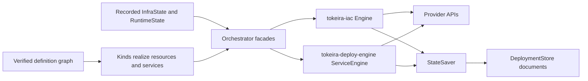

# Infrastructure as code engines

Tokeira has two provider-neutral convergence engines. `tokeira-iac` manages
infrastructure resources, while `tokeira-deploy-engine` manages service manifests and
image records. Both compare desired objects with recorded state, delegate provider work
through explicit traits, and leave persistence to their caller.

This guide is the engine-layer reference. Read
[the IaC architecture overview](../architecture/120-iac-framework.md) first for the
whole system shape, and use [the provisioning guide](../provisioning/README.md) for
deployment creation, `tkr`, the bound `tkp`, revisions, and the deployment repository.
Here the focus is narrower and deeper: resource and service contracts, planning,
mutation order, change semantics, orchestration, and state publication.

## Mental model

Every convergence operation combines three views:

1. **Desired state** is the graph realized from the admitted definition. On the legacy
   path it comes from Rust modules owned by the deployment adapter.
2. **Recorded state** preserves logical identities, provider identities, comparison
   properties, dependency edges, outputs, image references, and service manifest
   hashes.
3. **Live state** is provider evidence. Infrastructure resources return it from
   `describe`; the service engine asks its runtime platform whether an unchanged
   manifest is still current.

Desired state says what should exist. Recorded state says what the last successful
publication knew. Live state says what the provider can prove now. None substitutes for
another.

The engines are stateless algorithms. They mutate an operation-local context and call a
save callback; the orchestration layer owns the actual stores and version tokens.



## Ownership map

| Crate | Owns | Does not own |
|---|---|---|
| `tokeira-iac` | Infrastructure resource and module traits, composition, refresh, delta calculation, ordering, change semantics, `InfraState`, and `RuntimeState` document types | Provider clients, state backends, CLI confirmation, or deployment definitions |
| `tokeira-deploy-engine` | Image, service, and runtime-platform traits; manifest hashing; service ordering; service plan/apply/destroy | State-store selection, deployment admission, or platform discovery |
| `tokeira-orchestrator` | The `Deployment` adapter contract and the `InfraEngine<D>` / `DeployEngine<D>` facades that connect engines to contexts and stores | Definition parsing or provider behavior |
| `tokeira-state` | Validated document persistence, compare-and-swap publication, local and S3 backends, S3 snapshot storage, and operation leases | Resource semantics or desired-state calculation |
| `tokeira-platform` | Platform declarations, definition graphs, namespaces, kinds, and the infra/service realization split | Planning, apply order, state publication, or operator confirmation |
| `tokeira-tkp` | The definition-bound composition path: verification, `DescribedDeployment`, lifecycle gates, and the generated provisioner shell | Provider-specific resource implementations |

Platform packages are descriptions, not orchestrator deployments. A package exports a
pure `platform() -> PlatformDeclaration`; definition nodes realize through its
namespaces. On the bound path the framework supplies the single generic
`DescribedDeployment` implementation and chooses the infra and runtime stores.

The complete production implementor set of `tokeira_orchestrator::Deployment` is:

- `DescribedDeployment`, used by every definition-backed platform;
- `LocalDeployment`, the legacy local in-process adapter; and
- `EcsDeployment`, the legacy ECS in-process adapter.

Compose does not implement `Deployment`. Its package is a `PlatformDeclaration`, its
shape lives in definition documents, and its resource behavior lives in provider kinds.

## From a definition to engine objects

A platform declaration contributes `Namespace` values. Each namespace names its
author-visible kinds and decodes an authored value into `DecodedKind`. The kind realizes
once with invocation placement:

```rust
pub trait Kind<R>: fmt::Debug + Send + Sync {
    fn realize(&self, placement: &PlacementContext) -> Result<R, KindError>;
}
```

The heterogeneous result is either an infrastructure resource or a service:

```rust
pub enum RealizedResource {
    Infra(Box<dyn tokeira_iac::Resource>),
    Service(Box<dyn tokeira_deploy_engine::Service>),
}
```

Realization validates each object through its owning trait, verifies referenced output
names, rejects an infrastructure resource that depends on a service, and separates the
result into infra and service planes. `tokeira-tkp::ExecutionState` then retains:

- module identities and dependency edges;
- the unique dependency-free bootstrap module;
- infra resources grouped by module;
- realized services in declaration order;
- namespaces and writeback declarations;
- the logical-reference-to-`ResourceId` index; and
- canonical desired manifests and configuration identity.

`DescribedDeployment` converts that execution state into the older orchestrator seam.
It is an adapter, not a second desired-state model.

## Infrastructure resource contract

`ResourceId` is the stable join key shared by desired configuration, dependency edges,
plans, and `InfraState`. It must be known before provider creation. A cloud-assigned ID
belongs in `ResourceState::physical_id`, not in the logical ID.

The complete trait is:

```rust
#[async_trait::async_trait]
pub trait Resource: Send + Sync {
    fn resource_type(&self) -> ResourceType;

    fn validate_input(&self) -> Result<(), String> {
        Ok(())
    }

    fn declared_outputs(&self) -> &'static [&'static str] {
        &[]
    }

    fn desired_manifest(&self) -> serde_json::Value {
        serde_json::Value::Null
    }

    fn resource_id(&self) -> ResourceId;
    fn dependencies(&self) -> Vec<ResourceId>;

    fn describes(&self) -> bool {
        true
    }

    fn module(&self) -> &str;

    async fn create(&self, ctx: &ProvisionContext) -> Result<ResourceState, error::IacError>;
    async fn update(
        &self,
        current: &ResourceState,
        ctx: &ProvisionContext,
    ) -> Result<ResourceState, error::IacError>;
    async fn delete(
        &self,
        current: &ResourceState,
        ctx: &ProvisionContext,
    ) -> Result<(), error::IacError>;
    async fn describe(&self, ctx: &ProvisionContext) -> Result<DescribeResult, error::IacError>;
    fn diff(&self, current: &ResourceState, ctx: &ProvisionContext) -> InternalChange;
    fn change_semantics(&self, ctx: &SemanticsContext<'_>) -> ChangeSemantics;

    fn display_kind(&self) -> Option<&'static str> {
        None
    }
}
```

The methods divide into five responsibilities:

| Responsibility | Methods |
|---|---|
| Identity and graph | `resource_type`, `resource_id`, `dependencies`, `module` |
| Definition admission | `validate_input`, `declared_outputs`, `desired_manifest`, `describes` |
| Provider mutation and observation | `create`, `update`, `delete`, `describe` |
| Reconciliation and explanation | `diff`, `change_semantics` |
| Presentation | `display_kind` |

`validate_input` refuses an invalid realized object before a lifecycle method can run.
`declared_outputs` is the allow-list for output references. `desired_manifest` is the
canonical desired evidence retained for definition-backed resources. `describes` says
whether the implementation can perform a real provider query; definition verification
refuses a stub kind before planning.

A persisted `ResourceState` contains the resource type, provider physical ID,
provider-specific comparison properties, logical dependencies, creation and update
timestamps, and owning module. Create and update must return a complete state value
that supports later diff, refresh, recovery, and deletion.

### Three-valued live discovery

`describe` does not return an option:

```rust
pub enum DescribeResult {
    Present(ResourceState),
    Absent,
    Unsupported,
}
```

- `Present(state)` means a provider read found the live object. That state replaces the
  recorded planning view.
- `Absent` means a provider read positively confirmed nonexistence. Only this result
  permits state pruning.
- `Unsupported` means the implementation could not establish presence or absence. The
  engine preserves recorded state; a delete proceeds from the persisted physical
  identity rather than assuming the object is gone.

A missing client, missing prerequisite, permission ambiguity, or stub query is
`Unsupported`, never `Absent`. Deletion is deliberately fail-closed: uncertainty cannot
turn a live provider object into an untracked orphan.

### Diff and replacement

For a desired resource with current state, `diff` returns an `InternalChange` that
flattens to one of:

```rust
pub enum ChangeKind {
    Create,
    Update,
    Replace,
    Delete,
    NoChange,
}
```

`Replace` is delete-then-create for an immutable-field change. It is not a more severe
label on an update; it selects a different execution path. Both `Delete` and `Replace`
are destructive, and `destructive_changes` / `plan_is_destructive` expose that class to
the shell's confirmation gate.

`diff` must be pure. Provider reads belong in `describe`, and provider writes belong in
the lifecycle methods.

## Change semantics

`ChangeKind` tells the engine what reconciliation path to execute. `ChangeSemantics`
tells the operator what that path means for the running resource. A resource cannot
turn `Update` into `Replace` through semantics; it must return `Replace` from `diff`.

The shared vocabulary is:

```rust
pub enum LifecycleOperation {
    Created,
    UpdatedInPlace,
    Replaced,
    Deleted,
}

pub enum ReplacementPolicy {
    NotRequired,
    CreateBeforeDestroy,
    DestroyBeforeCreate,
}

pub enum Disruption {
    None,
    Rolling,
    BriefInterruption,
    UnavailableDuringChange,
}

pub enum DataEffect {
    NoDataHeld,
    Preserved,
    Migrated,
    Destroyed,
    Policy,
}

pub enum Reversibility {
    Reversible,
    ReversibleWithDataLoss,
    Irreversible,
}
```

Each field carries an explicit confidence grade:

```rust
pub enum Confidence<T> {
    Unknown,
    Inference { value: T, citation: Citation },
    EngineFact { value: T, citation: Citation },
    ProviderGuarantee { value: T, citation: Citation },
}

pub struct ChangeSemantics {
    pub operation: Confidence<LifecycleOperation>,
    pub replacement: Confidence<ReplacementPolicy>,
    pub disruption: Confidence<Disruption>,
    pub data_effect: Confidence<DataEffect>,
    pub reversibility: Confidence<Reversibility>,
    pub statement: Option<Cow<'static, str>>,
    pub provider_assigned: Vec<Cow<'static, str>>,
}
```

Every confidence field defaults to `Unknown`. Every non-unknown grade carries a
`Citation`: `EngineFact` cites code, `ProviderGuarantee` cites provider documentation,
and `Inference` cites the facts from which the engine derived it. The type therefore
prevents an uncited confident claim. `provider_assigned` names creation values that
cannot be known until apply, such as a provider-generated endpoint.

`change_semantics` is required, pure, and total. It receives the computed `ChangeKind`,
the current state when one exists, and the field-level differences. `NoChange` has no
semantics entry because there is no operation to explain.

## Modules, contexts, and composition

A module groups resources and gives the operator a stable selection unit. Its exact
trait is async-annotated even though its current methods are synchronous:

```rust
#[async_trait::async_trait]
pub trait Module: Debug + Send + Sync {
    fn name(&self) -> &str;
    fn dependencies(&self) -> Vec<&str>;
    fn resources(&self, ctx: &ModuleContext) -> Result<Vec<Box<dyn Resource>>, IacError>;
}
```

Module dependencies are module names, not resource IDs. The engine sorts modules before
calling `resources`; it then sorts the realized resource graph independently. Cycles in
either supplied graph are errors, and ready nodes are selected in stable lexical order.

Provider-neutral crates cannot depend on every provider SDK, so contexts carry typed
extension bags:

- `ProvisionContext` carries `InfraState`, deployment identity, tags, progress hooks,
  and infrastructure extensions.
- `ModuleContext` borrows the current infra state and the same infrastructure
  extensions while modules enumerate resources.
- `ServiceContext` carries `RuntimeState`, the preceding `InfraState`, and deploy
  extensions.
- `ImageContext` carries runtime state and image extensions.

The bags are separate. Registering a Docker or AWS handle in `ProvisionContext` does
not make it available to a service or image.

`InfraComposition` keeps three sets:

```rust
pub struct InfraComposition {
    pub desired_modules: Vec<Box<dyn Module>>,
    pub known_modules: Vec<Box<dyn Module>>,
    pub active_modules: Vec<String>,
}
```

- **Desired** is what should remain after apply.
- **Known** is everything this execution can manage, including objects that are no
  longer desired but still need refresh or deletion. It must contain every desired
  module.
- **Active** is the current operation scope used for module filtering.

The framework always includes the definition's unique dependency-free bootstrap module.
A named `ModuleSelection::Only` expands before composition: plan and apply include all
transitive prerequisites; destroy includes all transitive dependants. An empty or
unknown named selection is refused with the supported module names.

## Infrastructure plan

The bound plan path performs these steps:

1. Evaluate the admitted definition, verify the structural graph, realize its kinds,
   and run `verify_resources`. A kind with `describes() == false` or a dangling resource
   edge is refused before a provider operation.
2. Probe the platform. A reported `PlatformIssue` blocks the plan and produces no
   changes.
3. Open `InfraEngine<DescribedDeployment>`, load `(InfraState, version)` from the
   `DeploymentStore`, and expand any module selection toward prerequisites.
4. Validate composition: unique module IDs, every desired module present in known,
   an acyclic module graph, and unique resource IDs.
5. Realize desired and known resources, order the known graph, and call `describe` on
   every known resource.
6. Compute `Create`, `Update`, `Replace`, `Delete`, or `NoChange` from the refreshed
   in-memory view.
7. Return the plan and evidence. Plan supplies no `StateSaver`, so confirmed absence
   changes only the planning view.

A provider issue raised during resource refresh also blocks the plan. The engine
restores the pre-refresh recorded view and returns the issue rather than manufacturing
changes from stale state.

`PlanOutcome` is an evidence bundle, not a change vector:

```rust
pub struct PlanOutcome {
    pub changes: Vec<Change>,
    pub refresh: RefreshCoverage,
    pub semantics_by_id: BTreeMap<ResourceId, ChangeSemantics>,
    pub display_by_id: BTreeMap<ResourceId, String>,
    pub edges_by_id: BTreeMap<ResourceId, Vec<ResourceId>>,
    pub platform_issues: Vec<PlatformIssue>,
}
```

`RefreshCoverage` records whether refresh ran, each resource's status, and
`live_departed`: confirmed live properties or absence that differ from the recorded
view. Semantics and display nouns explain what each change means. Known-set dependency
edges remain unfiltered so an explanation can include unchanged dependants. A non-empty
`platform_issues` list means `changes` is empty.

Planning is read-only with respect to workload and state publication, but it is not
offline. Infrastructure plan performs provider reads; service plan can resolve
platform-owned prerequisites such as image-cache population.

## Infrastructure apply

The bound shell runs the operation-marker, binding, and create-time retarget gates
before provider mutation. Without `--yes`, it also plans and refuses if any `Delete` or
`Replace` is present. With `--yes`, the operator has already confirmed the destructive
class and the shell does not pay for a separate confirmation plan.

The engine then:

1. Reloads `InfraState` and its opaque store version.
2. Repeats composition validation, resource realization, and live refresh. A
   `PlatformIssue` is a hard error on a mutating verb.
3. Persists a confirmed missing known-but-not-desired resource during refresh.
4. Computes the delta.
5. Runs creates, updates, and replacements in forward resource order.
6. Runs deletes in reverse order reconstructed from persisted dependency edges.
7. Calls `StateSaver` after every successful state transition.

A replacement has two durable transitions. The engine deletes the old object, removes
its state, and saves; it then creates the replacement, inserts the new state, and saves
again. If execution stops between the saves, the next refresh sees a missing desired
object and resumes with creation.

Deletion ordering uses persisted edges because the current definition may no longer
contain the removed resource. Missing historical edges are tolerated. Cyclic or
unresolved remnants fall back to stable order so cleanup can continue, but the actual
delete remains fail-closed: the engine needs a known resource or a `ResourceRecovery`
that claims the persisted type.

The orchestrator's saver retains the latest version returned by `DeploymentStore::save`
and uses it for the next publication. A conflict or any save failure aborts the
operation; callers reload and re-plan rather than overwriting.

## Infrastructure destroy

Destroy is not apply with a convenient flag. The shell requires `--yes`, applies its
marker and binding gates, probes the platform, and expands a selected module toward its
dependants so nothing remains standing on a removed module.

The engine treats desired as empty, refreshes known resources, and calculates deletes
from recorded state. Immediately before each delete it calls `describe` again:

- `Present(live)` deletes using the fresh live state;
- `Absent` prunes the recorded entry; and
- `Unsupported` calls `delete` with the persisted state.

Deletes run in reverse dependency order and save after each removal. If a recorded
resource is absent from the known graph, `ResourceRecovery` may reconstruct a deletable
object from its `ResourceState`. If neither path can claim it, the engine returns
`UnknownResourceDelete` instead of dropping the state entry.

`destroy_selected_in` is the narrower rollback primitive. It touches only exact logical
IDs, treats an ID absent from state as already complete, and uses the same recovery,
reverse-order, and incremental-save path without refreshing the full known set.

## Orchestrator adapter contract

The orchestrator retains one adapter trait so both the definition-backed and legacy
paths can use the same facades:

```rust
#[async_trait]
pub trait Deployment: Send + Sync {
    type Config: Send + Sync + Clone + 'static;

    fn remote_state_module(
        &self,
        config: &Self::Config,
        deployment_dir: &Path,
    ) -> Box<dyn iac::Module>;
    fn infra_modules(
        &self,
        config: &Self::Config,
        selection: &iac::ModuleSelection,
    ) -> Vec<Box<dyn iac::Module>>;
    fn services(&self, config: &Self::Config) -> Vec<Box<dyn deploy_engine::Service>>;
    fn images(&self, config: &Self::Config) -> Vec<Box<dyn deploy_engine::Image>>;
    fn required_namespaces(&self, config: &Self::Config) -> Vec<String>;
    async fn register_infra_extensions(
        &self,
        config: &Self::Config,
        ctx: &mut iac::ProvisionContext,
    ) -> Result<()>;
    async fn register_deploy_extensions(
        &self,
        config: &Self::Config,
        ctx: &mut deploy_engine::ServiceContext,
    ) -> Result<()>;
    async fn register_image_extensions(
        &self,
        _config: &Self::Config,
        _ctx: &mut deploy_engine::ImageContext,
    ) -> Result<()> {
        Ok(())
    }
    fn create_infra_store(
        &self,
        config: &Self::Config,
        deployment_dir: &Path,
    ) -> Box<dyn DeploymentStore<iac::InfraState>>;
    fn create_deploy_store(
        &self,
        config: &Self::Config,
        deployment_dir: &Path,
    ) -> Box<dyn DeploymentStore<iac::RuntimeState>>;
    fn hydrate_config(&self, config: &Self::Config, state: &iac::InfraState) -> Self::Config;
    fn collect_writeback(
        &self,
        config: &Self::Config,
        state: &iac::InfraState,
    ) -> Vec<(String, String)>;
}
```

On the bound path, `DescribedDeployment` derives modules and services from
`ExecutionState`, delegates extension registration to `PlatformIntegration`, selects
framework-standard local stores under the deployment directory, keeps hydration as the
identity function, and resolves only definition-declared writebacks. A platform package
does not implement this trait or select these stores.

The legacy `LocalDeployment` and `EcsDeployment` adapters still construct their own
modules, stores, and writeback through this trait. That is compatibility surface, not the
extension recipe for a new platform.

## Service and image convergence

The definition realization boundary sends service kinds to the deploy plane. A service
has its own admission methods as well as manifest behavior:

```rust
pub trait Service: Debug + Send + Sync {
    fn resource_type(&self) -> &'static str;
    fn validate_input(&self) -> Result<(), String> {
        Ok(())
    }
    fn declared_outputs(&self) -> &'static [&'static str] {
        &[]
    }
    fn name(&self) -> &str;
    fn module(&self) -> &str;
    fn dependencies(&self) -> Vec<&str>;
    fn manifests(&self, ctx: &ServiceContext) -> Result<Vec<serde_json::Value>, RuntimeError>;
}
```

Manifest serialization is the desired comparison key, so generation must be stable.
Service names must be unique, every dependency must exist, and cycles are errors.

The bound service plan uses `plan_services_with_platform`. For each service in dependency
order it generates manifests, calls `Platform::prepare_service`, hashes the manifests,
compares the hash with `RuntimeState`, and calls `is_service_current` when the hash
matches. Preparation may populate an image cache but must not mutate the running
workload.

Apply repeats that per-service sequence. A create, changed hash, or detected live drift
calls `apply_manifests`, updates `RuntimeState`, and saves immediately before moving to
the next service. If every service is unchanged, the orchestrator still saves once so
newly recorded image references are persisted. Service replay must be safe because a
provider mutation can succeed before its save fails.

Destroy first refuses if any recorded service is absent from the current definition;
the manifest bodies required for deletion must be reproducible. It then checks
`Platform::supports_delete` for the complete pass, deletes in reverse service dependency
order, and saves after each successful removal.

`Image::desired_ref` contributes a repository, tag, and optional upstream reference.
`record_images` currently stores `repository:tag`, source metadata, and a timestamp; its
digest field remains `None`. Runtime state is therefore not proof that an image was
built, mirrored, or published.

## Two `Ops` traits

Two unrelated traits are named `Ops`:

- `tokeira_platform::declaration::Ops` is the definition-backed platform surface. It
  implements `log_stream`, `port_mappings`, and `scale` over `DeploymentRef { name,
  dir }`.
- `tokeira_orchestrator::Ops` is the legacy in-process surface. It owns a `Config`
  associated type and implements valid-service enumeration, desired replicas,
  `scale_up`, `scale_down`, `logs`, and `port_mappings` over that config.

New platform packages implement the declaration trait when they expose live operations.
Naming the module with the trait avoids confusing the current and legacy contracts.

## State seam

Both orchestrator facades hold the same generic store contract:

```rust
#[async_trait]
pub trait DeploymentStore<T>: Send + Sync {
    async fn load(&self) -> Result<(T, String), StateError>;
    async fn save(&self, doc: &T, expected_version: &str) -> Result<String, StateError>;
}
```

The string is an opaque version. A missing store loads a valid default document and an
empty version; an empty expected version is create-only. A stale version returns
`StateError::Conflict`.

Infrastructure saves after every mutation and after confirmed pruning during a
mutating refresh. Service apply and destroy save after every changed service. The
framework-standard bound path uses `CasStore` over `LocalBackend` for both documents;
legacy ECS selects `S3StateStore`. The complete persistence and locking protocols are
in [State and convergence](state-and-convergence.md).

## Correctness invariants

- Logical resource IDs, module names, and service names are stable and unique.
- Known modules contain every desired module.
- A kind with no real `describe` does not reach a definition-backed plan.
- `Absent` is returned only after a provider confirms nonexistence.
- `diff`, `change_semantics`, desired manifests, and service manifests are deterministic.
- `Replace` is selected by `diff` and executes as two durable transitions.
- Creates and updates run dependencies first; deletes run dependants first.
- A state-only resource or service is never forgotten merely because its current
  definition is missing.
- Store versions are threaded from the exact document read or save that produced them.
- Platform clients and behavior remain outside provider-neutral engine crates.

## Further reading

- [State and convergence](state-and-convergence.md) — refresh evidence, document
  ownership, CAS publication, snapshots, and operation locks.
- [Extending the IaC framework](extending.md) — kinds, namespaces, platform
  declarations, definitions, and provider implementation guidance.
- [IaC architecture overview](../architecture/120-iac-framework.md) — the full
  platform-as-description and bound-provisioner shape.
- [Provisioning](../provisioning/README.md) — deployment creation, revisions,
  repositories, and the `tkr`/`tkp` boundary.
- [`tokeira-iac` source](../../crates/tokeira-iac/src/lib.rs) and
  [engine](../../crates/tokeira-iac/src/engine.rs) — exact infra contracts and
  algorithms.
- [`tokeira-deploy-engine` source](../../crates/tokeira-deploy-engine/src/lib.rs) —
  exact service and image contracts.
- [`tokeira-orchestrator` source](../../crates/tokeira-orchestrator/src/lib.rs) —
  adapter and facade contracts.
- [`tokeira-state` source](../../crates/tokeira-state/src/lib.rs) — persistence
  implementations.
