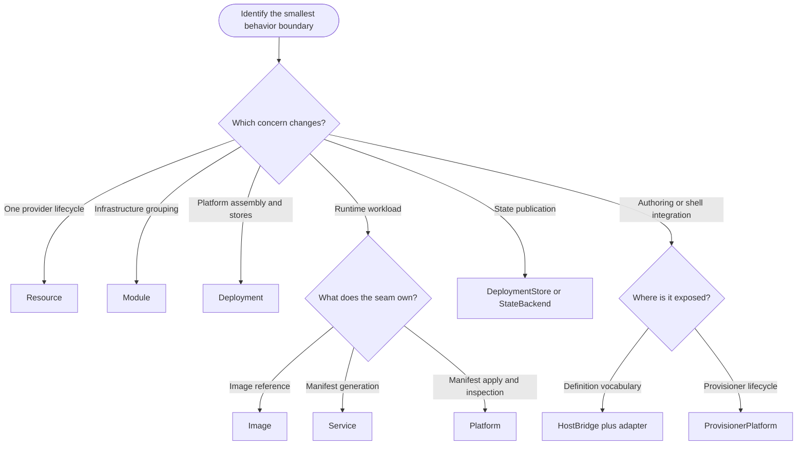
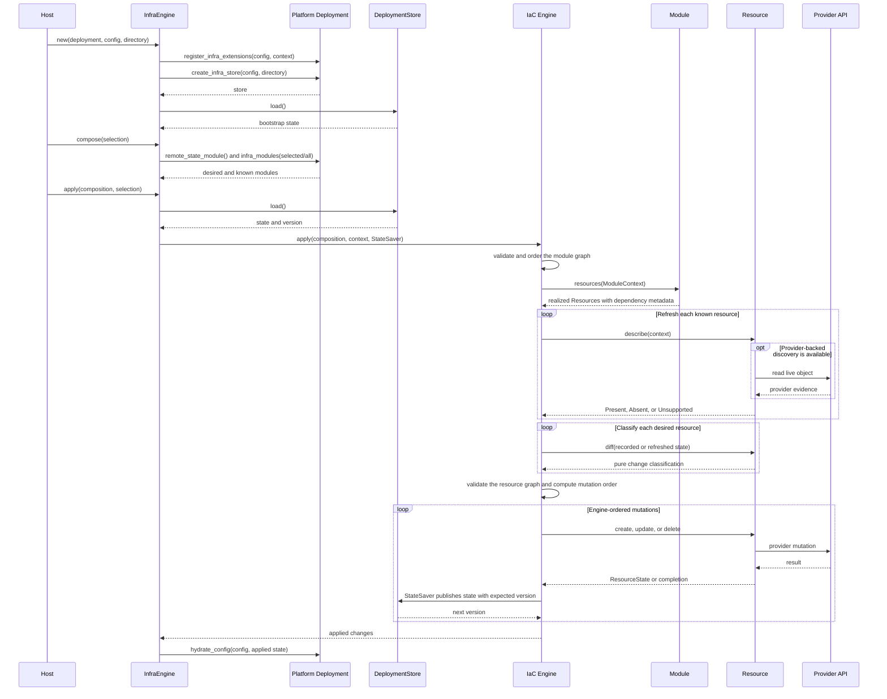

# Extending the IaC framework

Extend Tokeira's IaC framework by adding provider behavior at an existing seam, not by
adding provider knowledge to the framework crates. `tokeira-iac` and
`tokeira-deploy-engine` remain provider-agnostic; concrete API clients, resource
models, manifests, credentials, and recovery logic belong in platform crates.

The binding package-boundary rules and short recipes are in the
[engineering reference](../agents/engineering-reference.md). This guide explains how
to choose and implement the seams those recipes name.

## Choose the smallest extension seam

| Need | Extension seam | Typical owner |
|---|---|---|
| Manage one logical provider lifecycle | `tokeira_iac::Resource` | Platform crate |
| Group related infrastructure resources | `tokeira_iac::Module` | Platform crate |
| Connect platform config, modules, workloads, stores, and writeback | `tokeira_orchestrator::Deployment` | Platform crate |
| Describe an image reference for runtime state | `tokeira_deploy_engine::Image` | Platform crate |
| Generate a workload manifest | `tokeira_deploy_engine::Service` | Platform crate |
| Apply and inspect service manifests | `tokeira_deploy_engine::Platform` | Platform crate |
| Add deployment-definition vocabulary | `tokeira_tkd::HostBridge` plus platform kinds and adapter | Platform crate |
| Expose lifecycle operations through `tkp` | `tokeira_provisioner_cli::ProvisionerPlatform` | Platform provisioner |
| Add a deployment-state backend | `tokeira_state::DeploymentStore<T>` or `StateBackend` | State/platform crate |

Avoid a new abstraction when one resource, module, or adapter is sufficient. A new
framework dependency or context type is an architectural change.

## Implementing a resource

A `Resource` owns one logical lifecycle and state entry. It can manage one provider
object or a coordinated bundle whose members must converge as a unit. Its implementation
must make the following decisions explicit.

### Stable identity

`resource_id()` returns the logical state key. Build it from stable deployment input,
not from a provider ID assigned during creation. Persist the provider identity needed
for later operations in `ResourceState` so update, replacement, deletion, and recovery
can address the live object or bundle.

Two desired resources must never produce the same logical ID. Duplicate IDs block the
operation before mutation.

### Dependency metadata and engine ordering

`Resource::dependencies()` is the trait-level metadata surface through which a realized
resource exposes logical `ResourceId` edges assembled by its platform. It does not make
the resource implementation responsible for dependency management: `create`, `update`,
and `delete` must not schedule, traverse, or wait for other resources.

The engine collects the declared edges, builds the graph over the supplied resources,
rejects cycles, and computes deterministic execution order. Creates and updates run in
forward topological order; deletion uses persisted `ResourceState.dependencies` in
reverse order. The provider lifecycle remains responsible only for its own mutation.

Resource dependency values are logical resource IDs, not module names or physical
provider IDs. Module ordering is a separate engine-managed graph used before resource
ordering.

### Live discovery

`describe()` must distinguish:

- `Present` — a provider query found the object and returned comparison state;
- `Absent` — a provider query positively established that the object does not exist;
- `Unsupported` — the implementation cannot establish either result.

Never convert a stub, missing client, permission ambiguity, or unimplemented provider
query into `Absent`. False absence can prune state and turn a managed object into an
orphan.

The live `ResourceState` returned by `Present` should contain stable, normalized
properties. Provider response order, timestamps unrelated to desired state, and other
volatile fields can otherwise create perpetual diffs.

### Diff and change semantics

`diff()` compares desired input with recorded or refreshed state without making provider
calls. It is the seam that selects no change, in-place update, or replacement, and it
must be deterministic for the same inputs.

`change_semantics()` runs after that classification and adds operator-facing evidence
about the already selected change. It does not switch an update to replacement. A
resource that requires delete/create must return replacement from `diff()` so the engine
uses the durable replacement path.

Explanations should include provider-relevant field changes without leaking credentials
or opaque client data.

### Mutation

`create`, `update`, and `delete` own provider side effects. On success, create and
update return a complete `ResourceState` suitable for the next diff and for deletion
after process restart.

Operations should be idempotent where the provider permits it. An interrupted apply can
restart from the last successfully saved state, and live refresh can discover that a
provider mutation completed before its state save did.

Delete must use persisted provider identity rather than assuming the current desired
definition still contains every creation-time value.

## Implementing modules and composition

A `Module` realizes resources and declares module dependencies. Module IDs must be
stable and unique. The engine topologically realizes modules before validating and
ordering resources.

A platform's `Deployment` supplies both the selected desired modules and the complete
known module set. Keep these concepts separate:

- selection narrows what the operator wants to converge;
- known modules preserve the ability to refresh and delete previously managed objects;
- active module names communicate the current operation scope to module logic.

External module dependencies are allowed when the supplied composition intentionally
omits the external module. Cycles among supplied modules are not.

Include the remote-state module consistently. Missing state is a supported bootstrap
condition, and the remote-state resources must be converged through the same lifecycle
as other infrastructure.

## Registering provider capabilities

Use the existing typed extension bags instead of globals or framework dependencies:

- `ProvisionContext` for infrastructure modules and resources;
- `ServiceContext` for workload services; and
- `ImageContext` for image references.

Register extensions in the corresponding `Deployment` hook before realizing objects
that consume them. Typical values are authenticated clients, provider configuration,
platform handles, or `ResourceRecovery` implementations.

Each context has an independent map. If both a resource and a service need a client,
register it in both relevant contexts. Do not assume registrations flow between them.

The typed bags are the sanctioned provider-decoupling mechanism. Do not introduce a
new `Box<dyn Any>` context for a convenience path.

## Selecting and implementing state storage

A `Deployment` selects separate stores for infrastructure and runtime state. New and
changed stores must preserve these binding contracts:

- loading a missing store returns a valid default document for bootstrap;
- malformed documents and provider access failures remain errors;
- documents are validated after load and before save;
- versions are opaque and tied to the loaded document;
- callers pass the expected version when publishing a modified document; and
- a stale publication reports a conflict rather than forcing an overwrite.

`CasStore<T>` validates before save and delegates expected-version publication to its
`StateBackend`. `LocalBackend` uses a content hash as the version and holds a stable
sidecar lock across version verification, temporary-file write, and atomic rename. It
provides single-host CAS: concurrent same-version writers admit exactly one success.

Use `CasStore<T>` when a `StateBackend` supplies complete-document bytes and versioned
publication. Use `S3StateStore<T>` when the platform needs immutable snapshots,
checksum verification, manifest ETag CAS, and a short save lease. The S3 store validates
before serialization, acquires its lease only if the caller's expected version is
current, and returns the ETag from the exact manifest update that commits the new head.

An operation lock and a per-save version serve different scopes. `OperationLock` can
serialize a complete multi-save deployment operation, while each state publication
still carries the expected version of its source document. The S3 save lease is narrower
than either: it protects one snapshot and manifest publication.

Read the binding state rules in
[`crates/tokeira-state/AGENTS.md`](../../crates/tokeira-state/AGENTS.md) before changing
a store or state document.

## Supporting removed resources

A platform must plan for the case where state contains an object that current desired
configuration no longer constructs.

Prefer to retain a known module/resource implementation capable of deleting the object.
When that is impossible, register `ResourceRecovery` in `ProvisionContext`. Recovery
claims provider-defined resource types and reconstructs a deletable `Resource` from
`ResourceState`.

Recovery must be unambiguous. If no implementation claims a state entry, deletion
fails closed. Do not “clean up” by removing state without performing or positively
confirming provider deletion.

## Implementing runtime services and images

Use the runtime deployment engine when a platform has a distinct workload lifecycle.

An `Image` contributes a desired image reference. The current engine records
`repository:tag`, leaves the digest unset, and records a timestamp; image build, push,
mirror, and publication remain separate commands. Do not treat `ImageState` as proof
that an artifact was resolved or published.

A `Service` converts desired configuration and recorded image references into a
provider manifest. A service `Platform` checks live currency, applies manifests, and
optionally deletes workloads.

Manifest generation must be deterministic because the engine hashes serialized
manifests. Sort map-derived collections and exclude volatile values unless a change in
that value should trigger an update.

Runtime plan compares generated manifests with recorded hashes and performs no live
drift check. Apply checks `Platform::is_service_current` before applying changed or
drifted services.

Declare service dependencies by service name. The runtime engine rejects missing
dependencies, duplicates, and cycles. If the platform cannot safely delete services,
report that capability before a destructive pass; the engine rejects the pass before
partially deleting workloads.

Runtime state is saved once after the service loop, not after each service. An
interrupted apply can replay services that already succeeded, so
`Platform::apply_manifests` must be idempotent.

A platform does not have to use this lifecycle. If workloads are naturally provider
resources, they can be modeled under `tokeira-iac`. Make that choice explicit in the
platform adapter and operator documentation.

## Connecting a platform with `Deployment`

A complete `tokeira_orchestrator::Deployment` implementation normally performs these
jobs:

1. define the platform configuration type;
2. register infrastructure, service, and image extensions;
3. construct the remote-state module;
4. return selected desired modules and the full known module set;
5. return services and images if the runtime lifecycle applies;
6. create infrastructure and runtime state stores;
7. hydrate configuration from applied infrastructure outputs;
8. calculate host-owned writeback; and
9. report required configuration namespaces.

A typical infrastructure apply crosses those seams in this order. Platform code
constructs objects and performs provider-specific lifecycle calls; the orchestrator and
IaC engine retain control of state, graph management, and sequencing.

Keep realization free of hidden global state. The same deployment configuration and
registered context should produce the same logical IDs, module graph, and manifests.
Provider reads belong in lifecycle methods, not in local diff or graph construction.

Writeback calculation returns derived values to the invoking host. It does not imply
persistence: how and where those values are stored is outside the IaC framework and
belongs to the host command.

## Verification checklist

Before considering a platform extension complete, verify the behavior its seam owns:

- logical resource and module IDs are stable and unique;
- module and resource graphs reject cycles and produce deterministic order;
- `describe` distinguishes confirmed absence from unsupported discovery;
- `diff` selects the correct update or replacement execution path;
- normalized live state and pure diffing converge to no change after apply;
- replacement and deletion can resume from incrementally persisted state;
- removed resources remain deletable through known composition or recovery;
- state loading tolerates only a genuinely missing bootstrap store;
- new or changed state backends validate on save and reject stale publication;
- manifest generation is stable and service dependencies are complete;
- runtime manifest application is idempotent under replay;
- typed provider handles are registered in every context that consumes them; and
- destructive operations remain behind plan, review, and confirmation.

Use focused crate tests during development and the workspace validation bar before a
push or pull request.

## Further reading

- [IaC framework](README.md) — subsystem map and lifecycle overview.
- [State and convergence](state-and-convergence.md) — refresh, ordering, persistence,
  and deletion behavior.
- [Provisioning](../provisioning/README.md) — deployment definitions, platform
  provisioners, and the `tkr`/`tkp`/`tkd` boundary.
- [Engineering reference](../agents/engineering-reference.md) — binding boundaries and
  repository recipes.
- [`Resource` and `Module`](../../crates/tokeira-iac/src/lib.rs) — exact infrastructure
  contracts.
- [`Deployment`](../../crates/tokeira-orchestrator/src/lib.rs) — exact platform
  integration contract.
- [`ServiceEngine`](../../crates/tokeira-deploy-engine/src/engine.rs) — runtime
  convergence behavior.
