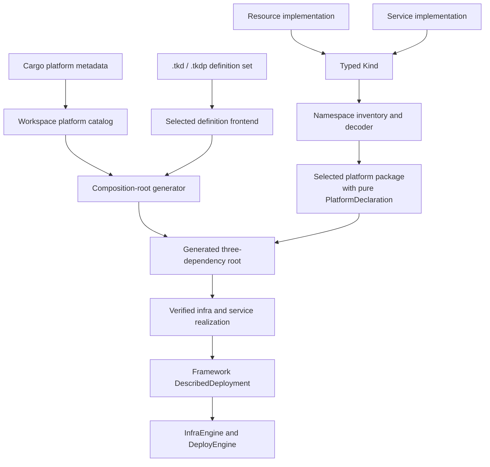

# Extending the IaC framework

Add provider behavior through kinds and namespaces, then assemble those capabilities in
a pure `PlatformDeclaration`. Add deployment shape through definition documents. The
framework generates the bound composition root and supplies orchestration, stores,
planning, ordering, confirmation, and persistence.

This is the extension recipe for definition-backed platforms. The architecture and
operator boundaries are established in
[the IaC architecture overview](../architecture/120-iac-framework.md) and
[the provisioning guide](../provisioning/README.md); this page covers the engine-facing
implementation work.

## Choose the owning seam

Start with the smallest contract that owns the behavior.

| Need | Current extension seam | Typical owner |
|---|---|---|
| Manage an infrastructure object or coordinated bundle | `tokeira_iac::Resource` | Provider or platform resource crate |
| Expose an authored infra object | `tokeira_platform::Kind<R>` plus `decode_resource` | Crate that owns the kind |
| Generate and converge workload manifests | `tokeira_deploy_engine::Service` | Provider or platform resource crate |
| Expose an authored service | `Kind<R>` plus `decode_service` | Crate that owns the kind |
| Group author-visible kinds | `tokeira_platform::definition::Namespace` | Same crate as the kinds |
| Connect reachability, context registration, service application, and live operations | `PlatformDeclaration` | `platforms/{name}` package |
| Describe modules, resources, dependencies, and writeback | `.tkd` and/or `.tkdp` definition set | `platforms/{name}` package |
| Add a state publication medium | `StateBackend` for direct-document CAS, or `DeploymentStore<T>` for a different store model | `tokeira-state` or an explicitly approved state integration |

Do not implement `tokeira_orchestrator::Deployment` for a new platform. The bound path
uses the framework's `DescribedDeployment`, which adapts every realized definition to
the orchestrator. `LocalDeployment` is a special-purpose in-process development adapter,
not a template for new work.



## 1. Declare package discovery metadata

Platform discovery comes from the platform package's Cargo metadata. A descriptor names
the platform, its engine version, default definition format, definition roots, and any
companion content trees:

```toml
[package.metadata.tokeira.platform]
id = "example"
engine = "0.1.1"
default = false
default-format = "tkd"
definitions = ["deployment.tkd", "definition.tkdp"]
content = ["configuration"]
```

`definitions` lists root documents, one per supported format. Companion parts are
resolved through the root document. `content` lists platform-owned trees that kinds may
read from the definition source's directory; retained revisions therefore realize their
own companion bytes.

The workspace catalog discovers this descriptor. Adding a platform does not require a
new `tkr` enum variant or command dispatch branch.

## 2. Implement the lifecycle object

An infrastructure `Resource` owns one logical state entry. A service `Service` owns one
stable manifest-producing workload. Both are provider-facing contracts and belong beside
the clients and provider models they use.

### Infrastructure resource checklist

Implement every resource decision explicitly:

- Return a stable `resource_id` derived from deployment input and placement, not a
  provider-assigned ID.
- Return logical `ResourceId` dependencies. Do not schedule them inside lifecycle
  methods; the engine owns ordering.
- Validate the fully realized input in `validate_input`.
- List every author-referenceable output in `declared_outputs`.
- Return a canonical, deterministic `desired_manifest` for retained definition
  evidence.
- Keep `describes() == true` only when `describe` performs a real provider query once
  its prerequisites are present. Override it to `false` for a stub; definition
  verification will refuse the kind.
- Make `describe` distinguish `Present`, confirmed `Absent`, and `Unsupported`.
- Keep `diff` pure and return `Replace` when an immutable field needs delete/create.
- Return complete `ResourceState` from create and update, including provider identity,
  normalized comparison properties, dependencies, and module ownership.
- Delete using persisted provider identity so removal still works after desired input
  has changed.
- Implement required, pure, total `change_semantics` with citations for every
  non-unknown claim.
- Supply a short lowercase `display_kind` when operator output benefits from a noun.

Normalize provider observations before putting them in `ResourceState::properties`.
Unordered API results, response timestamps, and volatile fields otherwise produce a
perpetual update.

Treat provider not-found as success in an idempotent delete. This is particularly
important when `describe` returns `Unsupported`: destroy must call delete from persisted
state because it cannot safely infer absence.

### Service checklist

A service validates authored input, declares outputs, names its module and dependencies,
and generates provider manifests. Keep the following properties:

- `name` is stable and unique across the realized service set.
- `dependencies` names other services, not modules or infrastructure resource IDs.
- `manifests` is deterministic because serialized JSON is hashed as desired state.
- `validate_input` refuses an invalid complete service before the deploy engine sees it.
- `declared_outputs` lists every output the authoring layer may reference.

The runtime `Platform` owns provider-side preparation, live currency checks, manifest
application, and deletion. `prepare_service` may satisfy a manifest prerequisite such
as an image cache but must not alter the running workload. `apply_manifests` and
`delete_service` should be idempotent: a provider operation can succeed before state
publication does.

If deletion is supported, return `true` from `supports_delete` and make an already
absent service a successful delete. Otherwise the default fails closed before a
non-empty delete pass.

### Images

Implement `Image` only when desired image references need their own runtime-state record.
`desired_ref` returns repository, tag, and any upstream reference. `writeback_targets`
names host-owned configuration fields populated by image publication flows.

`record_images` does not build or publish an artifact. It records a desired
`repository:tag`, source metadata, and a timestamp with no digest. Keep artifact
evidence in the image build and publication subsystem that actually produced it.

## 3. Wrap authored input in a kind

Definitions never construct provider resources by reflection. A typed kind deserializes
the authored fields and realizes the exact engine object:

```rust
pub trait Kind<R>: fmt::Debug + Send + Sync {
    fn realize(&self, placement: &PlacementContext) -> Result<R, KindError>;
}
```

`PlacementContext` supplies the stable deployment ID, deployment root, definition-source
directory, owning module, logical ID, realized infra dependencies, dependency content
identities, and tags. Use those values instead of reading global state.

For example, a service kind can take its service name from `placement.logical_id`, its
module from `placement.module`, and couple rendered configuration through a declared
dependency's content identity.

The namespace decoder chooses the lifecycle plane:

```rust
kind::decode_resource::<AuthoredBucket, BucketResource>(BUCKET_TYPE, value)
kind::decode_service::<AuthoredService, ProviderService>(SERVICE_TYPE, value)
```

The decoder applies `serde` to the source-located value. Realization then checks that
the concrete object's `resource_type` matches the authored kind name and calls
`validate_input`. Return `KindError` with source range where possible; do not postpone a
deterministic input error until provider mutation.

## 4. Publish a namespace

A namespace is the runtime shadow of one crate dependency:

```rust
pub struct Namespace {
    pub name: &'static str,
    pub kinds: &'static [&'static str],
    pub defaults: Option<fn(&str) -> Option<LocatedValue>>,
    pub decode: fn(&str, LocatedValue) -> Option<Result<DecodedKind, KindError>>,
}
```

Keep the namespace facts beside the kinds:

- `name` is the normalized crate name imported by definitions;
- `kinds` is the complete author-visible inventory;
- `defaults` returns authoring-only empty shapes when the frontend supports explicit
  struct-update defaults; and
- `decode` returns `None` for a name this namespace does not own.

Every advertised kind must decode, and kind names must be unique across all namespaces
in one platform declaration. A collision refuses the bound binary rather than letting
import order select behavior.

Provider crates should export reusable namespaces for provider objects. A platform
package can add its own namespace for deployment-specific kinds, such as a rendered
configuration bundle that consumes platform companion content.

## 5. Export a pure platform declaration

The platform package exports one entry point:

```rust
pub fn platform() -> PlatformDeclaration
```

Construct all four fields without filesystem, network, credentials, or provider clients:

```rust
pub struct PlatformDeclaration {
    pub namespaces: Vec<Namespace>,
    pub ops: Option<Box<dyn Ops>>,
    pub execution: Box<dyn PlatformExecution>,
    pub implementation: Arc<dyn PlatformIntegration>,
}
```

`PlatformExecution::probe` answers whether the substrate is reachable for a
`DeploymentRef`. Return `Ok(None)` when reachable or `Ok(Some(PlatformIssue))` when a
provider problem should block plan and refuse mutation. Keep the provider's fact,
evidence, and any grounded direction separate in the issue.

`PlatformIntegration` registers provider handles into infra, service, and image
contexts and constructs the runtime service `Platform`. Registration happens per
operation and receives only `DeploymentRef { name, dir }`, not a state document.

The declaration's `Ops` is `tokeira_platform::declaration::Ops`. It implements live
`log_stream`, `port_mappings`, and `scale` over `DeploymentRef`. Do not confuse it with
the legacy `tokeira_orchestrator::Ops`, whose methods operate on an associated config
type.

Test declaration purity by constructing it without a provider and by checking namespace
and kind-name uniqueness.

## 6. Author the definition set

Definitions own deployment shape. Put the configuration model, modules, resource and
service nodes, dependency edges, create-time annotations, and writebacks in `.tkd` or
`.tkdp`, not in a hand-written `Deployment` implementation.

The graph must have exactly one dependency-free module. The framework nominates it as
the bootstrap module and presents it through `remote_state_module`; it does not rely on
a reserved module name. Every other module should state its prerequisites explicitly.

Resource references create graph edges. Output references are checked against the
realized object's `declared_outputs`. An infrastructure resource cannot depend on a
service resource, and service outputs cannot feed infrastructure-backed writeback.

Writeback must be declared. A literal passes through; an output reference resolves
through the realization index and applied `ResourceState::properties`. On the bound
path `hydrate_config` is the identity function—the framework does not invent projection
from arbitrary state.

Definition-backed services are active engine objects. Realization separates them from
infra resources, `DescribedDeployment::services` exposes them to `DeployEngine`, and
deploy apply/destroy persists per-service progress.

Use [the deployment definition guide](../provisioning/deployment-definitions.md) for
language syntax and admission rules rather than duplicating the frontend contract here.

## 7. Let the framework generate the composition root

Do not add a hand-written `tkp` binary or a runtime platform dispatch table. The build
pipeline discovers the selected platform and definition frontend, creates an ordinary
generated workspace member, and links exactly three dependencies: the platform package,
the selected frontend package, and `tokeira-tkp`.

The generated `main` has this shape:

```rust
tokeira_tkp::bound_provisioner_main!(
    expected_platform: "example",
    platform: selected_platform::platform,
    expected_format: "tkd",
    content_roots: ["configuration"],
    frontend: selected_frontend::tkd::frontend,
);
```

Cargo remains the dependency resolver. The generated root joins the frozen,
closure-scoped workspace and lockfile; the generated source and selected identity are
part of engine identity. Definition bytes remain deployment data and are not compiled
into the binary.

## Provider capabilities and recovery

Register clients in the context that consumes them:

- infra clients and `ResourceRecovery` in `ProvisionContext`;
- runtime-platform helpers in `ServiceContext`; and
- image resolver or registry helpers in `ImageContext`.

The maps do not inherit from one another. If both an infra resource and a service need a
client, register an appropriate handle in both paths.

`ResourceRecovery` covers recorded infra state whose current definition no longer
realizes a resource. It takes `ResourceState` and may reconstruct a resource capable of
deleting that type. Return `None` for types the recovery implementation does not own.
The engine widens what can be deleted; it never widens what may be forgotten.

The service engine uses a stricter source requirement because `ServiceState` retains a
hash but not the manifest bodies needed for deletion. Restore any missing service
definitions before destroy; the engine refuses a recorded service that the current
definition cannot reproduce.

## State-store extensions

Adding a platform does not normally require a store implementation. The bound framework
selects `CasStore` over deployment-local `LocalBackend` instances for infra and runtime
state.

When an explicitly scoped change adds storage behavior, choose the right level:

- Implement `StateBackend` when `CasStore<T>` can serialize the complete document and
  the medium can provide conditional manifest writes plus immutable snapshot helpers.
  `LocalBackend` and `S3Backend` are the existing examples.
- Implement `DeploymentStore<T>` when the store has its own document protocol.
  `S3StateStore<T>` is the existing manifest-pointer plus immutable-snapshot model.

Preserve these contracts:

- a genuinely missing store loads `T::default()` with an empty version;
- malformed or inaccessible state is an error, not bootstrap;
- documents validate after load and before save;
- versions are opaque and tied to the exact loaded or committed document;
- an empty expected version is create-only; and
- a stale publication returns `StateError::Conflict`.

Read [`crates/tokeira-state/AGENTS.md`](../../crates/tokeira-state/AGENTS.md) before a
state implementation change. State dependencies and format changes are architectural
work, not incidental platform setup.

## Verification checklist

Before calling a platform extension complete, verify:

- the package descriptor is discoverable and names every definition/content root;
- `platform()` is pure and its kind names are unique;
- each kind decodes located input and realizes the advertised resource type;
- complete input validation runs before lifecycle methods;
- logical IDs, module names, and service names are stable and unique;
- module, resource, and service graphs reject invalid edges and cycles;
- every infra kind performs a real `describe`, or verification refuses it;
- `Absent` is returned only after a provider confirms nonexistence;
- normalized live state and pure diffing converge to `NoChange` after apply;
- immutable-field changes select `Replace` from `diff`;
- semantics are total and every non-unknown claim has a citation;
- replacement and deletion resume from incrementally published state;
- removed infra resources remain deletable through the known graph or recovery;
- service manifests are deterministic and application/deletion are idempotent;
- runtime deletion is supported or fails before touching a service;
- provider handles are registered in every context that consumes them;
- create-time definition changes are refused by the retarget gate; and
- destructive infra and service operations remain behind plan/review/confirmation.

Use focused crate tests while implementing. Finish with the workspace validation bar in
the root `AGENTS.md` before pushing.

## Further reading

- [Infrastructure as code engines](README.md) — exact engine traits and lifecycle
  algorithms.
- [State and convergence](state-and-convergence.md) — refresh, CAS publication,
  snapshots, and leases.
- [IaC architecture overview](../architecture/120-iac-framework.md) — platform
  declarations, definition realization, bound provisioners, and the legacy boundary.
- [Deployment definitions](../provisioning/deployment-definitions.md) — definition
  language and admission.
- [`tokeira-platform` declaration](../../crates/tokeira-platform/src/declaration.rs) and
  [kind](../../crates/tokeira-platform/src/kind.rs) — current extension types.
- [`tokeira-build` composition](../../crates/tokeira-build/src/composition.rs) — generated
  root and frozen workspace assembly.
- [`tokeira-tkp` described adapter](../../crates/tokeira-tkp/src/described.rs) — the
  framework's bound-path `Deployment` implementation.
