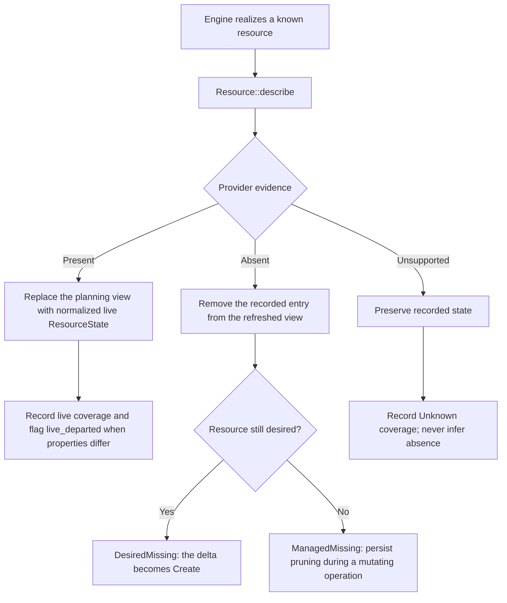
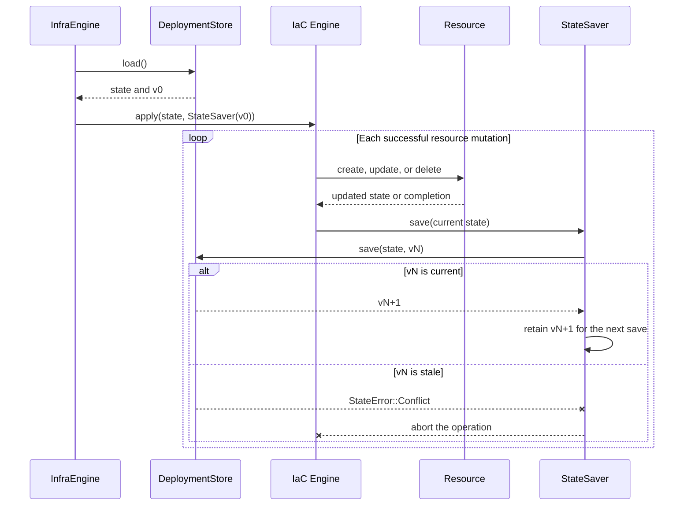
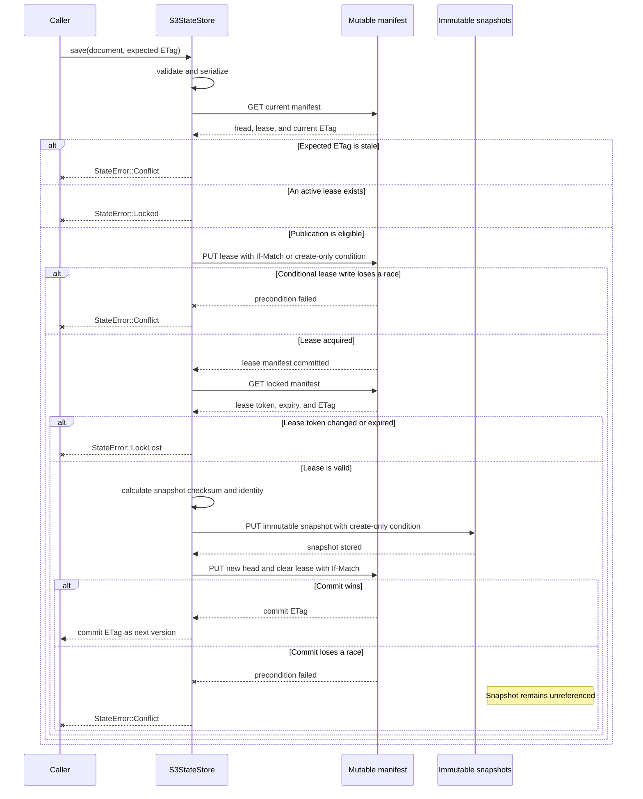

# State and convergence

Tokeira's IaC engines are stateless algorithms. A platform supplies desired objects,
the orchestrator loads recorded state, and provider implementations supply live
evidence. Convergence reconciles those three inputs without treating a configuration
file as proof of current provider state.

This page describes infrastructure and runtime deployment state. It does not describe
workflow histories or the Aurora DSQL storage used by the Tokeira runtime.

## Inputs to an infrastructure operation

An infrastructure operation combines:

1. **Desired resources** — objects that should exist after apply.
2. **Known resources** — all objects the deployment can manage, including definitions
   retained solely to remove an object that is no longer desired.
3. **Recorded state** — the last successfully persisted view of provider identities,
   comparison properties, dependencies, and outputs.
4. **Live evidence** — observations returned by each provider resource's `describe`
   implementation.
5. **Operation scope** — active module or resource selection.

`Engine` in `tokeira-iac` does not own a state store. The orchestrator loads state and
passes it into the engine together with an optional `StateSaver` callback. This keeps
resource lifecycle semantics provider- and backend-neutral.

## Refresh is evidence, not desired state

Before computing a normal plan or apply, the infrastructure engine refreshes every
known resource that it can realize. `Resource::describe` returns one of three outcomes:

- `Present(ResourceState)` positively reports the live object and replaces the
  recorded entry for planning.
- `Absent` positively confirms nonexistence and permits the recorded entry to be
  removed.
- `Unsupported` means the provider implementation cannot establish presence or
  absence. Recorded state is preserved and refresh coverage records the uncertainty.

A missing client, incomplete implementation, or failed prerequisite must not be
reported as `Absent`. Confirmed absence is deletion evidence; uncertainty is not.

Refresh can change the in-memory state used by a plan and can perform provider reads.
“Plan does not mutate” means that it performs no provider create, update, or delete;
it does not mean the operation is pure or offline.

The resulting refresh coverage allows an operator to distinguish a plan based on live
observations from one that includes unknown provider state.

## Delta calculation

After refresh, each resource's pure `diff` classifies the desired change and the engine
reports:

- **Create** when a desired logical ID has no recorded live object;
- **Update** when `diff` selects an in-place change;
- **Replace** when `diff` selects delete followed by create;
- **Delete** when a known recorded object is no longer desired;
- **No change** when desired and refreshed properties agree.

`change_semantics()` annotates an already classified update or replacement with
operator-facing evidence; it does not choose the execution path. Returning update from
`diff` and replacement only from `change_semantics()` still executes an update.

The logical `ResourceId` is the join key. It must remain stable across runs. Provider
physical IDs belong inside `ResourceState` and can change during replacement without
changing the desired logical identity.

The engine validates module and desired-resource graphs before mutation. Duplicate
module IDs, duplicate resource IDs, missing desired modules, and cycles block
convergence.

## Ordering

Creates and updates execute in forward topological order: dependencies before their
dependents. Removed resources execute in reverse dependency order: dependents before
the objects they use.

Desired graphs are strict because the current configuration can be corrected before
mutation. Deletion ordering can depend on historical resource state after definitions
have disappeared. Missing historical edges are tolerated, and cyclic or unresolved
remnants fall back to deterministic ordering so cleanup can continue.

Replacement has two durable halves:

1. delete the old physical object, remove its state entry, and save;
2. create the replacement, insert its new state, and save again.

If execution stops between those halves, the next operation observes no current object
for that logical ID and resumes as a create rather than attempting an update against a
deleted provider object.

The runtime service graph has a separate contract. Service names must be unique, every
dependency must exist, and cycles are rejected. Destroy processes services in reverse
service dependency order.

## Persistence and interruption

Infrastructure apply invokes `StateSaver` after every successful create, update, or
delete and after both state transitions of a replacement. A save failure aborts the
operation. This bounds replay after interruption and prevents a later step from
assuming that an earlier provider mutation was durably recorded when it was not.

The orchestrator reloads state for each verb and threads the version returned by one
successful save into the next save. `DeploymentStore<T>` treats versions as opaque: a
caller passes the version associated with the document it modified rather than
inventing a token or forcing an overwrite. Both store implementations validate after
load and before save, and a stale expected version returns `StateError::Conflict`.

### Local state publication

`CasStore<T>` serializes the complete document and passes the expected version to its
`StateBackend`. `LocalBackend` uses a SHA-256 content hash as the version and serializes
writers with an exclusive lock on a stable sidecar file.

The sidecar lock covers the version check, temporary-file write, and atomic rename. It
is deliberately separate from the manifest inode, which rename replaces. Concurrent
same-version writers on one host therefore admit one successful publication; later
writers acquire the lock, observe the changed hash, and return a conflict. Readers
observe either the complete previous manifest or the complete replacement.

`LocalBackend` is a single-host store. The sidecar lock does not provide distributed
coordination.

### S3 state publication

`S3StateStore<T>` stores a single mutable manifest and immutable full-document
snapshots. The manifest contains the committed head and a short save lease; its ETag is
the opaque version returned to callers.

A save validates and serializes the document, verifies the caller's expected manifest
ETag, and acquires the save lease in the same conditional manifest write. That write
both rejects stale versions and acquires the lease, so no writer can intervene between
those decisions. An empty expected version succeeds only when the manifest does not
exist. A current unexpired lease returns `StateError::Locked`.

After acquiring the lease, the store reloads the manifest and verifies the lease token
and expiry before uploading a new immutable snapshot. It then commits the new head plus
lease release in one `If-Match` manifest update. The ETag returned by that exact commit
becomes the caller's next expected version. A failed commit can leave an unreferenced
immutable snapshot, but the snapshot cannot overwrite committed data and the manifest
head remains unchanged.

Loads follow the manifest head, fetch the referenced snapshot, verify its SHA-256
checksum, deserialize it, and validate the resulting document. A missing manifest
returns the document default and an empty version.

### Coordination scopes

State publication and operation locking solve different problems:

- the expected version rejects a document derived from stale recorded state;
- the local sidecar lock serializes one host's check-and-rename publication;
- the S3 save lease protects one snapshot and manifest update; and
- `OperationLock` is a separate renewable lease over `StateBackend` for serializing a
  complete multi-save deployment operation.

Operation locking does not replace per-save CAS. Each save still carries the version of
the document from which it was derived.

Contributor invariants for state implementations are binding in
[`crates/tokeira-state/AGENTS.md`](../../crates/tokeira-state/AGENTS.md). Exact store
behavior is defined by [`DeploymentStore`](../../crates/tokeira-state/src/store.rs).

## Missing state and remote-state bootstrap

A missing backing store is a valid first-deployment condition. Loading returns the
default validated document plus an initial version instead of failing merely because
the state object does not exist yet.

The remote-state module participates in infrastructure composition so the first apply
can create the resources that hold later state. This creates a deliberate bootstrap
sequence:

1. load an empty deployment state;
2. include the remote-state resources in desired and known composition;
3. create those resources through the same reviewed lifecycle; and
4. publish the first state document through the selected store.

Missing-store tolerance must not be generalized to malformed or inaccessible state.
Validation failures and provider errors remain errors.

## Safe deletion after definitions change

Recorded state can outlive the source definition that created a resource. The engine
therefore separates “desired” from “known.” A platform should keep removed definitions
in the known set long enough to realize the resource needed for deletion.

When current modules cannot realize that resource, the platform can register a
`ResourceRecovery` implementation in `ProvisionContext`. Recovery reconstructs a
resource from its persisted type and state so normal provider deletion can run.

If neither a known resource nor a recovery implementation claims the recorded type,
the engine fails closed. It does not erase the state entry and pretend that the live
provider object was deleted.

Destroy refreshes known resources and then deletes in reverse order. Immediately
before deletion, confirmed `Absent` permits state pruning, while `Unsupported` drives
deletion from recorded state. A provider that cannot describe an object can still
support safe deletion if persisted state contains the required physical identity.

## Infrastructure state and runtime state

Infrastructure and runtime convergence use separate documents and stores.

| Document | Contains | Save cadence |
|---|---|---|
| `InfraState` | Resource identities, provider properties, dependencies, module ownership, and outputs. | Incrementally after infrastructure mutations. |
| `RuntimeState` | Recorded image references, service manifest hashes, and workload deployment records. | Once after the runtime operation completes. |

`ServiceEngine` generates provider manifests and hashes their serialized form. Runtime
plan compares absent, equal, or different recorded hashes without checking live
provider drift. During apply, `Platform::is_service_current` can promote a recorded
“no change” service to update before manifest application.

Manifest generation must be stable: semantically identical desired input must not
produce nondeterministic serialized manifests and perpetual updates.

Runtime apply mutates services sequentially and saves `RuntimeState` only after the
full service loop. If execution stops after one service succeeds but before the final
save, the next apply can replay that successful mutation. `Platform::apply_manifests`
must therefore be idempotent.

Current image recording stores a desired `repository:tag`, no resolved digest, and a
recorded timestamp. Image build, push, and mirror are separate command flows; runtime
state must not be described as proof that an artifact was built or published.

A platform can choose not to use the separate runtime engine. Some platforms model
workloads as infrastructure resources and route deployment operations through
`InfraEngine`. That is a platform realization choice; it does not merge `InfraState`
and `RuntimeState` into one framework concept.

## Provisioner and configuration state

A deployment-bound provisioner can keep an envelope and configuration history alongside
engine state. Those records govern which provisioner may operate, retain configuration
revisions, and make interrupted lifecycle transitions resumable. They do not replace
`InfraState` or `RuntimeState`.

Desired deployment source and server runtime configuration are separate domains as well.
A `.tkd` definition or platform config describes desired deployment state;
`tokeirad.toml` configures the running server; Aurora DSQL contains workflow-runtime
authority. Keeping them distinct prevents a source edit or config write from being
mistaken for proof that provider convergence succeeded.

The complete envelope, binding, and revision contracts are documented in
[the provisioner guide](../provisioning/provisioner.md).

## Outputs, hydration, and writeback

A resource can publish outputs into infrastructure state. After successful convergence,
the orchestrator can hydrate its in-memory platform configuration from those outputs. A
`Deployment` can also calculate deferred writeback as key/value updates.

Writeback calculation does not imply persistence. The invoking host owns any persistence
channel and target; the IaC framework only exposes derived values. Provisioning command
routing and host ownership are described in the
[provisioning guide](../provisioning/README.md).

Writeback remains derived from applied state. It is not the authority for whether the
provider object exists.

## Operation summary

| Operation | Live provider reads | Provider mutations | State behavior |
|---|---:|---:|---|
| Infrastructure plan | Yes | No | Loads and refreshes the in-memory planning view. |
| Infrastructure apply | Yes | Yes | Saves incrementally after resource mutations. |
| Infrastructure destroy | Yes | Yes | Removes entries as provider objects are confirmed absent or deleted. |
| Runtime plan | No | No | Generates manifests and compares them with recorded runtime state. |
| Runtime apply | Yes | Yes | Checks live currency and saves once after the service loop. |

All destructive CLI paths remain subject to review and confirmation policy; engine
capability does not bypass the operator contract.

## Further reading

- [IaC framework](README.md) — crates, boundaries, and entry paths.
- [Extending the IaC framework](extending.md) — provider contracts and integration.
- [Provisioning](../provisioning/README.md) — deployment definitions, provisioner
  envelope, revisions, and command routing.
- [`tokeira-iac` engine](../../crates/tokeira-iac/src/engine.rs) — exact refresh,
  delta, ordering, and mutation algorithms.
- [`tokeira-state`](../../crates/tokeira-state/src/lib.rs) — state documents and
  persistence implementations.
