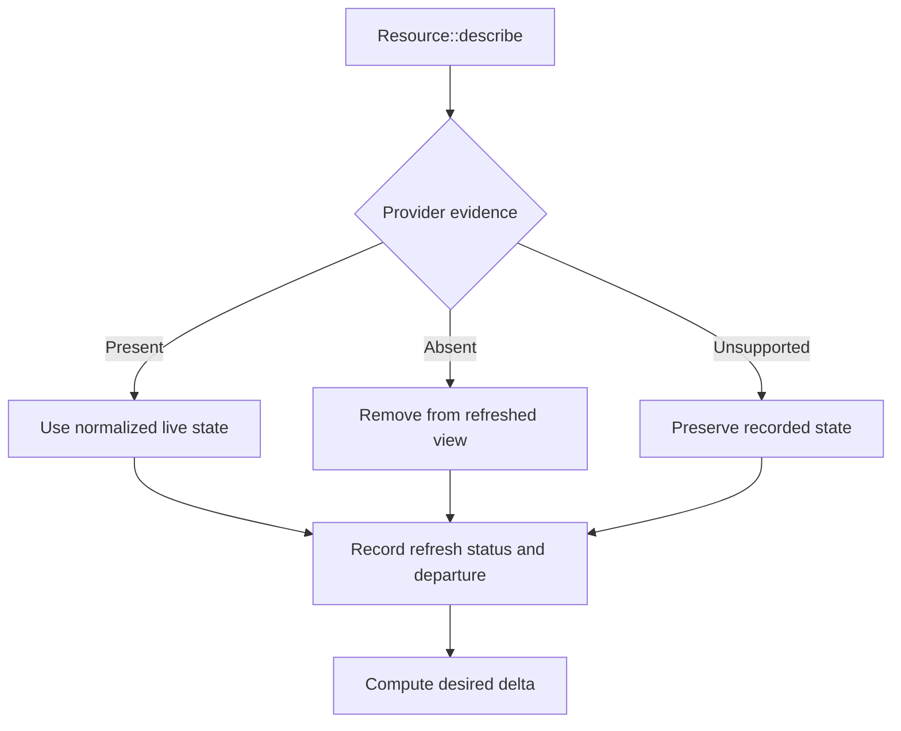
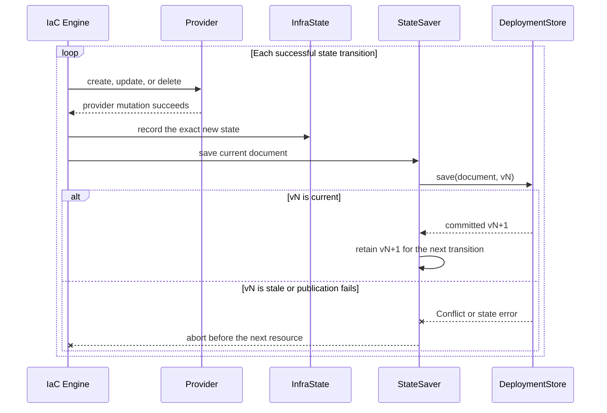
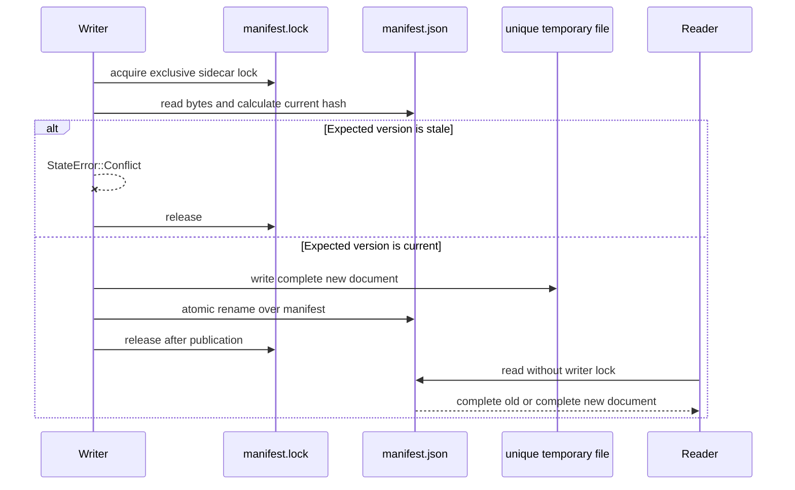
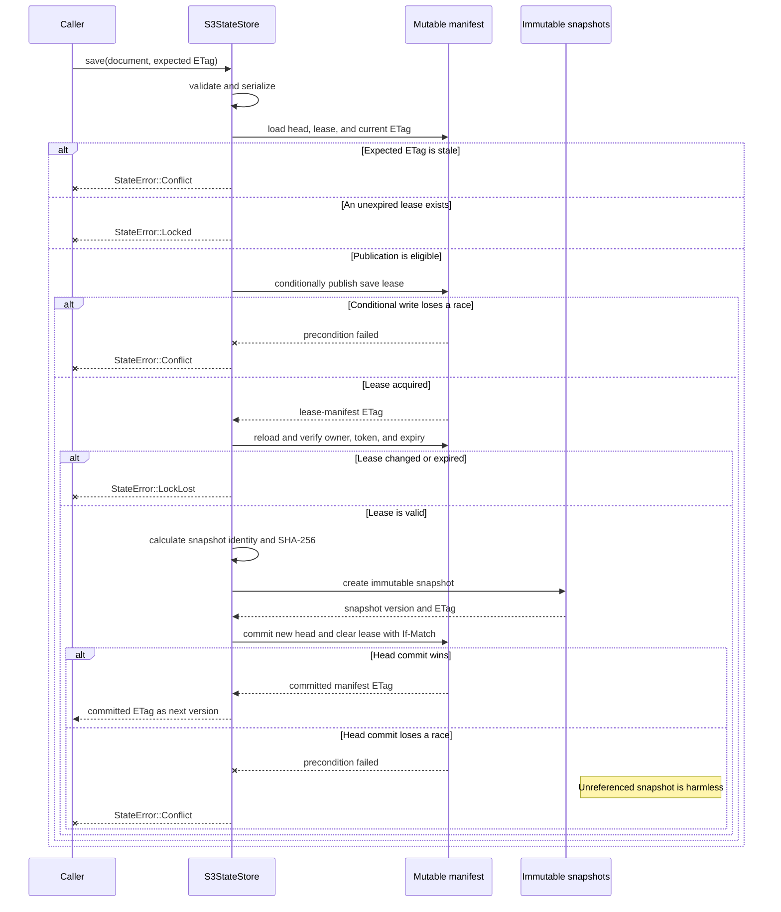

# State and convergence

Tokeira converges desired objects against recorded documents and live provider evidence.
The engines do not own a database or state backend: orchestration loads a document,
passes it into an operation context, and supplies a version-threaded callback for each
durable step.

This page covers infrastructure and service convergence state. It does not cover
workflow history or the Aurora DSQL storage used by the workflow runtime. The
deployment envelope and repository are introduced only where they meet engine state;
their complete lifecycle belongs in
[the provisioning guide](../provisioning/README.md).

## State domains

The convergence layer uses two document types from `tokeira-iac`:

```rust
pub struct InfraState {
    pub version: u32,
    pub resources: BTreeMap<ResourceId, ResourceState>,
    pub outputs: BTreeMap<String, String>,
    pub last_applied: String,
}

pub struct RuntimeState {
    pub version: u32,
    pub images: BTreeMap<String, ImageState>,
    pub services: BTreeMap<String, ServiceState>,
    pub last_applied: String,
}
```

`InfraState` records logical resources, provider identities and comparison properties,
dependency edges, module ownership, outputs, and apply metadata. `RuntimeState` records
desired image references and service manifest hashes. Neither document is desired
source, and neither is proof of current provider state.

Definition-backed deployments also have `DeploymentStateEnvelope` in
`tokeira-deployment`. It records engine binding and integrity, configuration revision,
rollback checkpoint, in-flight marker, infra/runtime heads, and the effective config
reference. The envelope coordinates the deployment lifecycle; it does not replace
`InfraState` or `RuntimeState`.

On the bound path these documents have separate namespaces under one admitted
placement:

| Document | Local root / remote suffix | Publication cadence |
|---|---|---|
| Infrastructure state | `state/infra` / `<prefix>/infra` | After every infra state transition and confirmed pruning during mutation |
| Runtime state | `state/deploy` / `<prefix>/deploy` | After every changed or deleted service; once for image-only recording when all services are unchanged |
| Deployment envelope | `state/envelope` / `<prefix>/envelope` | At lifecycle commit points owned by the shell |
| Operation lease | `state/lock` / `<prefix>/lock` | Acquire, renew, adopt, and release around a complete mutating command |

`metadata.json` records one `DeploymentStateLocation` for all four; individual verbs
cannot select their own backend. Local is the backward-compatible default. A
definition-bound create may instead select a pre-existing S3 bucket, its region, and a
deployment-exclusive prefix. Command admission prepares one `DeploymentStateStores`
bundle and threads its envelope, infra, runtime, and lock handles through the entire
verb. `PlatformDeclaration` remains provider behavior and does not choose state
placement.

### Remote placement

Remote state is a create-time deployment property:

```bash
tkr deployment create \
  --name shared \
  --platform compose \
  --state-bucket company-tokeira-state \
  --state-region eu-west-2 \
  --state-prefix deployments/shared \
  --dev-engine
```

The three state flags are all-or-none. The bucket is primordial and operator-owned:
Tokeira does not create it, modify its policy/lifecycle, or delete the prefix. The
ambient AWS identity needs `s3:GetObject` and `s3:PutObject` over the selected prefix;
state writes request S3-managed encryption and use conditional writes for CAS. The
bucket region is recorded independently of the platform region and selects the S3
client used for every state access.

Day 0 creates the remote envelope before the deployment directory becomes visible. An
already-bound prefix is refused, preventing two deployments from accidentally sharing
state. The signed Deployment Claim carries the locator (never credentials). A fetched
seat reconstructs `metadata.json` from that claim, loads the same remote envelope, and
verifies the claimed deployment name, engine binding/integrity, and configuration
revision before committing its local directory. A local-state publication continues to
receive a fresh local envelope because local state is not portable.

If Day 0 commits remotely but the subsequent atomic publication of the local directory
fails, Tokeira leaves the remote snapshots intact rather than guessing whether they are
safe to delete. The prefix remains reserved until an operator investigates it and
retires it under the bucket's retention policy.

Remote manifests, snapshots, and the released operation-lock record are retained after
`deployment destroy`. This is deliberate recovery/audit retention; an operator-owned
bucket lifecycle or a later explicit prune workflow decides eventual removal. Bucket
policy should protect `<prefix>/*/snapshots/*` according to the organization's retention
requirements because Tokeira does not take policy ownership of an adopted bucket.

## Inputs to infrastructure convergence

An infra operation combines:

1. **Desired resources** — objects that should exist after apply.
2. **Known resources** — all objects this execution can manage, including resources
   retained only for refresh or deletion.
3. **Recorded state** — the last successfully published identities, properties,
   dependencies, outputs, and module ownership.
4. **Live evidence** — each known resource's `DescribeResult`.
5. **Operation scope** — all modules, or an expanded active module set.

`InfraComposition` preserves desired, known, and active module sets separately. The
known set must contain every desired module. A named `ModuleSelection::Only` adds
transitive prerequisites for plan/apply or transitive dependants for destroy; unknown
names are refused.

The engine itself holds state only in `ProvisionContext`. `InfraEngine<D>` reloads the
store at each verb, installs the document in that context, and passes a `StateSaver`
only to mutating operations.

## Refresh is evidence

Before an ordinary infra plan or mutation, the engine calls `describe` on each known
resource in dependency order:

```rust
pub enum DescribeResult {
    Present(ResourceState),
    Absent,
    Unsupported,
}
```

The outcomes mean:

- **Present** — a provider query found the object. The normalized live state replaces
  the recorded entry in the operation's refreshed view.
- **Absent** — a provider query confirmed nonexistence. The entry is removed from the
  refreshed view; a mutating refresh can publish that pruning.
- **Unsupported** — the resource cannot establish presence or absence. Recorded state
  remains authoritative for this operation and cannot be pruned.



The distinction is a deletion invariant. A stub method, missing client, missing
dependency, or ambiguous permission error is not evidence that the object is gone. Such
a path returns `Unsupported`.

During plan the saver is absent, so pruning affects only the returned planning view.
During apply or destroy, confirmed absence for a known-but-not-desired resource is saved
immediately. If a provider issue interrupts plan refresh, the engine restores the
recorded view and returns a blocked `PlanOutcome` with no changes. The same issue is a
hard error during apply or destroy.

## Refresh coverage and plan evidence

`RefreshCoverage` distinguishes five per-resource states:

```rust
pub enum RefreshStatus {
    DesiredLive,
    DesiredMissing,
    ManagedLive,
    ManagedMissing,
    Unknown,
}
```

It also records:

- `examined`, so a consumer can distinguish no refresh from complete confirmation;
- `status_by_id`, stored in deterministic key order; and
- `live_departed`, the resources whose confirmed provider properties differ from the
  prior record or whose recorded object is confirmed absent.

`PlanOutcome` carries that refresh evidence with changes, semantics, display nouns,
known-set dependency edges, and platform issues. Semantics and edges remain unfiltered
for module-scoped plans: an unchanged dependant can still be relevant to the effect of a
selected change.

A platform issue is not an uncertain refresh entry. It blocks the entire plan, so the
outcome contains the issue and no planned changes. `Unknown` is narrower: refresh ran
for that resource but its `describe` could not prove presence or absence.

## Delta calculation

After refresh, the logical `ResourceId` joins desired objects to the recorded view:

- **Create** — desired ID has no current state.
- **Update** — `diff` selects an in-place change.
- **Replace** — `diff` selects delete followed by create.
- **Delete** — state contains an ID absent from desired.
- **NoChange** — desired and current state agree.

`change_semantics` describes the already selected path. It cannot convert an update into
a replacement. `Delete` and `Replace` are destructive; the shell uses the engine's
classification for review and explicit confirmation.

The engine validates composition before the delta: module IDs and resource IDs are
unique, desired modules are known, and the supplied module graph is acyclic. The bound
definition path also runs `verify_resources` before planning, refusing resources with
stub discovery and resource edges that point outside the realized definition.

## Ordering and interruption

Creates and updates execute in forward resource order: dependencies first. Deletes
execute in reverse persisted-dependency order: dependants first. Module ordering and
resource ordering are separate graphs.

Desired graphs are strict because an author can correct them before mutation. Historical
delete graphs may be incomplete after definitions change. Missing historical edges are
tolerated; cyclic or unresolved remnants are appended in stable order so cleanup can
continue.

### Infrastructure persistence

`StateSaver` runs after each successful create, update, or delete. It also runs when a
mutating refresh prunes a confirmed missing managed resource.

Replacement deliberately publishes twice:

1. delete the old provider object, remove its state, and save;
2. create the new provider object, insert its state, and save.

An interruption between those publications leaves an honest absence. The next operation
computes create instead of trying to update an object already deleted.

The saver closes over the latest store version. A successful save replaces that token
with the returned version; the next save must use it. A conflict or other save error
stops the operation before later resources can assume the prior state transition was
durable.



### Service persistence

The service engine orders services by declared service dependencies. The bound plan
generates manifests, lets the platform prepare each service, compares its SHA-256 hash
with `RuntimeState`, and checks live currency when the hash matches.

Apply handles one service at a time: prepare, classify, apply if changed or drifted,
update runtime state, then save. Destroy processes the graph in reverse and saves after
each successful deletion. A failure therefore retains the durable progress of earlier
services while leaving the failed and later services recorded for retry.

If apply changes no service, `DeployEngine` still saves once after image recording. This
preserves new desired image records even when every service manifest is unchanged.

`Platform::apply_manifests` and `delete_service` must remain idempotent. A provider call
can succeed while the following state save fails, so retry can repeat the call.

## Safe deletion when definitions change

Infra state can outlive the definition node that created it. The engine has two ways to
retain delete behavior:

1. the resource remains in the known graph even though it is not desired; or
2. a `ResourceRecovery` registered in `ProvisionContext` reconstructs a deletable
   resource from its `ResourceState`.

If neither path claims the state entry, deletion returns `UnknownResourceDelete`. The
engine never removes state merely because current desired source cannot construct the
provider object.

Destroy refreshes the known graph, orders recorded deletes in reverse, and describes
each resource again immediately before deletion. `Present` uses fresh live state,
`Absent` prunes, and `Unsupported` deletes from recorded physical identity.

Runtime state has no manifest bodies, only hashes. A recorded service missing from the
current service definition therefore cannot be safely reconstructed for deletion.
Service destroy refuses the whole pass and directs the operator to restore the service
definition. It also checks platform deletion support before touching any workload.

## Store contract

The common seam is `DeploymentStore<T>`:

```rust
#[async_trait]
pub trait DeploymentStore<T>: Send + Sync {
    async fn load(&self) -> Result<(T, String), StateError>;
    async fn save(&self, doc: &T, expected_version: &str) -> Result<String, StateError>;
}
```

`load` returns a validated document and an opaque version. `save` validates the document,
compares against the version of the document it was derived from, and returns the exact
version of the committed result.

A genuinely missing document loads as `T::default()` plus an empty version. The empty
version means create-only on save. A malformed document, inaccessible provider, or
unexpected backend error is not a missing store and remains an error.

Both built-in document stores validate after load and before save. A stale version
returns `StateError::Conflict`; callers reload and recompute rather than forcing an
overwrite.

## Store and backend families

`tokeira-state` has two layers because direct-document CAS and snapshot storage have
different protocols.

### `CasStore<T>` and `StateBackend`

`CasStore<T>` serializes the complete validated document as pretty JSON and uses a
`StateBackend` for I/O:

```rust
#[async_trait]
pub trait StateBackend: Send + Sync {
    async fn read_manifest(&self, key: &str)
        -> Result<Option<(Vec<u8>, String)>, StateError>;
    async fn write_manifest(
        &self,
        key: &str,
        data: &[u8],
        expected_version: &str,
    ) -> Result<(), StateError>;
    async fn read_snapshot(&self, key: &str) -> Result<Vec<u8>, StateError>;
    async fn write_snapshot(&self, key: &str, data: &[u8]) -> Result<(), StateError>;
    async fn list_snapshots(&self, prefix: &str) -> Result<Vec<String>, StateError>;
}
```

The manifest methods are the direct-document CAS surface. Snapshot methods support
other content-addressed users, including binary and bundle stores; `CasStore` itself
writes only the manifest document. `CasStore::save` re-reads after a successful write to
obtain the backend's new version.

Two backends implement this trait:

- `LocalBackend` maps keys to filesystem paths and uses content-hash versions.
- `S3Backend` maps keys to S3 objects and uses conditional requests with ETag versions.

`S3Backend` is not `S3StateStore`. The backend can place a single complete `CasStore`
document directly in S3; the store implements a separate manifest-head and snapshot
protocol.

### `S3StateStore<T>`

`S3StateStore<T>` implements `DeploymentStore<T>` directly. It stores a mutable
`manifest.json` plus immutable full-document snapshots. The manifest is the writer
serialization point and its ETag is the opaque document version.

The `manifest` module defines the protocol records:

- `StateManifest` — schema version, monotonic revision, optional snapshot head, and
  optional save lease;
- `SnapshotRef` — key, version ID, ETag, SHA-256, size, commit identity, time, and owner;
- `StateLeaseLock` — owner, token, acquisition time, and expiry;
- `ManifestState` — decoded manifest plus the ETag needed for its next CAS; and
- `LockGuard` — the in-memory owner/token/expiry proof used while saving.

The direct store and backend families share `StateError`, including `Conflict`,
`Locked`, `LockLost`, `Corrupted`, `NotFound`, provider-specific backend errors, and
other contextual failures.

## Local publication protocol

`LocalBackend` stores each direct document at `{root}/{key}/manifest.json`. The opaque
version is SHA-256 over the document bytes.

A writer:

1. creates the key directory;
2. acquires an exclusive advisory lock on the stable sibling `manifest.lock`;
3. re-reads the manifest and verifies the expected content hash, or verifies absence
   for an empty expected version;
4. writes a uniquely named temporary manifest; and
5. atomically renames it over `manifest.json` before releasing the lock.

The lock file must be a separate inode. Locking the manifest itself would not protect a
waiter after rename replaced that inode. With the stable sidecar, two writers derived
from the same version admit at most one success on one host.

Readers do not take the writer lock. Atomic rename exposes either the complete previous
document or the complete replacement. This is single-host coordination, not a
distributed lease.



## S3 direct-document backend

`S3Backend` stores each direct document at `{prefix}/{key}/manifest.json`.
`write_manifest` uses `If-None-Match: *` for an empty expected version and
`If-Match: <etag>` otherwise. A precondition failure becomes `StateError::Conflict`.

`read_manifest` treats `NoSuchKey`, `NotFound`, and `NoSuchBucket` as no state so a
remote-state resource can bootstrap in the same apply. Other S3 errors remain errors.

Snapshot writes use `If-None-Match: *`. A repeated write is idempotent only when the
existing bytes match; different bytes at the same immutable key are a conflict.

## S3 snapshot publication protocol

`S3StateStore<T>` uses:

```text
{key_prefix}/manifest.json
{key_prefix}/snapshots/<timestamp>-<uuid>.json
```

A save is one version-threaded protocol:

1. validate and serialize the document;
2. load the manifest and compare its ETag with `expected_version`, requiring true
   absence for an empty version;
3. reject an unexpired save lease;
4. publish a new lease through the same conditional manifest write that establishes
   version currency;
5. reload and verify the lease owner, token, and expiry;
6. upload a create-only immutable snapshot; and
7. publish the new head, incremented revision, and lease release in one `If-Match`
   manifest update.

The ETag returned by step 7 is the exact committed document version. A follow-up read
could observe another writer, so it cannot safely supply this token.

A failed final CAS can leave an unreferenced immutable snapshot. It cannot move or
corrupt the committed head. Loads follow the head, optionally pin the S3 object version,
verify the snapshot SHA-256, deserialize, and validate the document.

The store's save lease lasts only for one snapshot publication. It is not the lock for a
complete lifecycle operation.



## Operation locking

`tokeira_state::OperationLock` is a renewable lease over any `StateBackend`. Its record
lives under a dedicated key and uses backend CAS for acquire, renew, adoption, and
release.

- `acquire(holder, ttl)` accepts an absent, released, or expired lease. Concurrent
  acquirers race through CAS and at most one wins. An active lease returns
  `StateError::Locked`.
- `renew(guard, ttl)` verifies the token and publishes a later expiry. A missing,
  released, or replaced lease returns `StateError::LockLost`.
- `adopt(holder, token, ttl)` joins a live lease acquired by an orchestrating parent.
  This keeps one lock continuous across a two-binary lifecycle sequence.
- `release(guard)` marks the matching lease released. A missing lease or a different
  token is already no longer owned by the caller and is a no-op.

The bound shell acquires this lock around every mutating command and renews it while the
command runs. Upgrade and rollback orchestration can acquire in `tkr`, pass the holder
and token to `tkp`, and have the child adopt without opening a concurrency window.

This concrete lease is distinct from three nearby concepts:

- document-version CAS rejects a save derived from stale state;
- the S3 save lease protects one manifest-head publication; and
- `tokeira_deployment::OperationLock` is a serializable envelope field, not the
  `tokeira_state` lease primitive that performs backend coordination.

Operation locking does not replace per-save CAS. Each save still proves that its source
document version is current.

## Missing state and bootstrap

Missing state is a valid first-apply condition. `DeploymentStore::load` returns the
default document and an empty version when the backing document is genuinely absent.

The bound execution nominates exactly one dependency-free definition module as the
bootstrap module. `DescribedDeployment::remote_state_module` presents it to
`InfraEngine`, which includes it in desired and known composition for every operation.
On the deployment-local path this module commonly creates the state directory; on a
remote legacy path it can create the remote backing resource.

Bootstrap does not weaken validation. Corrupt JSON, invalid document fields,
authentication failures, or unexpected provider errors stop the operation.

## Outputs and writeback

Infrastructure outputs are recorded data. Definition writebacks declare which values
should project into the deployment's server configuration:

- a literal passes through unchanged;
- an output reference resolves through `RealizedResourceIndex` to one applied
  `ResourceState`, then reads the declared property name.

The bound `DescribedDeployment::hydrate_config` is an identity function. After infra
apply, `collect_writeback` resolves the declared entries, and the lifecycle shell writes
those key/value pairs to `tokeirad.toml` before committing the new configuration
revision.

Writeback is derived from applied state. It does not establish that a provider object
still exists, and undeclared outputs are not silently projected.

## Operation summary

| Operation | Provider interaction | Mutation | State publication |
|---|---|---|---|
| Infrastructure plan | Platform probe and resource `describe` reads | None | None; refresh is an in-memory planning view |
| Infrastructure apply | Probe, refresh, then provider create/update/delete | Yes | Incremental after every infra transition and confirmed managed pruning |
| Infrastructure destroy | Probe, refresh, and pre-delete `describe` | Yes | Incremental after every removal or confirmed absence |
| Service plan on the bound path | Manifest generation, platform preparation, and live currency check for matching hashes | No running-workload mutation; preparation may populate provider-owned prerequisites | None |
| Service apply | Preparation, live currency check, and manifest apply | Yes | After every changed service; one final save when only image records changed |
| Service destroy | Manifest regeneration and provider delete | Yes | After every deleted service |

The engine's ability to mutate does not bypass shell policy. Destructive apply and every
destroy remain subject to review and explicit confirmation.

## Further reading

- [Infrastructure as code engines](README.md) — resource, service, orchestration, and
  lifecycle contracts.
- [Extending the IaC framework](extending.md) — provider kinds, namespaces, platform
  declarations, and state extension rules.
- [Provisioning](../provisioning/README.md) — envelope, revisions, repository, and
  command routing.
- [`tokeira-iac` engine](../../crates/tokeira-iac/src/engine.rs) — refresh, delta,
  ordering, and save callbacks.
- [`DeploymentStore`](../../crates/tokeira-state/src/store.rs),
  [`S3StateStore`](../../crates/tokeira-state/src/s3_store.rs), and
  [`OperationLock`](../../crates/tokeira-state/src/operation_lock.rs) — exact
  persistence and coordination protocols.
- [`DescribedDeployment`](../../crates/tokeira-tkp/src/described.rs) — bound-path store,
  module, service, and writeback selection.
