# EKS platform components

A complete EKS platform must ship its custom TKD vocabulary as a platform-owned,
identity-bearing `tkp` and make that engine available to TKR's construction, admission,
placement, and launch-verification path. `platforms/eks` currently contains only the EKS
deployment-definition bridge and a closed vocabulary of AWS and Kubernetes kinds. These
components establish how an EKS-shaped `definition.tkd` can be parsed and evaluated into
platform builder values; they do not form a complete engine or operator provisioning
path.

In particular, the EKS platform does not provide:

- a complete builder-to-`tokeira_orchestrator::Deployment` adapter;
- a `tokeira_provisioner_cli::ProvisionerPlatform` implementation;
- a platform `tkp` binary target; or
- a `tkr deployment create --platform eks` route.

Do not use the presence of `HostBridge` or kind implementations as evidence that `tkr`
or `tkp` can provision an EKS deployment end to end. Compose is the current complete
reference for that assembly.

## Modeled deployment shape

The EKS vocabulary models a production-shaped Kubernetes target, including:

- an EKS Auto Mode cluster and arm64-oriented node placement;
- private AWS networking and endpoints;
- Aurora DSQL and coordination resources;
- IAM and Pod Identity integration;
- ECR, Secrets Manager, and S3-backed platform resources;
- Kubernetes workloads for Tokeira services; and
- Mimir, Loki, Grafana, and Alloy observability components.

These are platform capabilities exposed to the interpreted authoring model. Making them
operator-available also requires the adapter, provisioner seam, binary assembly, state
selection, provider wiring, and launcher route described in
[how a platform supplies a custom TKD](../../provisioning/deployment-definition-patterns.md#how-a-platform-supplies-a-custom-tkd).

## Where the pieces fit

```mermaid
flowchart LR
    Definition["EKS-shaped definition.tkd"] --> Core["tokeira-tkd interpreter"]
    Core --> Bridge["EKS HostBridge"]
    Bridge --> Kinds["AWS and Kubernetes kind values"]
    Kinds --> Missing["Required completion boundary"]
    Missing --> Adapter["Deployment adapter"]
    Adapter --> Seam["ProvisionerPlatform"]
    Seam --> Binary["EKS tkp binary"]
    Binary --> Route["tkr operator route"]
```

The left-hand path exists as implementation components. The completion boundary and the
operator route are not present, so there is no EKS lifecycle command sequence to follow.

## See also

- [Platform support matrix](../README.md)
- [Provisioning](../../provisioning/README.md) — complete triad and platform status
- [Deployment definition programming guide](../../provisioning/deployment-definitions.md) —
  abstract language and authoring rules.
- [Definition patterns and current practice](../../provisioning/deployment-definition-patterns.md) —
  EKS bridge/kind idioms and their completion boundary.
- [Compose platform](../compose/README.md) — complete definition-backed realization
- [ECS platform](../ecs/README.md) — available AWS deployment through in-process `tkr`
