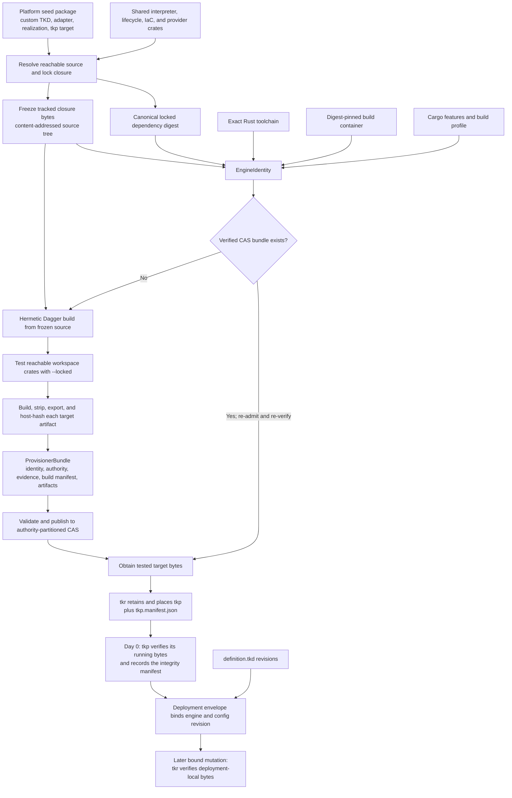
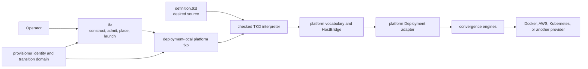
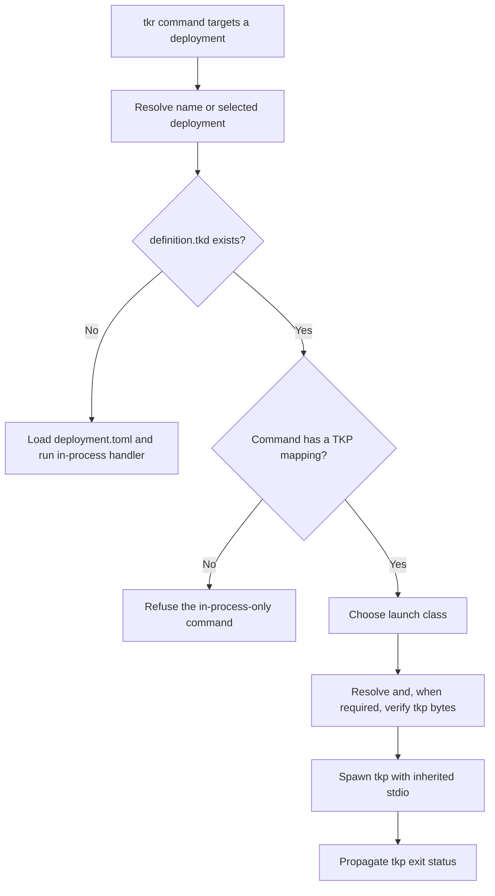
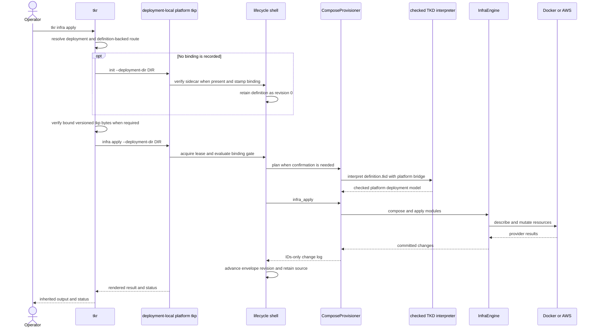

# Provisioning

Tokeira's platform contract is a matched language-and-engine pair: every platform
supported by `tokeirad` should define a custom TKD vocabulary and deliver the
platform-specific `tkp` engine that gives definitions in that vocabulary their meaning.
A `definition.tkd` is therefore not portable desired state interpreted by whichever
provisioner happens to be available. It is desired source for the exact platform engine
bound to its deployment.

`tkp` provenance is load-bearing. The engine includes the platform's closed TKD
vocabulary, bridge, deployment adapter, resource realization, provider integration, and
the shared interpreter and lifecycle machinery reachable from the platform binary. For a
versioned build, `tkr` derives an identity from that complete build closure, resolves or
builds a policy-qualified tested artifact, places it with the deployment, and later
verifies the married bytes before normal mutation.

The three operator-visible surfaces are:

- **`definition.tkd`** — desired deployment data written in one platform's admitted
  vocabulary;
- **`tkp`** — the platform-owned, versioned engine that interprets that vocabulary and
  realizes the deployment; and
- **`tkr`** — the construction, admission, placement, selection, and launch authority
  around deployment-local engines.

Shared crates do not make `tkp` a generic engine. `tokeira-provisioner-cli` supplies the
common lifecycle shell and `tokeira-tkd` supplies the checked interpreter, but the
platform package owns the binary target at the root of the build closure. The compiler
assembles one concrete engine without runtime plugins or reflection.

## Provenance is the language boundary

A `.tkd` edit can combine kinds and methods already compiled into the married engine. It
cannot add a provider call, filesystem read, dependency, kind, or resource
implementation. Those changes alter the engine closure and therefore its identity.

A versioned `tkp` identity is deliberately stronger than a semantic version or source
commit label. `EngineIdentity` combines:

- the content-addressed tree of the platform seed package's reachable workspace source
  closure, including build-shaping workspace files;
- the canonical locked third-party dependency closure reachable from that seed;
- the exact Rust toolchain;
- the digest-pinned build container;
- enabled Cargo features; and
- the build profile.

The definition digest is absent because a definition is data interpreted by the engine.
The human-facing semver is also absent because it does not prove executable equivalence.
`BuildAuthority` is orthogonal to identity: identical engine inputs can be built by a
local developer or trusted CI, while deployment policy can require one authority tier.
Target triples are represented by separately attested artifacts within the bundle.

The source snapshot is created before identity derivation and build. The hermetic build
materializes that immutable tree rather than reading the live worktree, runs the tests for
the reachable workspace crates, and uses `--locked` for test and build commands. Artifact
size and SHA-256 are calculated from the bytes exported from the build engine. A bundle
also records its build authority, passing test evidence, source tree and audit snapshot
identifiers, exact toolchain, request identifier, builder, and per-target descriptors.

A cache hit is only a performance result. CAS resolution re-runs authority, identity and
artifact revocation, and artifact-integrity admission; a present but inadmissible or
tampered entry is reported rather than replaced by a quiet rebuild. The CAS address is
partitioned by authority tier and keyed by engine identity and target, so local bytes
cannot satisfy a trusted-CI floor.

A fresh miss currently follows a narrower path: obtain refuses a requested build authority
below the deployment floor, the canonical build must pass its closure tests, and
publication refuses failed evidence or mismatched target bytes. The current miss path
does not invoke the separate identity/artifact revocation gate again before placement.
That distinction is implementation coverage, not permission to describe cache residence
or a successful build as trust by itself.

## Responsibility map

| Surface | Primary owner | Owns | Does not own |
|---|---|---|---|
| `tkr` | `apps/tkr` | Deployment registry and selection; platform-engine construction and obtain flow; authority floor; artifact retention and placement; launch classification and byte verification; upgrade and two-binary rollback orchestration | Definition evaluation or provider realization for forwarded deployments |
| Platform `tkp` | Platform package | The concrete engine executable: custom TKD vocabulary and bridge, adapter, platform lifecycle implementation, provider integrations, and the reachable shared engine closure | Deployment registry or selection |
| TKP lifecycle shell | `tokeira-provisioner-cli` | Commands, reports, binding gates, confirmation, operation lease, envelope, config revisions, and upgrade and rollback transitions | Platform kinds, clients, or resource construction |
| Provisioner domain | `tokeira-provisioner` | Engine identity, build authority, bundles, integrity and admission, binding verdicts, checkpoints, markers, and audit vocabulary | CLI parsing or provider operations |
| TKD interpreter | `tokeira-tkd` | Parsing, schema collection, reject-by-default subset checking, evaluation, admission constraints, and bridge dispatch | Filesystem, network, provider calls, or concrete platform kinds |
| `definition.tkd` | Operator | Desired values and structure within the married platform engine's admitted vocabulary | Executable behavior or arbitrary Rust code |

## Binding the definition to the engine

Bundled creation places both `<deployment>/tkp` and `tkp.manifest.json`. Before the first
provider mutation, hidden `tkp init` parses and validates that sidecar, reads the running
executable, and verifies its target-specific size and SHA-256. Only then does it record
the bundle integrity manifest and retain `definition.tkd` as configuration revision `0`.
A sidecar that does not describe the running bytes is a refusal, not a warning.

After initialization, the envelope is the durable marriage between engine provenance and
the effective definition revision. For an ordinary versioned mutation, `tkr` verifies the
deployment-local executable against the target descriptor recorded in that envelope
before spawning it. TKP then enforces the running-versus-recorded binding at the lifecycle
gate. Retained prior artifacts are keyed by `EngineIdentity × target` so rollback can
verify and restore the exact previous engine rather than find a similarly named binary.

Provider state remains separate. Infrastructure and runtime stores record convergence;
the provisioner envelope records who may operate, transition markers, integrity, and
configuration history. A successful envelope update does not prove that an arbitrary
provider object exists, and a retained `.tkd` revision only has operational meaning when
interpreted by the engine to which it is bound.

## Current operator paths

The platform contract above is the target architecture; current command coverage is not
yet uniform:

1. **Definition-backed deployments** contain `definition.tkd`. `tkr` launches the
   deployment-local platform `tkp` for supported lifecycle commands. Compose implements
   this complete path.
2. **In-process deployments** contain `deployment.toml`. `tkr` loads compiled platform
   configuration and invokes handlers in its own process. Local and ECS currently use
   this path.

File presence makes the routing decision. A definition-backed deployment cannot silently
fall through to a `deployment.toml` handler.

Versioned bundle construction is also an explicit current path rather than the default.
For Compose, `tkr deployment create --bundle --build-image
IMAGE@sha256:DIGEST` resolves the hard-coded Compose seed package, obtains a
`LocalDeveloper` bundle for the host target, retains it, and places its manifest. Without
`--bundle`, creation resolves native `tkp` bytes from `PATH`, beside `tkr`, or from a
workspace build. That development path has no bundle sidecar and receives a pre-identity
self-stamp; it must not be described as the versioned provenance guarantee.

`CandidateUpgrade` is also distinct from an ordinary bound launch. The current launcher
resolves candidate B outside married engine A but does not obtain or pre-verify B through
the bundle path; A's manifest cannot attest different candidate bytes. After a successful
ownership transfer, B records integrity for subsequent bound verification.

## A forwarded apply

For a Compose deployment, `tkr infra apply` and `tkr deployment apply` converge through
the same provisioner apply path. If the envelope is unstamped, the launcher first runs
the hidden initialization step.

## Platform coverage

Every fully supported definition-backed platform needs the whole chain: custom
vocabulary, bridge, builder, adapter, `ProvisionerPlatform`, platform-owned `tkp` target,
provenance-aware construction, and `tkr` routing.

| Platform | Current operator route | Custom TKD components | Complete platform TKP chain | Current consequence |
|---|---|---:|---:|---|
| Local | In-process | No | No | Uses `deployment.toml` and `tkr` handlers. |
| Compose | Definition-backed and forwarded | Yes | Yes | `tkr` creates `definition.tkd`, places the Compose engine, and forwards the supported lifecycle surface. |
| ECS | In-process | No | No | Uses `deployment.toml` and `tkr` handlers. |
| EKS | No complete deployment route | Bridge and kinds | No | Its vocabulary is an implementation component, not an end-to-end provisionable platform. |

A `HostBridge` alone is not an availability claim. EKS still lacks the complete
adapter/provisioner/binary/launcher chain, while Local and ECS remain available through
the older in-process route rather than the custom-TKD contract.

## Read next

- [Deployment definition programming guide](deployment-definitions.md) explains the
  platform-neutral language, program shape, admitted constructs, annotations, and
  interpretation passes.
- [Definition patterns and current practice](deployment-definition-patterns.md) shows
  source-backed authoring idioms and the complete custom-TKD platform chain.
- [The provisioner](provisioner.md) explains the lifecycle shell, platform seam,
  envelope, gates, locks, revisions, upgrade, and rollback.
- [`tkr` and `tkp`](tkr-and-tkp.md) follows engine construction, bundle admission,
  placement, Day-0 verification, launch verification, upgrade, and two-binary rollback.
- [Deployment configuration](deployment-configuration.md) documents named deployment
  directories, current in-process and forwarded layouts, and the `tkr` command surface.
- [IaC framework](../iac/README.md) covers the convergence engines and provider seams
  beneath provisioning.
- [Platform support](../platforms/README.md) summarizes current target environments.
