# Definition patterns and current practice

This guide shows how the abstract
[deployment-definition programming model](deployment-definitions.md) appears in current
source. It is example-led: snippets come from platform definitions, bridges, builders,
adapters, and provisioners already in the repository.

The examples have different support status:

- **Compose** supplies the complete definition-backed chain: a canonical
  `definition.tkd`, closed vocabulary, adapter, `ProvisionerPlatform`, platform-owned
  `tkp`, and `tkr` route.
- **EKS** supplies a bridge, builder, and kind vocabulary but not the complete
  adapter/provisioner/binary/operator chain. Its snippets demonstrate platform-extension
  practice, not an available EKS deployment workflow.

Treat these as current idioms, not a promise that every bound engine exposes the same
kinds or methods. The engine's closed `HostBridge` remains the authority for its
vocabulary.

## Pattern map

| Concern | Current example | Source |
|---|---|---|
| Separate editable values from deployment structure | Compose config types, `config()`, and `deployment()` | [`platforms/compose/definition.tkd`](../../platforms/compose/definition.tkd) |
| Select modules from config variants | Conditional DSQL module | [Compose definition](../../platforms/compose/definition.tkd) |
| Distinguish module and workload dependencies | Module `needs` and service `needs` | [Compose definition](../../platforms/compose/definition.tkd) |
| Keep host paths out of source | Context-provided volume anchors | [Compose definition](../../platforms/compose/definition.tkd) |
| Bind derived values through handles | Resource outputs and writeback | [Compose definition](../../platforms/compose/definition.tkd) |
| Supply optional kind fields through defaults | `Service::EMPTY` | [Compose bridge](../../platforms/compose/src/bridge.rs) |
| Keep kind values linear | Take-once host handles | [Compose bridge](../../platforms/compose/src/bridge.rs), [EKS bridge](../../platforms/eks/src/bridge.rs) |
| Distinguish config structs from host kinds | `ServiceManifest` and `IngressRule` classification | [EKS bridge](../../platforms/eks/src/bridge.rs) |
| Reject unknown kind fields | Typed extraction followed by `expect_empty()` | [Compose bridge](../../platforms/compose/src/bridge.rs), [EKS bridge](../../platforms/eks/src/bridge.rs) |
| Keep checking, snapshots, plan, and apply on one interpretation path | `interpret_definition` | [Compose provisioner](../../platforms/compose/src/provisioner.rs) |

## Keep configuration and topology separate

The Compose definition puts operator-editable values in ordinary config structs and
keeps builder calls in `deployment()`. The root config marks storage identity as a
create-time concern:

```rust
struct Compose {
    #[create]
    storage: Storage,
    tokeirad: Tokeirad,
    observability: Observability,
}

fn config() -> Compose {
    Compose {
        storage: Storage::InMemory,
        tokeirad: Tokeirad {
            image: "tokeirad:latest".into(),
            replicas: 1,
            grpc_port: 7233,
            metrics_port: 9090,
        },
        // ...
    }
}
```

The second entry point turns those values into platform handles and desired structure:

```rust
fn deployment(cfg: &Compose, cx: &Cx) -> Deployment {
    let mut d = Deployment::new(&["default"]);

    let local_state = d.module("local_state", &[]);
    d.resource(&local_state, "dir", LocalStateDir);

    // ...
    d
}
```

This split gives each half one job:

- `config()` remains host-free, comparable operator data;
- `deployment()` owns modules, resources, services, output references, and context use.

Do not move a constructed kind or builder handle into `config()` for convenience. The
interpreter deliberately rejects host values in the config result.

## Use enum variants to select structure

The canonical Compose source models storage as an enum. Only the DSQL variant adds the
DSQL module and resources:

```rust
if let Storage::Dsql { region, mode, endpoint, arn } = &cfg.storage {
    let dsql = d.module("dsql", &["local_state"]);
    let cluster = d.resource(
        &dsql,
        "cluster",
        DsqlCluster {
            region: region.clone(),
            mode: mode.clone(),
            endpoint: endpoint.clone(),
            arn: arn.clone(),
        },
    );

    // coordination resources and writeback use `cluster` below
}
```

This is preferable to constructing an always-present resource with sentinel strings.
The variant states both the data shape and whether the desired module exists. Plan and
apply therefore see the same structural decision.

The `#[create]` marker on `storage` records that changing this choice is intended to be a
retarget decision. Current Compose `ProvisionerPlatform` interpretation does not call
`tokeira_tkd::retarget_check` against the prior config, so the annotation is not yet an
automatic apply refusal. Code and documentation should preserve that distinction.

## Use stable modules as the large-grained graph

Compose groups resources and services under named modules and declares dependencies by
module name:

```rust
let local_state = d.module("local_state", &[]);
let observability = d.module("observability", &["local_state"]);
let runtime = d.module("runtime", &["local_state"]);
```

The names become part of operation selection, state ownership, and explanation. Keep them
stable. Add a module edge for ordering between groups; do not rely on source order.

Workload startup dependencies are separate. Grafana, for example, names the services it
needs inside the `Service` kind:

```rust
Service {
    image: o.grafana.image.clone(),
    replicas: o.grafana.replicas,
    publish: vec![o.grafana.port],
    needs: vec!["mimir".into(), "loki".into()],
    ..Service::EMPTY
}
```

A module dependency orders infrastructure composition. `Service.needs` records workload
ordering. Resource-level dependencies can be added by realization code as a third graph.
The Compose builder does this for services that mount generated config: typed config
volume anchors cause the realized service resource to depend on the config-files
resource. That edge is host logic rather than an extra magic string in the definition.

## Use engine defaults for sparse kinds

The Compose service vocabulary has many optional fields. Definitions overlay the fields
that matter onto `Service::EMPTY`:

```rust
Service {
    image: cfg.tokeirad.image.clone(),
    replicas: cfg.tokeirad.replicas,
    publish: vec![cfg.tokeirad.grpc_port, cfg.tokeirad.metrics_port],
    server_config: true,
    aws: match &cfg.storage {
        Storage::Dsql { region, .. } => Some(region.clone()),
        _ => None,
    },
    ..Service::EMPTY
}
```

The bridge implements that syntax by returning a complete default field map:

```rust
pub(crate) fn service_defaults() -> FieldMap {
    FieldMap::from([
        ("image".to_string(), Value::Str(String::new())),
        ("replicas".to_string(), Value::Int(0)),
        ("publish".to_string(), Value::Vec(Vec::new())),
        // ...
        ("server_config".to_string(), Value::Bool(false)),
        ("aws".to_string(), Value::Opt(None)),
    ])
}
```

The source-level `EMPTY` is therefore a host contract, not ordinary Rust constant
evaluation. When adding or changing a defaulted kind, keep the bridge field map and the
real kind defaults in lockstep. Prefer no default to a misleading default that changes
resource identity or security posture.

## Use context anchors instead of host paths

The Compose vocabulary exposes logical volume constructors through `cx`. The definition
names state or config intent and a container destination, not a machine-specific source
path:

```rust
volumes: vec![
    cx.state("grafana", "/var/lib/grafana"),
    cx.config("grafana/provisioning", "/etc/grafana/provisioning/"),
    cx.config("grafana/dashboards", "/var/lib/grafana/dashboards/"),
],
```

The builder carries these as typed `Vol` values. Realization resolves them relative to the
deployment directory. This keeps the definition hermetic and lets the engine control
which host paths are reachable.

The Docker socket is a deliberately whitelisted context method:

```rust
volumes: vec![
    cx.docker_sock(),
    cx.config("alloy.alloy", "/etc/alloy/config.alloy"),
],
```

That does not establish a general path escape. Compose recognizes one vetted method; the
EKS bridge exposes no volume host type and no `state`, `config`, or `docker_sock` methods.
Vocabulary should be as small as the target platform requires.

## Bind outputs through resource handles

Compose retains handles returned by `resource()` and uses them to declare deferred
writeback:

```rust
let cluster = d.resource(
    &dsql,
    "cluster",
    DsqlCluster {
        region: region.clone(),
        mode: mode.clone(),
        endpoint: endpoint.clone(),
        arn: arn.clone(),
    },
);

d.writeback("infrastructure.storage", "dsql");
d.writeback(
    "infrastructure.dsql.endpoint",
    cluster.output("cluster_endpoint"),
);
```

The `Output` handle records the logical module, resource, and output name. The adapter can
later realize the physical resource ID and resolve the named property from `InfraState`.
This is safer than assembling a string such as `"dsql.cluster.cluster_endpoint"`.

Writeback remains desired projection data. The current Compose adapter can calculate
values, but `ProvisionerPlatform::infra_apply` returns IDs-only change entries and does
not carry that writeback payload into `tokeirad.toml`. Do not document a declared
writeback as persisted runtime configuration until the command host actually performs
that persistence.

## How a platform supplies a custom TKD

A platform implementation is a complete chain, not only a list of kind names:

```mermaid
flowchart LR
    Definition["definition.tkd"] --> Core["tokeira-tkd"]
    Core --> Host["closed host-value enum"]
    Host --> Bridge["HostBridge"]
    Bridge --> Builder["platform builder"]
    Builder --> Adapter["orchestrator Deployment adapter"]
    Adapter --> Realization["resources, workloads, stores, providers"]
    Realization --> Seam["ProvisionerPlatform"]
    Seam --> Binary["platform-owned tkp"]
    Binary --> TKR["tkr construction and launch path"]
```



Compose implements the whole line. EKS currently implements the host, bridge, builder,
and resource-realization portion but stops before a complete adapter,
`ProvisionerPlatform`, `tkp`, and `tkr` route.

### Define a closed host-value set

Both current bridges use an enum for every opaque value the interpreter may carry.
Compose includes deployment, module, resource, output, kind, volume, and context handles:

```rust
pub enum HostObj {
    Deployment(Rc<RefCell<builder::Deployment>>),
    Module(ModuleRef),
    Resource(ResourceRef),
    Output(Output),
    Kind(Rc<RefCell<Option<HostKindVal>>>),
    Vol(Vol),
    Cx(Rc<Cx>),
}
```

EKS deliberately omits `Vol` because its vocabulary has no bind-mount operations. A
closed enum makes unsupported receiver/method combinations structural and avoids runtime
reflection.

### Make constructed kinds take-once

A kind literal is an unplaced desired object. Current bridges wrap it in
`Rc<RefCell<Option<...>>>` and consume the option when `resource()` or `service()` places
it. A second placement returns `kind handle already consumed`.

This linear-use convention prevents one mutable host object from being aliased into two
logical resources. Keep the take-once boundary in the bridge even when the concrete kind
is cloneable.

### Distinguish config structs from host kinds

EKS demonstrates an important classification boundary. `ServiceDeployment` is a host
kind that realizes provider resources. `ServiceManifest` and `IngressRule` are config
structs declared in source and nested inside kind fields. Its `is_kind` table includes
only the realizing types:

```rust
fn is_kind(&self, name: &str) -> bool {
    matches!(
        name,
        "Vpc"
            | "VpcEndpoint"
            | "SecurityGroup"
            // ...
            | "ServiceDeployment"
    )
}
```

`ServiceManifest` and `IngressRule` are intentionally absent. The bridge receives them as
ordinary `Value::Struct` values and explicitly decomposes their fields. Misclassifying a
config struct as a kind would route it through host construction and change the language
meaning.

### Consume every kind field

Current constructors extract each typed field and end with `expect_empty()`:

```rust
pub(crate) fn build_vpc(f: &mut FieldMap) -> Result<Vpc, EvalError> {
    let r = Vpc {
        cidr: f.take_str("cidr")?,
        availability_zones: f.take_vec_str("availability_zones")?,
    };
    f.expect_empty()?;
    Ok(r)
}
```

This pattern performs range and shape checks at the bridge edge and rejects misspelled or
unknown fields. Do not ignore leftovers for forward compatibility: silently dropped
desired data is more dangerous than a clear incompatibility error.

### Expose only deliberate context fields

Compose exposes `project_name` and optional `region`; EKS additionally exposes optional
`account_id`. Both omit `deployment_dir` from readable fields even though realization
context carries it internally.

```rust
match field {
    "project_name" => Ok(Value::Str(cx.project_name.clone())),
    "region" => Ok(Value::Opt(
        cx.region.clone().map(|s| Box::new(Value::Str(s))),
    )),
    other => Err(EvalError::new(format!(
        "`Cx` has no readable field `{other}`"
    ))),
}
```

Keep provider clients, credentials, live state, and filesystem locations out of this
surface. They belong in typed engine contexts used after interpretation.

### Let vocabulary differ by realization model

The current bridges intentionally do not expose identical APIs:

- Compose has `service`, volume anchors, and `Service::EMPTY` because containers and
  bind-mounted config are part of its author model.
- EKS has no `service` builder verb and no volume host type. Kubernetes workloads are
  represented as resource kinds and flow through one infrastructure engine path.
- Compose's DSQL kind has an explicit `DsqlMode`; EKS infers managed versus preexisting
  behavior from endpoint or ARN presence.

These differences are evidence that TKD is a per-platform language. Do not force a
least-common-denominator bridge merely to make source look portable.

### Adapt the builder without changing meaning

The adapter should map the interpreted builder to orchestrator modules, resources,
workloads, stores, namespaces, and deferred outputs. Keep provider handles outside the
definition and register them through typed engine contexts.

Compose's `TkdDeployment` reinterprets the retained source to supply modules and desired
snapshots. Its builder shares realization paths so planning and apply cannot derive
resource identities or dependencies differently. For example, the same
`realized_service` helper feeds module realization and desired snapshots.

### Use one full-interpretation entry point

Compose's provisioner funnels definition checking, config loading, desired snapshots,
plan, and apply through one `interpret_definition` helper:

```rust
fn interpret_definition(
    deployment_dir: &Path,
    path: &Path,
) -> Result<(String, Cx, crate::builder::Deployment)> {
    let source = std::fs::read_to_string(path)
        .with_context(|| format!("failed to read {}", path.display()))?;
    let cx = Cx {
        project_name: project_name(deployment_dir),
        region: None,
        deployment_dir: deployment_dir.to_path_buf(),
    };
    let (deployment, _config) = crate::interp::interpret(&source, &cx)
        .map_err(|e| anyhow::anyhow!("the definition does not verify: {e}"))?;
    Ok((source, cx, deployment))
}
```

The context contains host plumbing, but only bridge-whitelisted fields reach source. The
shared helper ensures authoring checks and lifecycle operations cannot assign different
meaning to the same bytes.

### Assemble and provenance-bind the engine

The complete platform binary should contain almost no policy at its entry point:

```rust
#[tokio::main]
async fn main() -> anyhow::Result<()> {
    tokeira_provisioner_cli::run(ComposeProvisioner).await
}
```

The small main does not make the engine generic. Its reachable closure contains the
interpreter, bridge, builder, adapter, realization, provider wiring, lifecycle seam, and
domain contracts. TKR's versioned construction and verification path binds that complete
closure to the deployment. See [`tkr` and `tkp`](tkr-and-tkp.md) for the provenance chain.

## Review checklist

When borrowing a pattern from current source, check the contract rather than copying its
shape mechanically:

- Is the value host-free config, a host kind, or an opaque handle?
- Is a structural branch better modeled as an enum variant?
- Is the logical module or resource name stable across ordinary edits?
- Is the dependency a module edge, resource edge, or workload edge?
- Does a context helper preserve hermetic source?
- Does every kind constructor consume and reject leftover fields?
- Is a constructed kind consumed exactly once?
- Are config structs kept out of `is_kind`?
- Do checks, snapshots, plan, and apply share one interpretation path?
- Does writeback have an actual persistence owner?
- Does the platform implement the complete adapter/provisioner/binary/launcher chain, or
  only an authoring component?
- Will changing this behavior re-key the platform engine rather than masquerade as a
  config-only edit?

## Further reading

- [Deployment definition programming guide](deployment-definitions.md) — abstract
  language and authoring rules.
- [Provisioning overview](README.md) — matched language/engine architecture.
- [The platform provisioner](provisioner.md) — lifecycle seam, state, and transitions.
- [`tkr` and `tkp`](tkr-and-tkp.md) — construction, identity, placement, and verification.
- [Extending the IaC framework](../iac/extending.md) — resource, module, adapter, and
  provider seams beneath a platform vocabulary.
- [Compose definition](../../platforms/compose/definition.tkd) and
  [Compose bridge](../../platforms/compose/src/bridge.rs) — complete current authoring
  path.
- [EKS bridge](../../platforms/eks/src/bridge.rs) and
  [EKS kinds](../../platforms/eks/src/kinds.rs) — current vocabulary components without a
  complete operator path.
