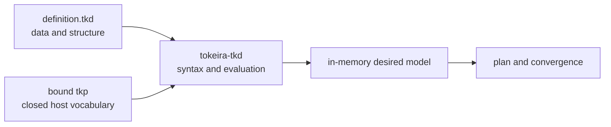
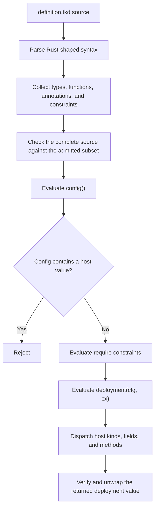

# Deployment definition programming guide

A `definition.tkd` is a declarative program interpreted by the platform-specific `tkp`
bound to a deployment. It uses a checked subset of Rust syntax, but it is not compiled
Rust and cannot execute arbitrary code. The definition describes desired data and
structure using only the vocabulary compiled into its engine.

This guide explains the programming model independently of any particular platform.
Concrete kind names, builder methods, context fields, and examples from current
implementations are collected in
[Definition patterns and current practice](deployment-definition-patterns.md).

## The language-and-engine contract

The shared `tokeira-tkd` interpreter owns syntax, evaluation, and fail-closed checking.
The bound engine supplies the host vocabulary:

- kind names and their fields;
- default values available through struct update syntax;
- associated functions that create host values;
- methods accepted on each host-value type;
- readable fields and methods on the injected context; and
- the host value that `deployment()` must return.

A source file is valid only for an engine that recognizes every host operation it uses.
The same syntax can therefore describe different resource models under different engines,
but a definition never discovers or loads capabilities at runtime. Changing values or
structure within the admitted vocabulary is a configuration revision. Adding a kind,
method, field meaning, provider operation, or other executable behavior is an engine
change.



## Program shape

A definition has two required entry points:

1. `config()` returns host-free operator data.
2. `deployment(cfg, cx)` combines that data with an engine-supplied context and returns
   the engine's deployment-builder value.

Types declared in the file describe configuration data. Host kinds and builder handles
are supplied by the engine rather than declared by the definition.

```rust
enum DataMode {
    Ephemeral,
    External {
        endpoint: String,
    },
}

#[require(replicas > 0)]
struct Runtime {
    image: String,
    replicas: u32,
}

struct Config {
    #[create]
    data: DataMode,
    runtime: Runtime,
}

fn config() -> Config {
    Config {
        data: DataMode::Ephemeral,
        runtime: Runtime {
            image: "application:stable".into(),
            replicas: 1,
        },
    }
}

fn deployment(cfg: &Config, cx: &Cx) -> Deployment {
    let mut d = Deployment::new(&["default"]);

    let foundation = d.module("foundation", &[]);
    if let DataMode::External { endpoint } = &cfg.data {
        d.resource(
            &foundation,
            "data",
            DataStore {
                endpoint: endpoint.clone(),
            },
        );
    }

    let runtime = d.module("runtime", &["foundation"]);
    d.resource(
        &runtime,
        "application",
        Workload {
            name: format!("{}-application", cx.project_name),
            image: cfg.runtime.image.clone(),
            replicas: cfg.runtime.replicas,
            ..Workload::EMPTY
        },
    );

    d
}
```

`Deployment`, `DataStore`, `Workload`, `module`, `resource`, `project_name`, and
`Workload::EMPTY` are illustrative host vocabulary. They are not language keywords. A
real definition may use them only when its bound engine exposes those exact names and
shapes.

## Configuration data

`config()` is the operator-editable half of the program. Its result must contain only
interpreter data: structs, enums, strings, integers, booleans, vectors, options, tuples,
and other admitted values composed from them.

The function must not produce a host value. In particular, do not construct resource
kinds, call builder methods, or retain engine context handles in configuration. The
host-free result is what makes configuration comparable across revisions and available
to requirement and retarget checks without provider access.

### Structs

Use structs to group related values and to make repeated shapes explicit:

```rust
struct Listener {
    port: u16,
    enabled: bool,
}

struct Config {
    image: String,
    listeners: Vec<Listener>,
}
```

A struct literal must satisfy the fields declared by that config type. A host kind has a
different contract: its fields are checked by the engine's kind constructor.

### Enums

Use enums when one choice changes the shape of configuration or deployment structure:

```rust
enum Storage {
    Temporary,
    Managed {
        region: String,
    },
    Existing {
        endpoint: String,
    },
}
```

Unit, tuple-like, and struct-like variants are values. `if let` and `match` can destructure
them later in `deployment()`.

### Options and collections

Use `Some(value)` and `None` for optional values. Use `vec![...]` for owned vectors and
`&[...]` where a host method accepts an array-like argument.

```rust
struct Network {
    endpoint: Option<String>,
    ports: Vec<u16>,
}

fn config() -> Network {
    Network {
        endpoint: None,
        ports: vec![7233, 9090],
    }
}
```

Whether a host-kind field accepts an option, vector, tuple pair, or scalar is part of the
bound engine's vocabulary.

## Building deployment structure

`deployment(cfg, cx)` turns pure config into an in-memory desired model. It may use three
categories of values:

- borrowed config values from `cfg`;
- whitelisted data and methods exposed through `cx`; and
- opaque host handles returned by admitted associated functions and methods.

A common builder shape is:

1. create a deployment handle;
2. declare modules and their dependencies;
3. construct host kinds from config data;
4. place each kind under a stable logical ID;
5. retain returned resource handles when later output references are needed; and
6. return the deployment handle.

The actual methods are engine-defined. The interpreter dispatches them through a closed
method table; it does not invoke arbitrary Rust methods or perform dynamic lookup.

### Stable logical names

Module names, resource IDs, and service names become part of desired identity and state
matching. Keep them stable across ordinary configuration edits. Changing a logical name
can turn an update into a deletion plus creation even when the provider-facing values are
otherwise unchanged.

### Explicit dependencies

Declare structural dependencies where the host vocabulary provides them. A module edge
usually orders groups of resources. A resource or workload edge can express a separate,
finer-grained dependency graph. Do not assume one dependency category implicitly creates
another unless the engine contract says it does.

### Handles and deferred outputs

When a builder returns a resource handle, retain the handle rather than reconstructing a
magic provider identifier:

```rust
let database = d.resource(&storage, "database", Database { /* fields */ });
let endpoint = database.output("endpoint");
d.writeback("runtime.database.endpoint", endpoint);
```

Here `output` and `writeback` are illustrative host methods. A deferred output is desired
data tied to the logical resource; it is resolved from recorded state only by an adapter
that implements that contract. Declaring writeback does not itself persist a file or
prove that provider convergence occurred.

## Control flow

The language admits bounded, deterministic control flow for selecting desired structure.
It does not admit general computation.

### `let` bindings

Use `let` to retain config values and host handles:

```rust
let foundation = d.module("foundation", &[]);
let resource = d.resource(&foundation, "primary", ResourceKind { /* fields */ });
```

A mutable deployment binding is allowed when the host builder methods mutate it:

```rust
let mut d = Deployment::new(&[]);
```

### `if let`

Use `if let` when one enum variant enables a block of desired structure:

```rust
if let Storage::Managed { region } = &cfg.storage {
    let storage = d.module("storage", &[]);
    d.resource(
        &storage,
        "primary",
        ManagedStorage { region: region.clone() },
    );
}
```

### `match`

Use `match` when all variants contribute a value or distinct structure:

```rust
let external = match &cfg.storage {
    Storage::Temporary => None,
    Storage::Managed { region } => Some(region.clone()),
    Storage::Existing { endpoint } => Some(endpoint.clone()),
};
```

Patterns must be from the admitted subset. Loops and unrestricted branching are not
available; deployment structure must remain statically bounded by the source and its
finite config values.

## Expressions and value shims

The admitted expression surface includes:

| Form | Use |
|---|---|
| `Type { field: value }` | Construct config data or an engine-recognized kind. |
| `Type::Variant` | Construct or match an enum variant. |
| `Some(value)` / `None` | Construct optional values. |
| `vec![...]` / `&[...]` | Construct admitted list forms. |
| `format!(...)` | Build deterministic strings from admitted values. |
| `..Kind::EMPTY` | Overlay explicit fields onto engine-provided defaults. |
| `.clone()` | Copy an admitted value when ownership requires it. |
| `.into()` / `.to_string()` | Perform admitted string conversion. |
| `.as_str()` / `.as_deref()` | Borrow admitted string values. |
| `.is_some()` / `.is_none()` | Test optional presence. |

These names do not imply general Rust trait dispatch. The interpreter recognizes the
specific forms it supports. Unknown operators, macros, methods, or paths fail closed.

The language does not admit:

- `use` declarations;
- arbitrary helper functions or method definitions;
- loops;
- filesystem or environment access;
- network calls;
- process execution;
- printing;
- unrestricted macros or operators; or
- provider API access.

## Admission annotations

Annotations describe constraints on host-free configuration. They do not add executable
capabilities.

### `#[require(...)]`

Attach `#[require]` to a config type to reject values that violate a local invariant:

```rust
#[require(replicas > 0)]
struct Runtime {
    image: String,
    replicas: u32,
}
```

Requirements run after `config()` evaluation and before `deployment()`. The admitted
expression slice includes comparisons, boolean composition, `matches!(field, Pattern)`,
and option-presence checks. A failed requirement rejects the definition before planning
or provider access.

Prefer requirements that explain invalid combinations at the configuration boundary.
Do not rely on a later kind-construction error when the invariant is expressible over
host-free data.

### `#[create]`

Mark a field with `#[create]` when changing it represents deployment retargeting rather
than ordinary reconciliation:

```rust
struct Config {
    #[create]
    identity: Identity,
    runtime: Runtime,
}
```

The annotation is metadata consumed by `tokeira_tkd::retarget_check`. Interpretation and
syntax validation do not compare revisions by themselves. The host must call the
retarget check against recorded prior config for `#[create]` to become an apply gate.
Treat the annotation as a declared boundary whose enforcement depends on that host
integration, not as an automatic provider mutation rule.

## Engine-provided context

`cx` is an opaque host value. Only fields and methods explicitly whitelisted by the
bound engine are available. A definition cannot enumerate hidden fields or reach the
filesystem through the context.

Use context values for engine-supplied identity and sanctioned logical anchors, not as a
back door for non-hermetic inputs. Provider credentials, deployment-directory paths,
clients, and live provider data belong on the realization side of the engine boundary.

## Kind defaults and field checking

An engine can expose defaults for a kind and permit struct update syntax:

```rust
Workload {
    image: cfg.image.clone(),
    replicas: cfg.replicas,
    ..Workload::EMPTY
}
```

The default object is not a Rust constant evaluated by the definition. It is a field map
supplied by the host bridge and overlaid with explicit fields. Use defaults only when the
engine documents them.

Kind construction should be total over the authored field map: required fields are
consumed, types and numeric ranges are checked, and leftover fields are rejected. A
misspelled or newly unsupported field must fail rather than disappear.

## Interpretation and checking

Full interpretation follows a fixed sequence:



The order is load-bearing:

1. parsing supplies located syntax errors;
2. schema collection builds in-file type and function tables and extracts annotations;
3. subset checking walks the complete syntax tree before evaluation, returning unknown
   constructs as errors;
4. `config()` evaluates and is rejected if its result contains any host value;
5. `#[require]` constraints run over the resolved config;
6. `deployment(cfg, cx)` evaluates through the host bridge; and
7. the bridge verifies that the returned host value is the expected deployment type.

`tokeira_tkd::validate` performs only parsing, schema collection, and subset checking. It
does not evaluate either entry point. An operator-facing definition check should use the
bound engine's full interpretation path so it also catches unknown kind fields, invalid
variants, requirement failures, context misuse, and an invalid return value without
contacting a provider or writing state.

## Authoring workflow

Use the engine intended to own the deployment throughout authoring:

1. Start from that engine's prototypical definition or documented vocabulary.
2. Model operator-editable values in config structs and enums.
3. Add `#[require]` constraints for invalid value combinations.
4. Mark true create-time identity fields with `#[create]`, understanding the host
   enforcement requirement.
5. Build modules and resources from stable logical names.
6. Run a full definition check.
7. Review an infrastructure or workload plan.
8. Apply only after reviewing destructive changes.

Typical commands are:

```bash
tkr definition check --path definition.tkd
tkr infra plan
tkr infra apply
```

A successful syntax-only validation is not enough. Full checking must run through the
same platform interpretation path used by plan and apply; otherwise the authoring tool
could accept source the actual engine rejects or assign it a different meaning.

## Design guidelines

- Keep `config()` pure, explicit, and easy to diff.
- Put structural choices in enums rather than sentinel strings.
- Use requirements for invalid combinations, not provider failures.
- Keep logical module and resource names stable.
- Declare dependencies explicitly and at the correct graph layer.
- Retain typed handles for outputs instead of reconstructing identifiers.
- Use context only through documented, hermetic fields and anchors.
- Prefer engine defaults for optional kind fields when those defaults are part of the
  vocabulary contract.
- Check and plan after every structural edit.
- Treat an unknown construct as a language error, not as a request for dynamic extension.

## Further reading

- [Definition patterns and current practice](deployment-definition-patterns.md) —
  source-backed examples and platform implementation idioms.
- [Provisioning overview](README.md) — language/engine binding and provenance.
- [The platform provisioner](provisioner.md) — lifecycle, state, binding, and transitions.
- [`tkr` and `tkp`](tkr-and-tkp.md) — engine construction, placement, and verification.
- [`tokeira-platform-definition` (tkd)](../../crates/tokeira-platform-definition/src/tkd/mod.rs) and
  [`HostBridge`](../../crates/tokeira-platform-definition/src/tkd/bridge.rs) — exact interpreter contracts.

## The Python form: `.tkdp`

A deployment definition can equally be authored in Python as `definition.tkdp`,
evaluated by the embedded Monty interpreter through the same structural
contract. `.tkd` and `.tkdp` are peer definition formats: one logical
definition produces the same typed configuration, the same structural graph,
and the same realized desired manifests in either form (the Compose seeds are
held to exactly that parity by test), and a deployment differs only in its
recorded definition format.

The authored shape mirrors the Rust form:

- **Facade imports.** Builders and kinds arrive via
  `from tokeira import Context, Deployment, Service, …`. The importable set is
  the complete engine kind inventory plus `Context` and `Deployment` — no
  platform curates below what the engine ships. `import tokeira` and
  `from tokeira import *` are rejected; the frontend satisfies the import
  itself (Monty resolves no such module).
- **Config types are dataclasses.** `@dataclass` classes with typed fields and
  defaults; union fields (`storage: InMemory | Dsql`) are admitted as
  annotations. Enum variants are spelled one dataclass per variant — a
  zero-field dataclass is a unit variant (`Managed()`), a field-carrying one a
  payload variant (`Dsql(region=…)`), decoding exactly as the `.tkd` enum
  spelling does.
- **The entrypoints are `config()` and `deployment(cfg, cx)`**, both required
  exactly once, with exact arities.
- **Kinds construct with keyword fields.** Omitted fields fill from the
  provider's declared defaults (the `..Service::EMPTY` equivalent); unknown
  kinds and fields fail at the declaring call with its position.
- **`match` is supported in a restricted subset**: wildcard, bare capture,
  literal and singleton patterns, keyword-only class patterns whose fields
  capture into bare names (or `_`), and guards. Sequence, mapping, OR, `as`,
  star, positional-argument, and dotted-value patterns are rejected before
  evaluation with spanned diagnostics. Two deliberate deviations from CPython,
  chosen for configuration semantics: a `match` whose cases all fail **raises**
  with the definition position (silent fall-through would let a definition
  that matches nothing produce an incomplete graph), and class patterns match
  on **exact variant identity** (`type(x) is C`), not `isinstance` subclassing.
- **Diagnostics land on your file.** The transient program Monty executes is
  internal; every parse error, runtime traceback, decode failure, and
  structural finding is translated to `definition.tkdp` positions, with
  facade/driver frames labelled internal.

Reserved namespace: identifiers beginning `__tokeira_internal_` are rejected
in definitions (they belong to the lowering), as is tab indentation.
