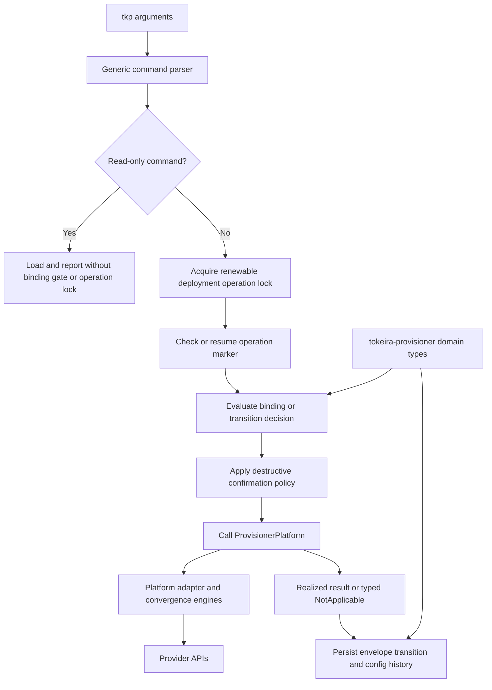
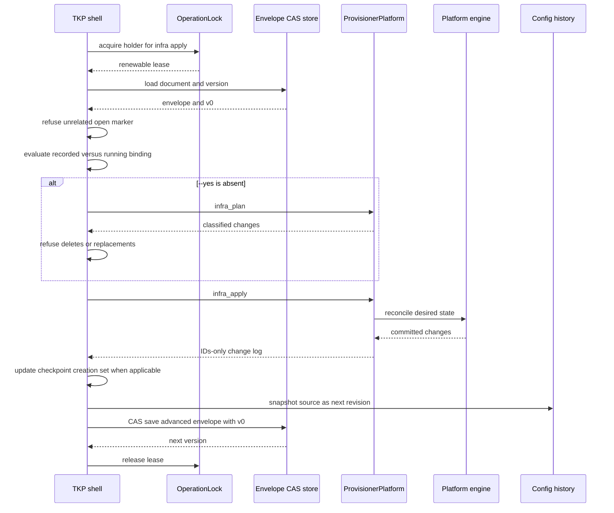

# The platform provisioner (`tkp`)

`tkp` is one platform's concrete deployment-language engine. It gives that platform's
`definition.tkd` its kinds, methods, defaults, resource behavior, and provider effects,
and it operates the resulting deployment through the shared lifecycle contract. Every
complete definition-backed platform therefore supplies its own platform-owned `tkp`
target; a generic provisioner selected independently of the definition would break the
language binding.

The binary is assembled from distinct compile-time responsibilities:

| Component | Responsibility |
|---|---|
| Platform binary target | Roots the platform engine closure and instantiates the concrete implementation passed to `tokeira_provisioner_cli::run`. |
| Custom TKD implementation | Closed host values, kinds, methods, defaults, bridge, builder, and deployment adapter that define the platform language. |
| `ProvisionerPlatform` implementation | Platform label and identity, definition checking, desired snapshots, recorded state, infrastructure operations, optional workload operations, and optional scale realization. |
| `tokeira-provisioner-cli` | Shared lifecycle shell: command parsing, output, binding orchestration, confirmation, operation locking, envelope persistence, config history, and lifecycle transitions. |
| `tokeira-provisioner` | Serializable identity and transition domain: provenance, binding, build authority, integrity and admission, bundles, state heads, checkpoints, markers, and audit entries. |

The domain crate is not a CLI and does not know a provider. The lifecycle shell does not
know Compose, AWS, or Kubernetes resource types. The platform implementation is injected
as a generic value, so the compiler produces one concrete executable without runtime
plugins or reflection. For a versioned bundle, `tkr` identifies and verifies the complete
reachable closure rather than treating the small binary entry point or its semver as the
engine boundary.

## Shell and platform ownership

`Realization<T>` makes conditional capabilities explicit. Infrastructure operations are
required. Definition checks, desired snapshots, workloads, and scale can return
`NotApplicable` with an operator-facing reason; the shell converts that into a typed
refusal rather than hiding the command or panicking.

## Command surface

Every command targets exactly one directory using `--deployment-dir`.

| Command | Class | Behavior |
|---|---|---|
| `tkp describe --deployment-dir DIR` | Read-only | Reports identity, provenance, integrity, binding, envelope, and state facts. |
| `tkp definition check --deployment-dir DIR [--definition PATH]` | Read-only | Asks the platform to parse and interpret a definition entirely in memory. |
| `tkp infra plan --deployment-dir DIR` | Read-only | Reports binding and infrastructure plan without gating or locking. |
| `tkp infra apply --deployment-dir DIR [--yes]` | Mutating | Gates the running engine, confirms destructive changes, applies infrastructure, and advances the config revision. |
| `tkp infra destroy --deployment-dir DIR --yes` | Mutating | Gates and irreversibly tears down platform infrastructure. |
| `tkp deploy plan --deployment-dir DIR` | Read-only | Plans the platform's workload realization, or reports `NotApplicable`. |
| `tkp deploy apply --deployment-dir DIR [--yes]` | Mutating | Gates, confirms, applies workloads, and advances the config revision. |
| `tkp deploy destroy --deployment-dir DIR --yes` | Mutating | Removes workloads in reverse dependency order while retaining infrastructure and deployment records. |
| `tkp destroy --deployment-dir DIR --yes` | Mutating | Removes workloads and then infrastructure; the owning `tkr` removes local records after success. |
| `tkp scale --deployment-dir DIR SPEC...` | Mutating | Passes platform-interpreted capacity specs and advances the config revision when realized. |
| `tkp revert --deployment-dir DIR --to N` | Mutating | Restores retained config revision `N`, reconciles with the same engine, and records a new forward revision. |
| `tkp upgrade --deployment-dir DIR` | Mutating | Transfers ownership to the running engine, applies it, and retains rollback evidence. |
| `tkp rollback --deployment-dir DIR` | Mutating | Uses the prior checkpoint to remove new-engine creations, re-pin, and reconcile with the prior engine. |

Day 0 is deliberately not a TKP command. `tkr deployment create` records the binding,
integrity manifest, and initial source revision while the deployment is still staged;
mutating TKP verbs therefore always begin from a complete creation record.

Global `--json` and `--detail` select structured output and evidence depth. Plan and
apply commands can additionally write a complete explanation model with
`--explanation PATH`; that artifact is independent of the stdout rendering.

## Platform seam

`ProvisionerPlatform` receives the deployment directory on every method because the
provisioner is married to one deployment and the platform owns its local conventions.
The required split is:

### Shell-owned policy

- CLI shape and output modes;
- read-only versus mutating classification;
- renewable operation-lock scope;
- binding and in-flight marker gates;
- destructive plan confirmation;
- Day-0 provenance and integrity stamp;
- envelope schema and CAS publication;
- config revision snapshots;
- upgrade and rollback transition ordering; and
- IDs-only audit representation.

### Platform-owned realization

- human label, config basename, and deployment identity;
- definition interpretation and canonical desired snapshots;
- loading the recorded infrastructure state used by causality checks;
- infrastructure plan, apply, full destroy, and selected-resource destroy;
- workload plan and apply where distinct; and
- scale dimensions where available.

A platform method returns changes that actually committed. For apply and selected
destroy, the shell receives IDs and `Created`/`Updated`/`Deleted` operations. It does not
receive resource before-images or provider clients.

## Apply sequence

Passing `--yes` records that the operator has already reviewed the destructive risk and
skips the shell's extra plan pass. Without it, a benign create/update plan can proceed,
while a plan containing delete or replacement refuses and names the destructive changes.
`infra destroy` always requires `--yes`.

## Provisioner state

The shell stores a `DeploymentStateEnvelope` separately from provider convergence state.
For the concrete Compose provisioner, these paths live under the deployment directory:

| Path | Owner | Contents |
|---|---|---|
| `state/envelope/` | TKP shell | CAS-published envelope document and version. |
| `state/config-revisions/N/definition.tkd` | TKP shell | Exact retained desired source for revision `N`. |
| `state/lock/` | TKP shell and `tkr` rollback orchestrator | Renewable operation lease serializing a complete mutating transition. |
| `state/binaries/` | Provisioner domain and launcher | Identity-keyed retained provisioner artifacts used for verified rollback. |
| `state/infra/` | Platform convergence engine | Resource identities, properties, dependencies, and outputs. |
| `state/deploy/` | Platform convergence engine | Runtime state when the platform uses a separate workload engine. |

The envelope can record:

- deployment identity;
- running-engine provenance and build mode;
- integrity manifest and build authority;
- engine identity for bundled builds;
- envelope schema version;
- monotonic config revision and effective config digest;
- infrastructure and runtime state heads;
- rollback checkpoint and creations since that checkpoint; and
- an open upgrade or rollback operation marker with its phase and audit log.

These fields govern who may perform a transition and how it resumes. They do not replace
`InfraState` or `RuntimeState`, and an envelope revision is not evidence that an arbitrary
provider object exists.

## Day 0 and configuration revisions

Deployment creation records the provisioner's reported provenance and independently
verified integrity manifest, sets revision `0`, and retains the platform's complete
authored source set before publishing the deployment directory. No provider operation
runs during this creation transition.

Every successful config-applying operation advances the revision and snapshots the exact
source beneath `state/config-revisions/`. The effective config reference is a SHA-256
digest of that source.

`revert --to N` does not decrement the counter. It restores the retained source for an
older revision, runs the ordinary same-engine infrastructure apply, then creates a new
revision whose content equals `N`. History therefore remains append-only and the revert
itself can be reverted.

## Binding gate

The binding verdict compares recorded and running provenance. The authoritative key is
the source-tree hash; semantic version is used to identify downgrades, not to prove code
equality.

| Verdict | Condition | Mutating result |
|---|---|---|
| `Match` | Versioned recorded and running engines have the same source-tree hash. | Proceed authoritatively. |
| `DevIterate` | A dev binary operates a dev-stamped deployment. | Proceed under the advisory development regime and re-stamp. |
| `Mismatch` | Versioned hashes differ, or a versioned binary meets a dev deployment. | Refuse ordinary mutation; use the matching engine or upgrade. |
| `Downgrade` | Running version is older than the recorded version. | Refuse. |
| `ModeRegression` | A dev binary meets a versioned deployment. | Refuse. |
| `Unknown` | No binding is recorded. | Refuse mutation; recreate or re-fetch the incomplete deployment. |

Read-only commands report rather than enforce this verdict. This is intentional: an
operator must be able to inspect and plan a deployment precisely when mutation is
blocked.

## Operation locking and interruption

All mutating commands execute inside `lock::with_operation_lock`. The renewable lease
covers the complete shell transition, not only one state save. Envelope and engine state
saves still use expected-version CAS; the operation lock does not turn stale publication
into a valid overwrite.

Upgrade and rollback open durable markers. An interrupted upgrade resumes only by
running `upgrade` with the engine that owns the marker. An interrupted rollback resumes
only through `rollback`. Other mutating verbs refuse while a marker is open, preventing a
normal apply from bypassing a half-completed ownership transition.

## Upgrade and rollback

An upgrade distinguishes engine change from config change:

1. verify that a recorded prior engine exists and evaluate the upgrade decision;
2. verify a migration path for the envelope schema and run it when needed;
3. in one CAS commit, capture the prior engine checkpoint, bind the running engine, record
   its integrity, and open the upgrade marker;
4. verify the recorded state heads still match the checkpoint baseline;
5. apply the new engine;
6. durably record the IDs-only audit log and creation set; and
7. close the marker.

A rollback requires that checkpoint. It verifies the retained prior binary before
destructive work, asks the platform to delete exactly the resources created since the
checkpoint, re-pins the envelope and config reference to the prior engine, then has that
engine reconcile forward. The [`tkr` and `tkp` guide](tkr-and-tkp.md) explains how the
launcher keeps one lock across the two executable launches.

## Compose realization

Compose is the concrete TKP implementation. `ComposeProvisioner`:

- treats `definition.tkd` as the config source;
- derives deployment identity from the deployment directory name;
- uses one shared `interpret_definition` path for check, snapshots, plan, and apply;
- opens `InfraEngine<TkdDeployment>`;
- tolerates an unreachable Docker daemon for planning by reporting unsupported live
  description, but requires a reachable daemon for apply and destroy;
- models Compose services as IaC resources, so deploy plan/apply delegate to infra
  plan/apply; and
- reports scale as `NotApplicable`.

## Further reading

- [Provisioning overview](README.md) — responsibility map and end-to-end flow.
- [Deployment definition programming guide](deployment-definitions.md) — abstract
  language, authoring, and interpretation rules.
- [Definition patterns and current practice](deployment-definition-patterns.md) —
  source-backed bridge, adapter, and platform-engine idioms.
- [`tkr` and `tkp`](tkr-and-tkp.md) — placement, launch classes, and binary handoff.
- [State and convergence](../iac/state-and-convergence.md) — engine state and CAS behavior.
- [`ProvisionerPlatform`](../../crates/tokeira-tkp/src/lib.rs) — exact platform seam.
- [`DeploymentStateEnvelope`](../../crates/tokeira-deployment/src/lib.rs) — provisioner domain entry point.
