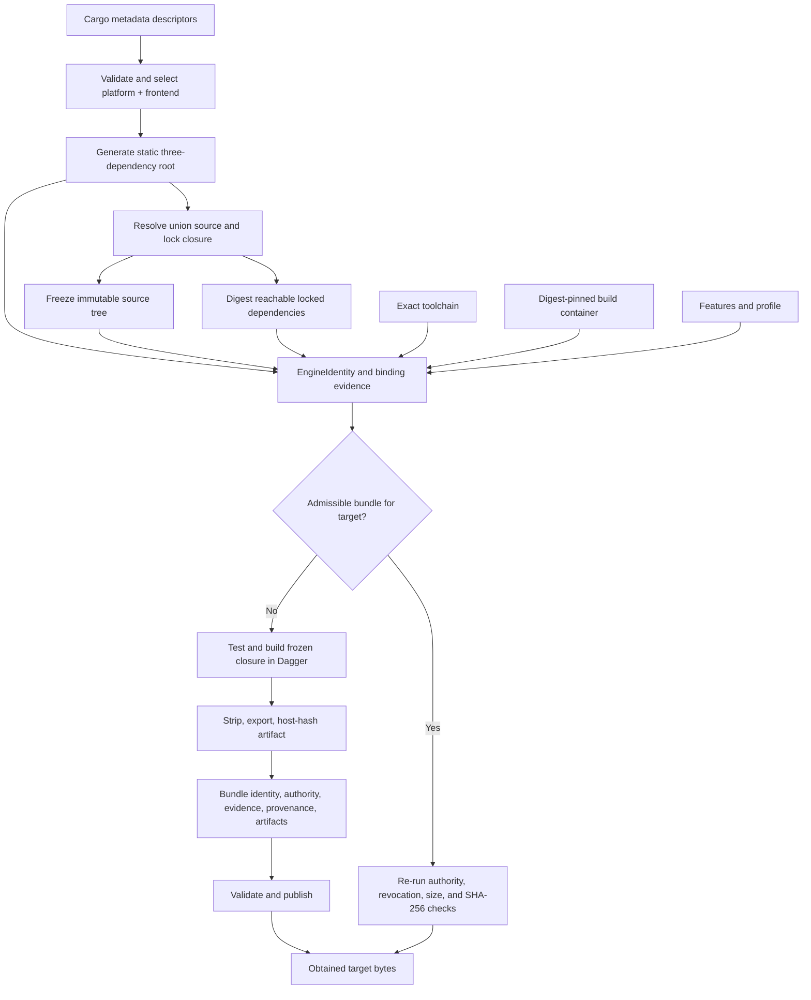
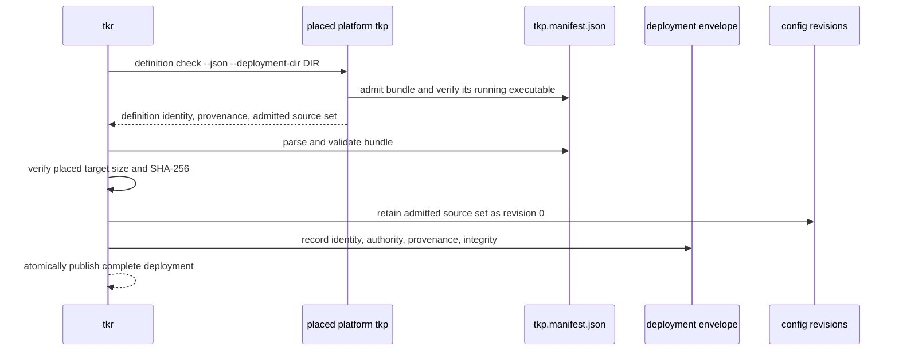
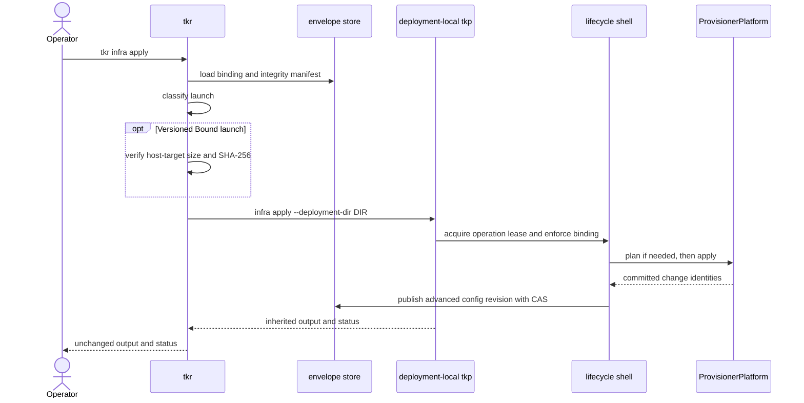
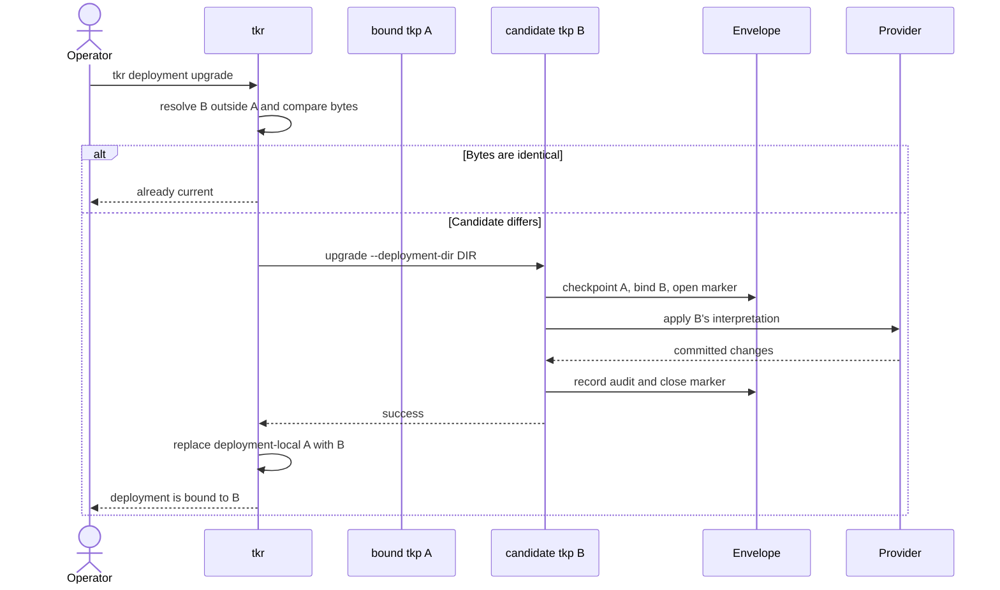
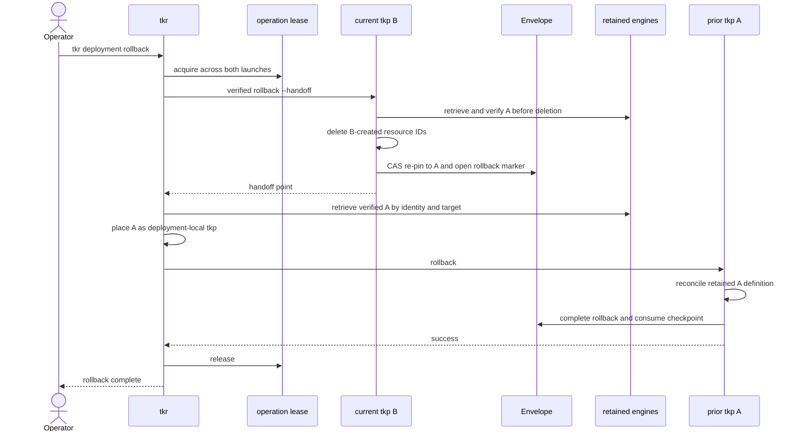

# How `tkr` constructs and governs `tkp`

For a definition-backed deployment, `tkr` is more than a process launcher. It constructs
or obtains the platform engine, applies the deployment's build-authority policy, retains
and places target-specific bytes, establishes the creation-time verification material, and
verifies the bound executable before later versioned mutations. The spawned `tkp` then
owns the lifecycle transition and provider convergence.

This boundary is what makes a deployment definition safe to retain as data. Its format,
closed kind set, context, and provider realization are defined by the exact platform and
frontend bound to the deployment, not by a generic executable selected by name or
semantic version.

## A statically assembled platform engine

A platform package does not own a committed `tkp` binary target. It exports its concrete
provisioner constructor, while a definition-frontend package exports its evaluator.
Cargo-metadata descriptors let `tkr` select both without a platform enum or match arm.

`tokeira-build` generates a disposable composition root with exactly three direct
dependencies:

- the selected platform implementation;
- the selected definition frontend; and
- the shared `tokeira-provisioner-cli` lifecycle shell.

The generated `main.rs` binds the platform and frontend's conventional exports and
records their open identifiers. It contains no runtime platform dispatch. The resolved
source closure then brings in provider clients, state and convergence types, the
frontend evaluator, and the provisioner identity and transition domain required by that
one selection.

The generated entry point is tiny, but its compiled closure is the language engine. A
change anywhere in the identity-bearing closure, or a change to the selected platform,
format, or private contract version, produces different evidence. The definition bytes
remain versioned configuration data rather than engine-identity input.

## Constructing and obtaining a versioned TKP

<p align="center">
  
</p>

The bundled creation path begins from catalog selection rather than an already-installed
executable or a hard-coded starting package:

1. `tkr` loads the normalized platform/frontend catalog from Cargo metadata, validates
   descriptor contracts and package coordinates, and selects one platform plus one
   compatible definition format.
2. `tokeira-build` renders the three-dependency composition root and resolves the union
   source and lock closure of the generic shell, selected platform, and selected
   frontend. Workspace `Cargo.toml`, `Cargo.lock`, `rust-toolchain.toml`, and
   `.cargo/config.toml` join the closure when present.
3. `tkr` freezes tracked worktree bytes under the closure paths into a content-addressed
   Git tree and deterministic audit commit without changing the real index, worktree, or
   refs. Staged and unstaged tracked content is captured. Untracked Rust sources refuse
   the current request rather than disappear from provenance.
4. Before compilation, the selected identifiers and contract versions, generated-root
   bytes, snapshot tree, lock closure, exact toolchain, digest-pinned build container,
   features, and profile determine the build and binding evidence.
5. The bundle store is queried by authority tier, identity, and target. A hit is admitted
   and byte-verified again; it is not trusted because it was cached.
6. On a miss, the canonical Dagger pipeline materializes only the frozen snapshot. It
   runs the closure test command, then builds the generated root's `tkp` target with
   `--locked`, strips it, exports it, and calculates size and SHA-256 from the exported
   host bytes.
7. The resulting `ProvisionerBundle` binds identity, build authority, human version,
   `TestEvidence`, the selected platform/frontend and generated-root evidence, the build
   manifest, and all target artifact descriptors. Publication validates the evidence and
   bytes and writes the manifest last.



`BuildAuthority` does not change how the engine is built. It records who performed the
same canonical build and lets a deployment require `LocalDeveloper` or `TrustedCi`.
Authority-tier partitioning prevents a local artifact from satisfying a trusted floor.
On a CAS hit, a revoked identity, revoked artifact, malformed descriptor, mismatched size,
or mismatched digest is an admission error; a present but inadmissible entry does not
trigger a quiet replacement build.

A fresh miss currently receives the authority-floor check before work and publication
checks for passing test evidence and matching bytes. The current obtain implementation
does not call the separate identity/artifact revocation admission gate again between that
fresh publication and placement. Cache-hit admission and fresh-build validation must
therefore not be described as the same current path.

### Current bundled coverage

The current `tkr deployment create --bundle --build-image
IMAGE@sha256:DIGEST` implementation is intentionally narrower than the platform contract:

- it resolves Compose and TKD through the workspace catalog;
- it builds the generated bound-provisioner target with the `dist` profile;
- it records `BuildAuthority::LocalDeveloper`;
- it builds the host target selected through `TKR_TARGET`;
- it uses a deployment-creation-local bundle CAS; and
- it excludes untracked Rust sources from the snapshot request, which makes their
  presence a refusal.

This is the versioned construction path used by Compose and ECS. Local remains on its
isolated in-process route; EKS is not operator-enabled.

## Retention and placement

After obtain returns the bundle and target bytes, `tkr`:

1. selects the descriptor and bytes for the host target;
2. retains those bytes under deployment state, keyed by
   `EngineIdentity × target`;
3. places an executable copy at `<deployment>/tkp`; and
4. places the serialized bundle sidecar at `<deployment>/tkp.manifest.json`.

The retained identity-keyed copy is not merely an installer cache. It is the exact prior
engine source used by verified two-binary rollback.

```text
<registry>/dev/
├── definition.tkd
├── metadata.json
├── tkp
├── tkp.manifest.json
├── tokeirad.toml
└── state/
    └── binaries/
```

Creating Compose with `--dev-engine` follows the native development path. `tkr` uses the
same catalog selection and composition-root generation, builds that generated root with
the workspace toolchain and lockfile, and places its `tkp` bytes plus a development-tier
bundle sidecar in the deployment. The sidecar honestly records a native, non-hermetic
build and local-developer authority. This path is useful for native iteration; it is not
interchangeable with the hermetic bundle guarantee.

Local uses the in-process deployment shape and receives `deployment.toml`. Compose and
ECS receive definition source sets and a deployment-local provisioner. See
[deployment configuration](deployment-configuration.md) for both layouts.

## Binding at creation

Creation realizes the complete local deployment before its staged directory becomes
visible. It does not create provider resources.

For every discovered engine, creation:

1. runs the placed provisioner's read-only admission and definition check;
2. receives that exact binary's embedded provenance and admitted source set;
3. parses and validates `tkp.manifest.json` as a bundle;
4. independently verifies the placed artifact's target, canonical SHA-256, size, and
   digest;
5. records the bundle's integrity manifest and reported engine provenance in the
   deployment envelope; and
6. retains the complete authored source set as configuration revision `0`.

A missing target, malformed sidecar, absent creation fact, or byte mismatch aborts
creation. Apply never repairs or initializes an incomplete deployment.



The envelope is now the durable binding. Retained definition revisions have meaning
under the recorded engine, and ordinary versioned mutation requires both the launcher
and lifecycle gate to agree that the running engine is the bound one.

## Verification on every launch class

Before spawning, `tkr` loads the envelope and classifies the request:

| Class | Used for | Binary rule | Launcher byte verification |
|---|---|---|---|
| `ReadOnly` | `describe`, `definition check`, and namespaced plans | Resolve an available provisioner so blocked deployments remain diagnosable. | Not required. |
| `Bound` | Normal mutation of a versioned deployment | Prefer `<deployment>/tkp`; refuse a development fallback. | Verify target-specific size and SHA-256 against the envelope integrity manifest. |
| `DevCandidate` | Mutation of a development deployment | Use the deployment copy or native source fallback. | No versioned manifest requirement; development binding remains advisory. An unstamped directory is incomplete and the TKP gate refuses it. |
| `CandidateUpgrade` | Upgrade | Resolve a candidate outside the old deployment-local bound copy. | The old manifest describes engine A and cannot attest candidate B; the launcher does not perform replacement prelaunch manifest verification. |
| `Rollback` | Engine handback | Start with bound B, then restore retained A. | Verify B against the current envelope and A against A's checkpoint manifest. |

```mermaid
flowchart TD
    Request["Forwarded verb"] --> Read{"Read-only?"}
    Read -->|Yes| ReadOnly["ReadOnly: report without launcher byte gate"]
    Read -->|No| Upgrade{"Upgrade?"}
    Upgrade -->|Yes| Candidate["CandidateUpgrade: resolve fresh candidate"]
    Upgrade -->|No| Rollback{"Rollback?"}
    Rollback -->|Yes| RB["Rollback: verify B, then retained A"]
    Rollback -->|No| Mode{"Recorded build mode"]
    Mode -->|Versioned| Bound["Bound: verify deployment-local tkp"]
    Mode -->|Dev or unstamped| Dev["DevCandidate: advisory native launch"]
```

Read-only permissiveness does not authorize mutation. It lets an operator inspect the
binding and plan when a mismatch is the problem. TKP's lifecycle gate still refuses an
applying verb that does not satisfy the recorded binding.

For `Bound`, verification happens before process launch. The deployment-local bytes must
match the target descriptor in the integrity manifest already protected by the envelope's
CAS context. An installed `tkp` with the same name or semver cannot substitute for them.
The launcher inherits stdin, stdout, and stderr and propagates the TKP status unchanged.

## Forwarding decision and command mapping

`tkr` identifies a bound deployment from the admitted definition record in
`metadata.json`, not from filename or extension heuristics. The record names the open
platform ID, definition format, and safe deployment-relative definition path. A command
without a TKP implementation is refused rather than sent to a legacy in-process handler.

| Operator command | Launched command |
|---|---|
| `tkr definition check` | `tkp definition check --deployment-dir DIR` |
| `tkr infra plan` | `tkp infra plan --deployment-dir DIR` |
| `tkr infra apply` | `tkp infra apply --deployment-dir DIR` |
| `tkr infra destroy` | `tkp infra destroy --deployment-dir DIR` |
| `tkr infra status` | `tkp describe --deployment-dir DIR` |
| `tkr deploy plan` | `tkp deploy plan --deployment-dir DIR` |
| `tkr deploy apply` | `tkp deploy apply --deployment-dir DIR` |
| `tkr deploy destroy` | `tkp deploy destroy --deployment-dir DIR` |
| `tkr deploy status` | `tkp describe --deployment-dir DIR` |
| `tkr scale up/down` | `tkp scale --deployment-dir DIR ...` |
| `tkr scale status` | `tkp describe --deployment-dir DIR` |
| `tkr deployment describe` | `tkp describe --deployment-dir DIR` |
| `tkr deployment apply` | `tkp infra apply --deployment-dir DIR` |
| `tkr deployment destroy --name NAME` | `tkp destroy --deployment-dir DIR`, followed by local record removal |
| `tkr deployment upgrade` | candidate-driven `tkp upgrade`, then provisioner replacement |
| `tkr deployment rollback` | rollback orchestration across the bound and retained provisioners |

`--yes` and `--explanation PATH` cross the apply boundary where TKP supports them.
`--json` and `--detail` cross the read-only reporting boundary. In-process-only options
are not invented on the other side; for example, `tkr deploy apply --force` has no TKP
flag and is not forwarded. Logs and port mappings have bound-platform capabilities;
schema remains a Local in-process command path.

## Normal bound apply



There are two locks with different jobs. `tkr deployment lock` is a registry-level
mis-apply guard that pins mutating `tkr` commands to one selected deployment. TKP's
`state/lock/` operation lease serializes a complete mutating provisioner transition.
Neither replaces state-store CAS.

## Upgrade: transferring the language engine

`tkr deployment upgrade` changes the engine that defines the deployment rather than
merely replacing a file:

1. resolve candidate B from the native source pool, never from `<deployment>/tkp`, which
   is bound engine A;
2. compare candidate and bound bytes, treating identical bytes as an idempotent no-op;
3. launch candidate B's `upgrade` transition;
4. let B checkpoint A, validate the transition, bind itself, record its running-binary
   integrity, apply its interpretation of the desired source, and close the durable
   marker; and
5. only after success, replace `<deployment>/tkp` with B's bytes.



Candidate-upgrade launch is not equivalent to bound launch verification. A's manifest
cannot attest B, and the current launcher does not require B to arrive through the bundle
obtain path before starting it. B self-records integrity during a successful ownership
transition so subsequent bound launches can verify the bound deployment-local bytes.

## Rollback: verified handback from B to A

Rollback changes engine ownership. `revert --to N` instead restores prior definition data
under the same engine.

For an identity-bearing checkpoint, `tkr` holds one operation lease across both engines:

1. verify and launch bound engine B with a hidden handoff flag;
2. B retrieves and verifies retained A before destructive work, deletes exactly the
   resource IDs recorded as created since A's checkpoint, re-pins the envelope to A, and
   leaves the rollback marker open;
3. `tkr` retrieves A by `EngineIdentity × target`, verifies it against A's checkpoint
   manifest, and places it as `<deployment>/tkp`;
4. launch A's `rollback` so A reconciles its retained definition and completes the marker;
   and
5. release the continuously held lease.



If the process stops after the re-pin, another rollback resumes from the durable marker
rather than repeating the ownership decision. A pre-identity development checkpoint uses
the single-process fallback and cannot claim the verified two-binary handoff.

## Direct TKP use

A platform `tkp` can be invoked directly for a known deployment directory, but doing so
does not reproduce TKR's full role. `tkr` adds registry selection, platform-engine obtain
and placement, authority policy, identity-keyed retention, launch-class byte verification,
staged creation-time realization, candidate selection, deployment-level lock enforcement, and
multi-binary rollback. It is therefore the recommended operator surface; direct TKP
commands are primarily useful for implementation tests and precise lifecycle diagnosis.

## Further reading

- [Provisioning overview](README.md) — the matched language-and-engine architecture.
- [The provisioner](provisioner.md) — lifecycle shell and envelope mechanics.
- [Deployment definition programming guide](deployment-definitions.md) — the abstract
  language interpreted by each platform engine.
- [Definition patterns and current practice](deployment-definition-patterns.md) —
  source-backed custom vocabulary and assembly idioms.
- [Deployment configuration](deployment-configuration.md) — registry and current command
  surfaces.
- [`tkr` platform discovery](../../apps/tkr/src/platform_discovery.rs) — normalized workspace
  platform/frontend discovery.
- [`tkr` deployment construction](../../apps/tkr/src/deployment_dir.rs) — definition
  recording, generated native build, and placement.
- [`tkr` bundle construction](../../apps/tkr/src/bundle_create.rs) — snapshot, obtain,
  retention, and versioned placement flow.
- [Provisioner build pipeline](../../crates/tokeira-build/src/pipelines/provisioner.rs) —
  hermetic test, build, export, and packaging implementation.
- [`apps/tkr` launcher](../../apps/tkr/src/launcher.rs) — launch classification and byte
  verification.
- [Generated provisioner composition](../../crates/tokeira-build/src/composition.rs) —
  the deterministic root binding one platform, one frontend, and the generic shell.
