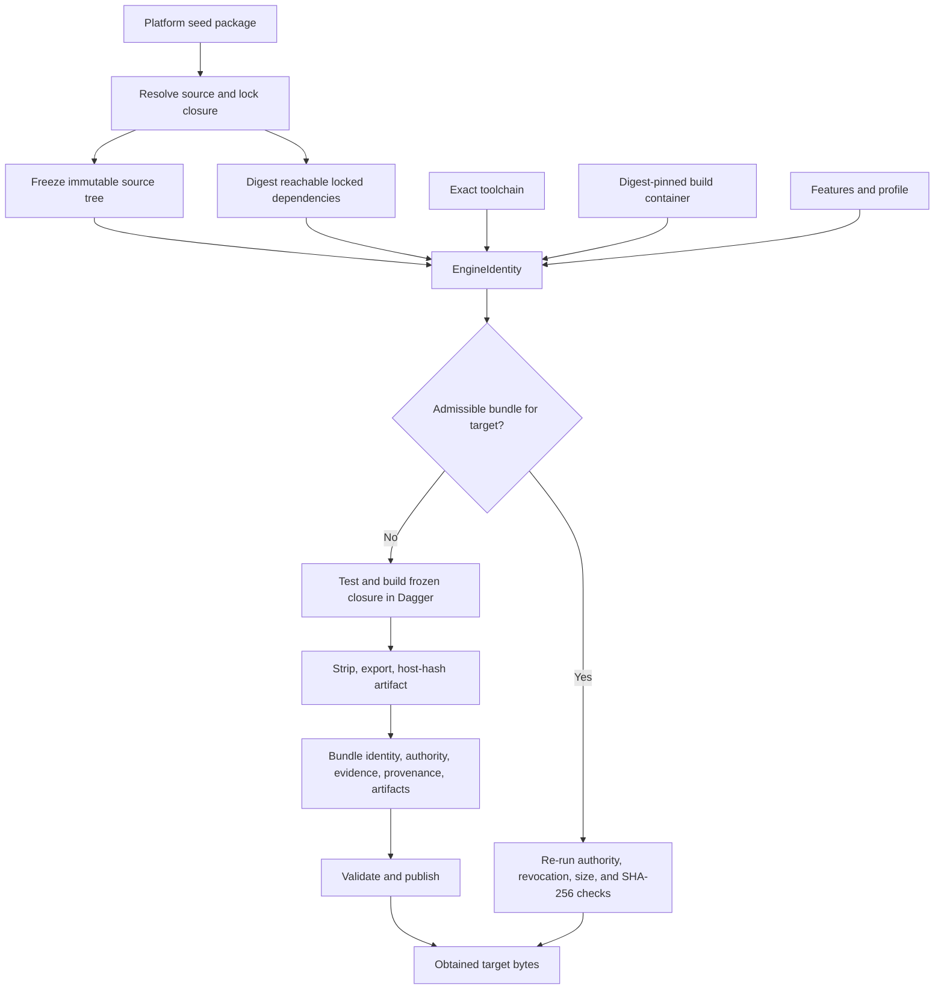
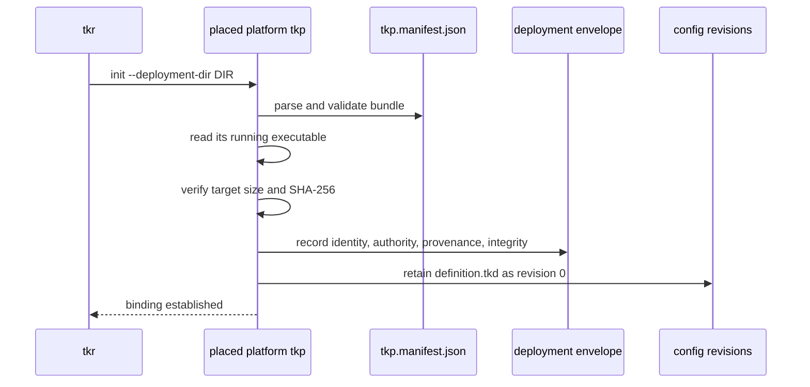
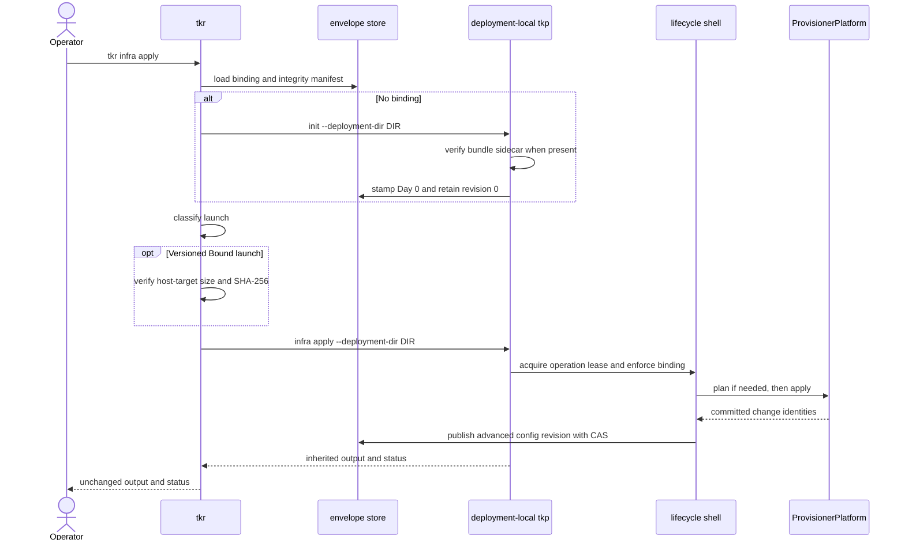
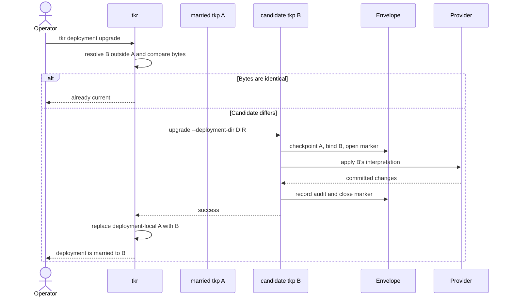
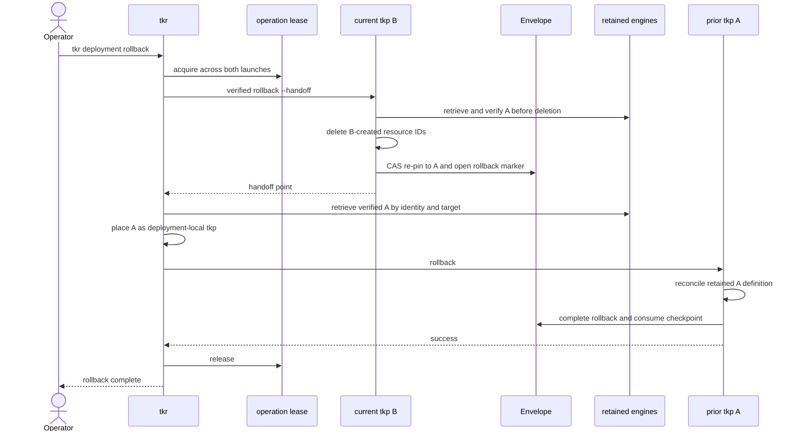

# How `tkr` constructs and governs `tkp`

For a definition-backed deployment, `tkr` is more than a process launcher. It constructs
or obtains the platform engine, applies the deployment's build-authority policy, retains
and places target-specific bytes, establishes the Day-0 verification material, and
verifies the married executable before later versioned mutations. The spawned `tkp` then
owns the lifecycle transition and provider convergence.

This boundary is what makes a custom `definition.tkd` safe to retain as data. Its kinds,
methods, defaults, adapter behavior, and provider realization are defined by the exact
platform-specific engine bound to the deployment, not by a generic executable selected
by name or semantic version.

## A platform engine, not a generic wrapper

The platform package owns the `tkp` binary target. Its dependency closure brings together:

- the platform's custom TKD host values, kinds, methods, and `HostBridge`;
- the builder and orchestrator `Deployment` adapter;
- the `ProvisionerPlatform` implementation;
- provider clients, stores, resource types, and convergence engines;
- the checked `tokeira-tkd` interpreter;
- the shared `tokeira-provisioner-cli` lifecycle shell; and
- the `tokeira-provisioner` identity, integrity, admission, and transition domain.

The binary entry point may be tiny, but the compiled closure is the language engine. A
change anywhere in the identity-bearing closure produces a different engine identity.
The definition itself is deliberately not an identity input: it is versioned data whose
meaning is fixed by the married engine.

## Constructing and obtaining a versioned TKP

The bundled creation path begins from a platform seed package rather than from an
already-installed executable:

1. `tkr` asks Cargo metadata for every workspace package reachable from the seed with all
   features enabled. The safe over-approximation means an optional workspace dependency
   can re-key the engine but cannot be omitted from its provenance. Workspace
   `Cargo.toml`, `Cargo.lock`, `rust-toolchain.toml`, and `.cargo/config.toml` also join
   the source closure when present.
2. The same dependency walk records the reachable third-party lock closure as canonical
   name, version, source, and lockfile checksum tuples.
3. `tkr` freezes tracked worktree bytes under the closure paths into a content-addressed
   Git tree and deterministic audit commit without changing the real index, worktree, or
   refs. Staged and unstaged tracked content is captured. Untracked Rust sources refuse
   the current request rather than disappear from provenance.
4. Before any compilation, the snapshot tree, lock closure, exact toolchain,
   digest-pinned build container, features, and profile determine `EngineIdentity`.
5. The bundle store is queried by authority tier, identity, and target. A hit is admitted
   and byte-verified again; it is not trusted because it was cached.
6. On a miss, the canonical Dagger pipeline materializes only the frozen snapshot. It
   runs `cargo test --locked` for the reachable workspace crates, then builds the
   platform-owned `tkp` target with `--locked`, strips it, exports it, and calculates size
   and SHA-256 from the exported host bytes.
7. The resulting `ProvisionerBundle` binds identity, build authority, human version,
   `TestEvidence` showing the closure test command passed, the build manifest, and all
   target artifact descriptors. Publication validates the evidence and bytes and writes
   the manifest last.



`BuildAuthority` does not change how the engine is built. It records who performed the
same canonical build and lets a deployment require `LocalDeveloper` or `TrustedCi`.
Authority-tier partitioning prevents a local artifact from satisfying a trusted floor.
On a CAS hit, a revoked identity, revoked artifact, malformed descriptor, mismatched size,
or mismatched digest is an admission error; a present but inadmissible entry does not
trigger a quiet replacement build.

A fresh miss currently receives the authority-floor check before work and publication
checks for passing test evidence and matching bytes. The current obtain implementation
does not call the separate identity/artifact revocation admission gate again between that
fresh publication and placement. Cache-hit admission and fresh-build validation must
therefore not be described as the same current path.

### Current bundled coverage

The current `tkr deployment create --bundle --build-image
IMAGE@sha256:DIGEST` implementation is intentionally narrower than the platform contract:

- its seed package is currently fixed to `tokeira-compose-deployment`;
- it builds the `tkp` target with the `provisioner` feature and `dist` profile;
- it records `BuildAuthority::LocalDeveloper`;
- it builds the host target selected through `TKR_TARGET`;
- it uses a deployment-creation-local bundle CAS; and
- it excludes untracked Rust sources from the snapshot request, which makes their
  presence a refusal.

This is the complete versioned construction path implemented today for Compose. It does
not yet make Local, ECS, or EKS definition-backed platform engines.

## Retention and placement

After obtain returns the bundle and target bytes, `tkr`:

1. selects the descriptor and bytes for the host target;
2. retains those bytes under deployment state, keyed by
   `EngineIdentity × target`;
3. places an executable copy at `<deployment>/tkp`; and
4. places the serialized bundle sidecar at `<deployment>/tkp.manifest.json`.

The retained identity-keyed copy is not merely an installer cache. It is the exact prior
engine source used by verified two-binary rollback.

```text
<registry>/dev/
├── definition.tkd
├── metadata.json
├── tkp
├── tkp.manifest.json
├── tokeirad.toml
└── state/
    └── binaries/
```

Creating Compose without `--bundle` follows the development placement path instead. Its
source resolution order is:

1. `tkp` installed on `PATH`;
2. `tkp` beside the running `tkr`; or
3. a workspace build of the Compose package's `tkp` target.

`tkr` copies those bytes into the deployment and makes them executable, but there is no
bundle sidecar. The first initialization records a pre-identity development self-stamp.
This path is useful for native iteration; it is not interchangeable with the versioned
bundle guarantee.

Local and ECS currently use the in-process deployment shape, receive `deployment.toml`,
and have no deployment-local provisioner. See
[deployment configuration](deployment-configuration.md) for both layouts.

## Day-0 marriage

Creation places files but does not create provider resources or stamp the envelope. The
first forwarded apply runs hidden `tkp init` before mutation.

For a bundled engine, initialization:

1. parses and validates `tkp.manifest.json` as a bundle;
2. reads the bytes of the currently running executable;
3. selects the descriptor for `TKP_TARGET`;
4. verifies descriptor uniqueness, canonical SHA-256, size, and digest;
5. records the bundle's integrity manifest and engine provenance in the deployment
   envelope; and
6. retains `definition.tkd` as configuration revision `0`.

A missing target, malformed sidecar, or byte mismatch aborts initialization. The sidecar
is not permission to trust arbitrary bytes; it supplies the bundle material from which
the running artifact must be verified. Without a sidecar, only the native development
self-stamp is available.



The envelope is now the durable marriage. Retained definition revisions have meaning
under the recorded engine, and ordinary versioned mutation requires both the launcher
and lifecycle gate to agree that the running engine is the married one.

## Verification on every launch class

Before spawning, `tkr` loads the envelope and classifies the request:

| Class | Used for | Binary rule | Launcher byte verification |
|---|---|---|---|
| `ReadOnly` | `describe`, `definition check`, and namespaced plans | Resolve an available provisioner so blocked deployments remain diagnosable. | Not required. |
| `Bound` | Normal mutation of a versioned deployment | Prefer `<deployment>/tkp`; refuse a development fallback. | Verify target-specific size and SHA-256 against the envelope integrity manifest. |
| `DevCandidate` | Mutation of a development or unstamped deployment | Use the deployment copy or native source fallback. | No versioned manifest requirement; development binding remains advisory. |
| `CandidateUpgrade` | Upgrade | Resolve a candidate outside the old deployment-local married copy. | The old manifest describes engine A and cannot attest candidate B; the launcher does not perform replacement prelaunch manifest verification. |
| `Rollback` | Engine handback | Start with bound B, then restore retained A. | Verify B against the current envelope and A against A's checkpoint manifest. |

```mermaid
flowchart TD
    Request["Forwarded verb"] --> Read{"Read-only?"}
    Read -->|Yes| ReadOnly["ReadOnly: report without launcher byte gate"]
    Read -->|No| Upgrade{"Upgrade?"}
    Upgrade -->|Yes| Candidate["CandidateUpgrade: resolve fresh candidate"]
    Upgrade -->|No| Rollback{"Rollback?"}
    Rollback -->|Yes| RB["Rollback: verify B, then retained A"]
    Rollback -->|No| Mode{"Recorded build mode"]
    Mode -->|Versioned| Bound["Bound: verify deployment-local tkp"]
    Mode -->|Dev or unstamped| Dev["DevCandidate: advisory native launch"]
```

Read-only permissiveness does not authorize mutation. It lets an operator inspect the
binding and plan when a mismatch is the problem. TKP's lifecycle gate still refuses an
applying verb that does not satisfy the recorded binding.

For `Bound`, verification happens before process launch. The deployment-local bytes must
match the target descriptor in the integrity manifest already protected by the envelope's
CAS context. An installed `tkp` with the same name or semver cannot substitute for them.
The launcher inherits stdin, stdout, and stderr and propagates the TKP status unchanged.

## Forwarding decision and command mapping

`tkr` identifies the definition-backed shape by the presence of `definition.tkd`. A
command without a TKP implementation is refused rather than sent to a nonexistent
`deployment.toml` handler.

| Operator command | Launched command |
|---|---|
| `tkr definition check` | `tkp definition check --deployment-dir DIR` |
| `tkr infra plan` | `tkp infra plan --deployment-dir DIR` |
| `tkr infra apply` | hidden `tkp init` when needed, then `tkp infra apply --deployment-dir DIR` |
| `tkr infra destroy` | `tkp infra destroy --deployment-dir DIR` |
| `tkr infra status` | `tkp describe --deployment-dir DIR` |
| `tkr deploy plan` | `tkp deploy plan --deployment-dir DIR` |
| `tkr deploy apply` | `tkp deploy apply --deployment-dir DIR` |
| `tkr deploy status` | `tkp describe --deployment-dir DIR` |
| `tkr scale up/down` | `tkp scale --deployment-dir DIR ...` |
| `tkr scale status` | `tkp describe --deployment-dir DIR` |
| `tkr deployment describe` | `tkp describe --deployment-dir DIR` |
| `tkr deployment apply` | hidden `tkp init` when needed, then `tkp infra apply --deployment-dir DIR` |
| `tkr deployment upgrade` | candidate-driven `tkp upgrade`, then provisioner replacement |
| `tkr deployment rollback` | rollback orchestration across the bound and retained provisioners |

`--yes` and `--explanation PATH` cross the apply boundary where TKP supports them.
`--json` and `--detail` cross the read-only reporting boundary. In-process-only options
are not invented on the other side; for example, `tkr deploy apply --force` has no TKP
flag and is not forwarded. Logs, port forwarding, exec, and schema remain current
in-process command paths.

## Normal bound apply



There are two locks with different jobs. `tkr deployment lock` is a registry-level
mis-apply guard that pins mutating `tkr` commands to one selected deployment. TKP's
`state/lock/` operation lease serializes a complete mutating provisioner transition.
Neither replaces state-store CAS.

## Upgrade: transferring the language engine

`tkr deployment upgrade` changes the engine that defines the deployment rather than
merely replacing a file:

1. resolve candidate B from the native source pool, never from `<deployment>/tkp`, which
   is married engine A;
2. compare candidate and bound bytes, treating identical bytes as an idempotent no-op;
3. launch candidate B's `upgrade` transition;
4. let B checkpoint A, validate the transition, bind itself, record its running-binary
   integrity, apply its interpretation of the desired source, and close the durable
   marker; and
5. only after success, replace `<deployment>/tkp` with B's bytes.



Candidate-upgrade launch is not equivalent to bound launch verification. A's manifest
cannot attest B, and the current launcher does not require B to arrive through the bundle
obtain path before starting it. B self-records integrity during a successful ownership
transition so subsequent bound launches can verify the married deployment-local bytes.

## Rollback: verified handback from B to A

Rollback changes engine ownership. `revert --to N` instead restores prior definition data
under the same engine.

For an identity-bearing checkpoint, `tkr` holds one operation lease across both engines:

1. verify and launch bound engine B with a hidden handoff flag;
2. B retrieves and verifies retained A before destructive work, deletes exactly the
   resource IDs recorded as created since A's checkpoint, re-pins the envelope to A, and
   leaves the rollback marker open;
3. `tkr` retrieves A by `EngineIdentity × target`, verifies it against A's checkpoint
   manifest, and places it as `<deployment>/tkp`;
4. launch A's `rollback` so A reconciles its retained definition and completes the marker;
   and
5. release the continuously held lease.



If the process stops after the re-pin, another rollback resumes from the durable marker
rather than repeating the ownership decision. A pre-identity development checkpoint uses
the single-process fallback and cannot claim the verified two-binary handoff.

## Direct TKP use

A platform `tkp` can be invoked directly for a known deployment directory, but doing so
does not reproduce TKR's full role. `tkr` adds registry selection, platform-engine obtain
and placement, authority policy, identity-keyed retention, launch-class byte verification,
first-apply initialization, candidate selection, deployment-level lock enforcement, and
multi-binary rollback. It is therefore the recommended operator surface; direct TKP
commands are primarily useful for implementation tests and precise lifecycle diagnosis.

## Further reading

- [Provisioning overview](README.md) — the matched language-and-engine architecture.
- [The provisioner](provisioner.md) — lifecycle shell and envelope mechanics.
- [Deployment definition programming guide](deployment-definitions.md) — the abstract
  language interpreted by each platform engine.
- [Definition patterns and current practice](deployment-definition-patterns.md) —
  source-backed custom vocabulary and assembly idioms.
- [Deployment configuration](deployment-configuration.md) — registry and current command
  surfaces.
- [`tkr` bundle construction](../../apps/tkr/src/bundle_create.rs) — current Compose seed,
  snapshot, obtain, retention, and placement flow.
- [Provisioner build pipeline](../../crates/tokeira-build/src/pipelines/provisioner.rs) —
  hermetic test, build, export, and packaging implementation.
- [`apps/tkr` launcher](../../apps/tkr/src/launcher.rs) — launch classification and byte
  verification.
- [Compose TKP target](../../platforms/compose/src/bin/tkp.rs) — the small entry point at
  the root of the complete platform engine closure.
