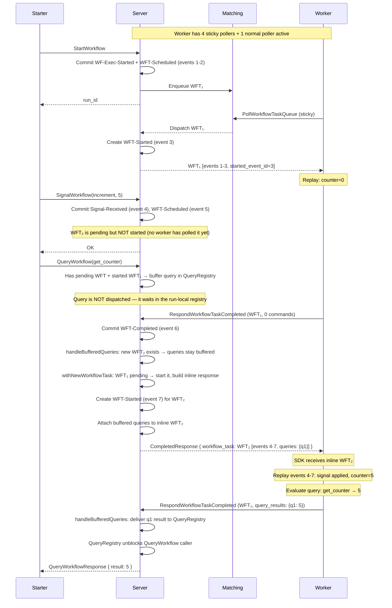
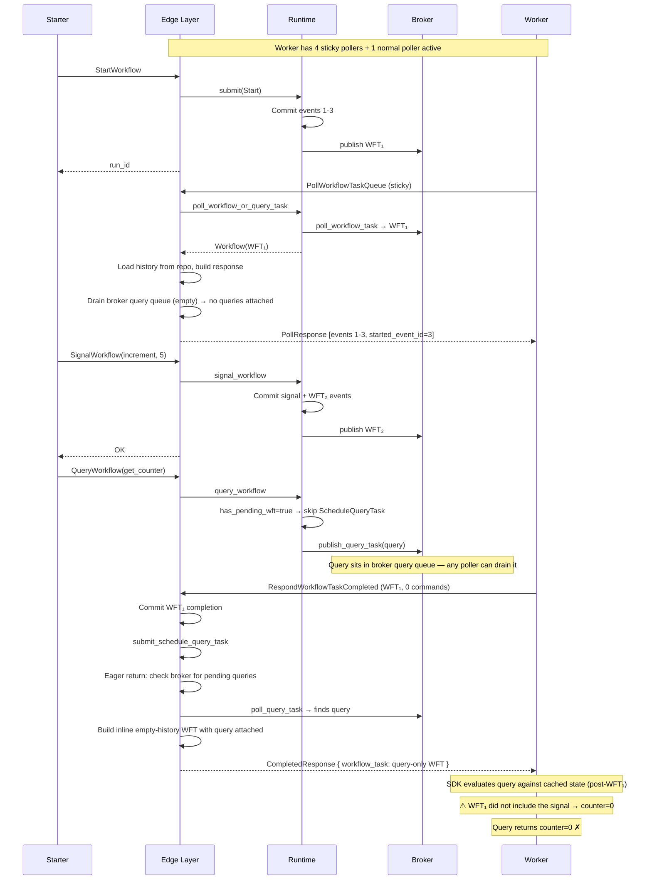

# Query Timing Analysis: Signal → Query Ordering

This document analyzes the `message_passing` example's signal-then-query
sequence, comparing the idealized Temporal server behavior with tokeira's
current implementation, and cataloguing the remaining issues.

## The Example

```
starter:  StartWorkflow(target=10)
starter:  Signal(increment, 5)        // counter becomes 5
starter:  Query(get_counter)           // expects 5
starter:  Update(set_counter, 10)      // expects old=5
starter:  GetResult()                  // expects 10
```

The core invariant: **once the signal call has returned successfully, a
subsequent consistent query must not be evaluated against pre-signal
workflow state.** Temporal's public docs describe signals as write messages,
queries as read messages, and say message handlers operate on the
workflow's current state.

Temporal's worker API distinguishes between:
- **Piggybacked queries** (`queries` map, field 14) — answered through
  `RespondWorkflowTaskCompleted.query_results`
- **Legacy standalone query tasks** (`query` field 10) — answered through
  `RespondQueryTaskCompleted`

The proto comments are explicit: queries in the `queries` map are
"executed after applying the history in this task." That is the
consistency contract.

---

## 1. Idealized Temporal Server



### Key Temporal Mechanisms

1. **QueryRegistry on MutableState** — queries are buffered in a run-local
   registry on the workflow's mutable state, NOT in a broker/matching queue.
   No poller can grab them independently. There is a bounded buffered-query
   count per run.

2. **Authoritative WFT state** — mutable state tracks pending and started
   workflow tasks directly. The query dispatch decision is based on this
   authoritative execution state, not on delivery/broker state.

3. **`handleBufferedQueries`** — runs after every WFT completion. If the
   completion included `query_results`, those are delivered. If a new WFT
   was created during the completion (e.g., from a signal), remaining
   buffered queries stay buffered — they are NOT delivered yet. Only when
   no new WFT was created (workflow is quiescent) are queries "unblocked"
   and dispatched directly through matching.

4. **`withNewWorkflowTask` (eager WFT return)** — when
   `return_new_workflow_task` is true and a new WFT was created during
   completion, the server starts it (creates WFT-Started), attaches
   buffered queries whose barrier is satisfied, and returns the inline
   `PollWorkflowTaskQueueResponse` in the completion response's
   `workflow_task` field.

5. **Direct dispatch through matching** — when no WFT is pending/started
   AND the workflow has completed at least one WFT, queries are dispatched
   directly through matching (sticky first, then normal). The worker
   evaluates against cached state. This is the "unblocked" path.

6. **WFT-Started timing** — `WorkflowTaskStarted` is created when the
   service hands the task to a worker via `PollWorkflowTaskQueue`, not at
   signal commit or workflow start. This matters for reasoning about which
   history snapshot the worker actually receives.

7. **Ordering guarantee** — a query that arrives while a WFT is in progress
   is NEVER evaluated until that WFT completes AND the query's required
   state barrier is satisfied. The query either rides on the next WFT (via
   eager return or piggybacking) or is dispatched directly after the run
   becomes quiescent.

---

## 2. Tokeira (Current Implementation)



### What the Uncommitted Changes Did

1. **Removed query-only task delivery from `poll_workflow_or_query_task`** —
   the runtime no longer returns `PolledWorkflowOrQueryTask::Query`. This
   eliminates the race where a poller independently drains a query from the
   broker while a WFT is in progress.

2. **Added eager WFT return** — after WFT completion, if
   `return_new_workflow_task` is true and queries are pending in the broker,
   the edge builds an inline empty-history query-only WFT and returns it in
   `RespondWorkflowTaskCompletedResponse.workflow_task`.

These changes eliminate the "poller drains query independently" race. But
the eager return fires unconditionally — it does not check whether a new
WFT was created by the completion, so it delivers the query against the
wrong state boundary.

---

## 3. Remaining Issues

### Issue 1: The missing abstraction — run-local consistent-query registry

The fundamental problem is that tokeira treats consistent queries as broker
items. A broker is a good abstraction for workflow tasks, activity tasks,
and delivery. It is a bad abstraction for consistent query waiters.

Consistent queries need a **run-local registry** with:
- A waiter/future for the client RPC
- The query payload (type + args)
- A **required state barrier** (`required_last_event_id` or
  `required_transition_seq`) captured at query acceptance time
- Delivery status tracking
- Cancellation/deadline cleanup
- A bounded count per run

Without this, the system tries to infer correctness from broker state,
which is too weak. The broker knows about delivery readiness, not about
execution state boundaries.

Temporal's architecture confirms this: there is a `QueryRegistry` on
mutable state, a bounded buffered-query count, and dedicated worker-response
paths for query-only versus piggybacked queries.

### Issue 2: Eager return needs a read barrier, not a simple boolean

The current eager return checks "are there queries in the broker?" That is
a delivery fact, not an execution fact. The correct question is:

> Is there any in-flight or not-yet-processed workflow task such that this
> query must wait for its state effects before evaluation?

Each buffered query should carry a minimum state barrier. A query may only
be delivered on a task whose worker-visible state is guaranteed to include
at least that barrier. The rule becomes:

- If the selected delivery task's history snapshot is too old, do not
  deliver the query
- If it is new enough, piggybacking is safe
- If no task is new enough yet, keep buffering

The current "only eager-return when no new WFT was created" heuristic is
necessary but not sufficient. It should be restated as:

> Only deliver a buffered query when the selected delivery path is
> guaranteed to observe the query's required state barrier, and when no
> older in-flight workflow task can still reorder that observation.

### Issue 3: Piggybacking is only safe when the WFT hasn't been started

Piggybacking a query onto a real WFT is safe only if that WFT has not
already been handed to a worker. If WFT₂ is still pending and the poll
response is being built now, then:
- Poll loads history that includes the signal
- The worker replays that history
- The query runs after replay
- Result is correct

But if WFT₂ has already been started and is executing on a worker, the
server cannot retroactively add the query to that in-flight task payload.
In that case, the query must remain buffered until WFT₂ completes, and
then either:
- Ride on the next real WFT, or
- Be dispatched through the query-only path once the run is quiescent

"There is a relevant WFT" is not the same as "the query can be delivered
now."

### Issue 4: ScheduleQueryTask creates unnecessary history churn

Temporal's API surface strongly suggests two query delivery modes:
1. Piggyback on an existing workflow task (`queries`)
2. Deliver a separate query-only task (`query`) answered via
   `RespondQueryTaskCompleted`

Neither mode requires minting a new history-bearing workflow-task lifecycle
just to read state. If tokeira's `ScheduleQueryTask` creates a real normal
workflow task that flows through ordinary WFT history (Scheduled + Started +
Completed events), that is:
- Adding unnecessary latency
- Adding unnecessary history churn
- Drifting away from Temporal-compatible behavior

A pure query should not normally require creating WFT history events. This
should be marked as a separate architectural follow-up.

---

## 4. Recommended Architecture

### Run-Local BufferedQueries Registry

```
On QueryWorkflow:
  1. Resolve the run
  2. Read authoritative run state
  3. Capture required_barrier = current last_event_id (or transition_seq)
  4. Decide:
     - If no pending/started WFT and run is at a safe direct-query point:
       dispatch through the direct query-only path
     - Otherwise: place query into run-local BufferedQueries registry
```

### On Poll Response Construction (Real WFT)

```
When a new WFT is about to be handed to a worker:
  1. Determine the task's observable history barrier
  2. Attach only those buffered queries whose required_barrier
     is satisfied by this task's history snapshot
  3. Leave the rest buffered
```

### On RespondWorkflowTaskCompleted

```
After applying the completion:
  1. Resolve any returned query_results
  2. Inspect remaining buffered queries
  3. If this completion created or left behind another relevant WFT:
     keep them buffered (they'll ride on the next WFT)
  4. If the run is now quiescent (no started/pending WFT blocking them):
     dispatch through the direct query-only path
```

### Three Implementation Rules

1. **Buffered consistent queries live with the run, not in the broker.**
   Each query carries a `required_barrier`.

2. **Piggybacking and eager return are both gated by authoritative WFT
   state** (pending/started from run state), not broker visibility.

3. **A query is only delivered when the selected delivery path is
   guaranteed to observe the query's required state barrier**, and when no
   older in-flight workflow task can still reorder that observation.

---

## 5. What This Means for the message_passing Example

With the recommended architecture applied, the sequence becomes:

1. Signal committed → `last_event_id` advances to N
2. Query arrives → `required_barrier = N` → buffered (WFT₁ is started)
3. WFT₁ completes → signal created WFT₂ → queries stay buffered
4. WFT₂ polled → history includes signal (barrier satisfied) → query attached
5. Worker replays signal → `counter=5` → evaluates query → returns 5
6. Query caller receives `counter=5` ✓

The signal-then-query invariant is upheld not by timing heuristics but by
an explicit execution barrier on each buffered query.
